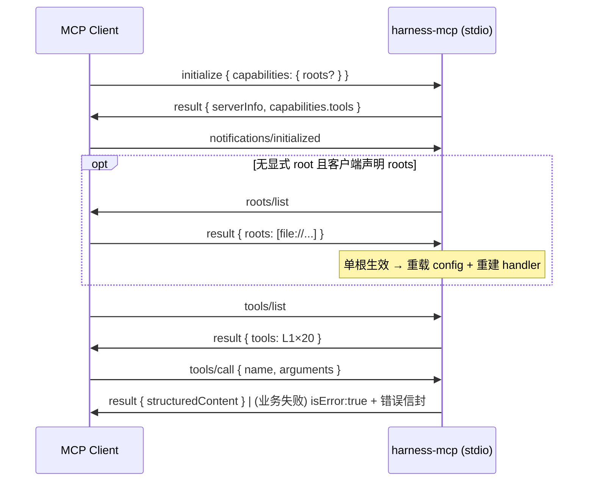

# 交互设计（Interaction Spec）— TASK-20260918142555-5d8f7ec3

> 设计阶段产物 **2/4**。对应 PRD：`PRD-20260918-other-phase-1-mcp-零安装接入-harness-mcp-bin-root-定位-l1-工具面`
> 本任务的"界面"即 **MCP 协议面**：会话序列、工具契约、错误信封、确认点与状态一致性。

## 1. 会话序列（stdio）



- root 优先级：`--root` > `HARNESS_ROOT` > MCP roots 协商 > cwd 向上查找。
- 服务无内存态；handler 在协商命中后重建（rootDir/config 热切换一次为限）。

## 2. 工具契约（新增 7 个；既有 13 个冻结不变）

| 工具 | 参数 | 成功返回（要点） | 失败 code（isError 信封） |
|---|---|---|---|
| `gate_create` | `task`（必填）、`type`、`taskId`、`lite` | `{ gateId, phase, checks[], remainingPreparation, branch, head }` | `NO_ACTIVE_TASK` / `NOT_GIT` / `PLUGIN_ERRORS` / `USAGE` |
| `gate_status` | `gateId`（缺省最新） | `{ gateId, phase, remaining, valid, expired, hoursAgo, maxAge, taskId, checks[] }` | `NO_GATES_DIR` / `NO_ACTIVE_GATES` |
| `gate_clear` | `checkId`（必填）、`gateId`、`note` | `{ cleared: true, done, total, state, remainingIds }` | `GATE_NOT_FOUND` / `UNKNOWN_CHECK` / `EVIDENCE_CONTROLLED` / `TASKLESS_EVIDENCE_GUARD` / `MACHINE_CHECK_FAILED` |
| `run_verifier` | `verifierId`（必填）、`taskId`、`summary?` | `{ verifierId, command, exitCode, evidenceId, summary }` | `VERIFIER_NOT_FOUND` / `NO_ACTIVE_TASK` / `VERIFIER_FAILED` |
| `get_next_action` | — | `{ taskId?, gateId?, phase?, blockingReason?, nextAction, commands[], humanDecisionRequired }` | —（无任务时返回稳定 no-task 结构） |
| `get_task` | `taskId`（缺省最新活动） | Task 对象（`id/status/risk/changePlan/findings`） | `TASK_NOT_FOUND` |
| `list_tasks` | `status?`、`limit?`、`all?` | `{ count, tasks[] }`（默认按 `output.taskListDefaultLimit` 裁剪） | — |

## 3. 错误信封（RFC-0004 §6.1）

```json
{ "code": "EVIDENCE_CONTROLLED", "message": "...", "hint": "...", "retryable": false, "nextAction": "run evidence verify ..." }
```

- 业务失败 → tool result `isError: true`（便于模型自愈），**不是** JSON-RPC error；协议级非法（未知工具/方法）仍走 JSON-RPC error（-32601）。
- `code` 基线 = `EXIT_CODES` 语义（POLICY_FAILURE / USAGE / INTERNAL）+ 细分码（NOT_FOUND / STALE / LOCKED / EVIDENCE_CONTROLLED …）。

## 4. 权限与人工确认点

- `gate_clear` 对 `user-confirmed` / `design-confirmed`（human-WAIT）**不提供裸清路径**；人类确认仍走 CLI（本阶段）。
- `run_verifier` 仅执行 `harness.config.evidence.verifiers` 注册表中的验证器（白名单）；无任意命令执行面。

## 5. 状态一致性

- 全部状态落 `.harness-state/` 与 `harness/gates/`；`withStateLock` 文件锁 + 原子写，多客户端并行安全；
- 工具响应中的 `gateId`/`taskId` 为后续调用的显式锚点（支持多任务切换）。

## 6. 兼容声明

- 既有 13 工具的名称、参数与错误行为**冻结**（回归由既有 `mcp.test.mjs` 用例保证）；
- 协议版本维持 `2025-03-26`（Phase 2 再评估结构化升级）。
