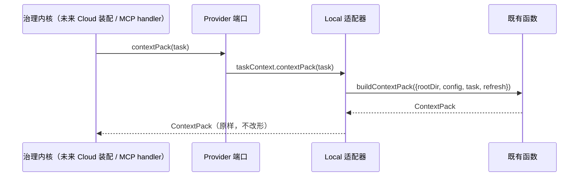

# 交互规格 — TASK-20260919101110-f33d9810（D04/D05 Provider 抽象）

本任务无界面交互；这里的「交互」指**端口 API 契约**（调用方与实现之间的交互面）。以下契约一经冻结，D08（SubmittedContext / SubmittedGitSnapshot）与 D07（Sqlite 适配器）必须逐条满足。

## 1. 端口与方法面（冻结）

| 端口 kind | 方法 | 语义 | 缺失/空态归一 |
|---|---|---|---|
| `ProjectContextProvider` | `profile()` | 项目画像（`buildProjectProfile` 契约对象） | 无 package.json 等缺失字段 → null 字段，不抛错 |
| `ProjectContextProvider` | `index()` | 重建/返回知识索引（`indexKnowledge`） | 无资产 → `assets: []` |
| `ProjectContextProvider` | `search(query, top = 10)` | 检索（`searchKnowledge`） | 未索引 → `{ indexed: false, results: [] }` |
| `ProjectContextProvider` | `status()` | 索引状态（`brainStatus`） | 未索引 → `{ indexed: false, assets: 0, stale: [] }` |
| `TaskContextProvider` | `contextPack(task, refresh = false)` | 任务上下文包（`buildContextPack`） | 无匹配资产 → `assets: []` |
| `TaskContextProvider` | `recordDecision({ taskId, title, decision, reason })` | 决策落盘（`recordDecision`） | 必填缺失 → 既有 `createContract` 报错，不吞 |
| `GitSnapshotProvider` | `changedFiles(base = 'origin/main')` | 变更文件清单（既有信封 `{files, errors}`） | 无变更 → `files: []`（errors 透传） |
| `GitSnapshotProvider` | `diff(base = 'origin/main', opts)` | 统一 diff（既有信封 `{diff, errors}`） | 无变更 → `diff: ''` |
| `GitSnapshotProvider` | `showAtRef(ref, file)` | 指定版本文件内容（既有信封 `{content, error}`） | 不存在 → `error` 非空、`content` 为 null/空 |
| `GitSnapshotProvider` | `createSnapshot({ taskId, branch, baseHead, allow = [] })` | 生成快照对象（不落盘） | — |
| `GitSnapshotProvider` | `writeSnapshot(snapshot)` | 快照落盘 | — |
| `GitSnapshotProvider` | `readSnapshot(snapshotId)` | 读回快照 | 不存在 → null（既有 `readSnapshot` = `readJson(required:false)`） |
| `GitSnapshotProvider` | `listSnapshots()` | 列举快照 | 无 → `[]` |

## 2. 调用方交互序列（本批交付层，暂未接线）



**不改形原则**：适配器只做参数重排与 `rootDir/config` 绑定，返回值**原样透传**（不做字段增删），保证与 D09/D12 切换时行为等价。

## 3. 装配交互（本机）

```js
import { createLocalProviders } from './local-providers.mjs';
const { projectContext, taskContext, gitSnapshot } = createLocalProviders({ rootDir, config });
projectContext.kind // 'ProjectContextProvider'
```

- `createLocalProviders` 是**纯装配**：不读文件、不建目录、不校验 git（首次调用方法时才触碰 IO）。
- 每个 provider 对象带 `kind`，可被 `isProviderImplementation` 直接校验。

## 4. 错误语义

| 场景 | 行为 |
|---|---|
| 未知 kind 传给校验器 | 返回失败（`errors` 说明），不抛错 |
| 实现缺方法 | 返回失败 + `missing` 列表，不抛错 |
| 方法内部 IO 失败（如 git 缺失） | 沿用既有函数行为（抛错），适配器**不吞异常** |
| 快照 id 不存在 | 沿用既有 `readSnapshot` 行为（返回 null，不抛错） |
