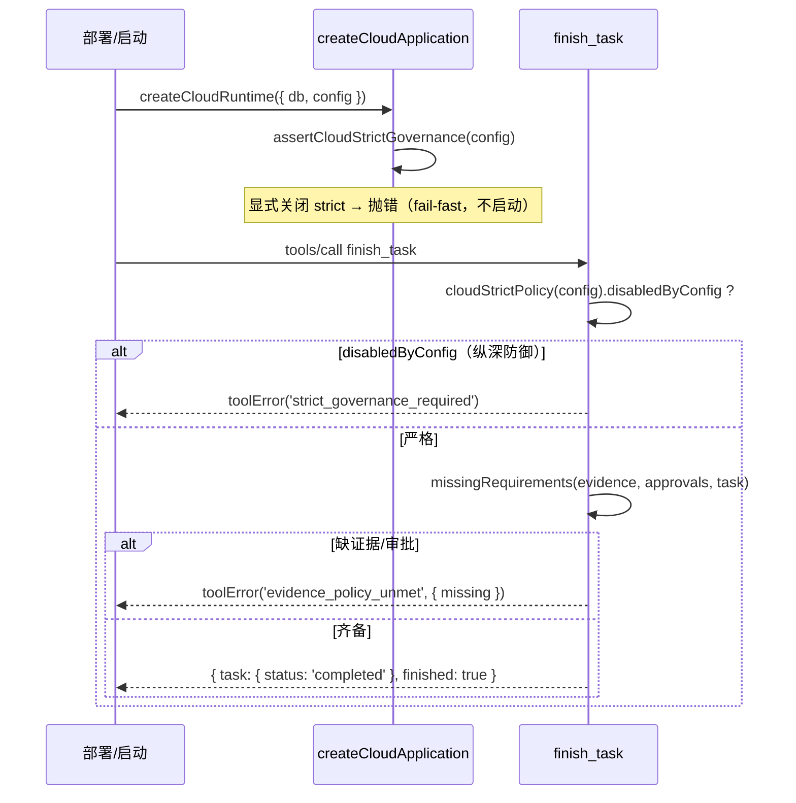

# 交互规格 — TASK-20260919110529-abfac7d9（D13）

本任务无界面交互；「交互」= **strict 策略的判定/守卫/可观测契约**。

## 1. 策略函数契约

| 调用 | 输入 | 输出 |
|---|---|---|
| `strictFlagDisabled(config)` | 任意配置 | `true` 仅当 `config.strictGovernance === false` 或 `config.governance?.strictGovernance === false` |
| `cloudStrictPolicy(config)` | 任意配置 | `{ strictGovernance: true, disabledByConfig: boolean, enforcedBy: 'cloud' }` |
| `assertCloudStrictGovernance(config)` | 任意配置 | 正常返回 `{ strictGovernance: true, … }`；`disabledByConfig` → 抛 `TypeError`（信息含修复建议） |

**不变式**：`CLOUD_STRICT_GOVERNANCE === true`，且 `cloudStrictPolicy()` 的 `strictGovernance` 恒为 `true`（不随配置变化）。

## 2. 守卫时序

## 3. 可观测

| 端点/字段 | 内容 |
|---|---|
| `createCloudRuntime(...).strictGovernance` | `true` |
| `GET /health` | `{ ok: true, runtime: 'cloud', strictGovernance: true }` |
| 错误码 `strict_governance_required` | 仅在"配置试图关闭 strict 且调用方绕过装配守卫"时出现（纵深防御） |

## 4. 失败语义

| 场景 | 行为 |
|---|---|
| 配置未设置 strict | Cloud 恒定严格（**不是**"继承 Local 默认 off"） |
| 配置显式 `true` | 严格（同上） |
| 配置显式 `false`（装配路径） | 启动抛 `TypeError`，错误信息指出 Cloud 不允许关闭 |
| 配置显式 `false`（命令层直连） | `finish_task` → `strict_governance_required`，任务状态不变 |
| 证据/审批不足 | `evidence_policy_unmet` + `missing`，任务状态不变（D12 语义） |
| 任何其它工具 | 一律不得把任务置为 `completed`（AC-008 扫描断言） |
