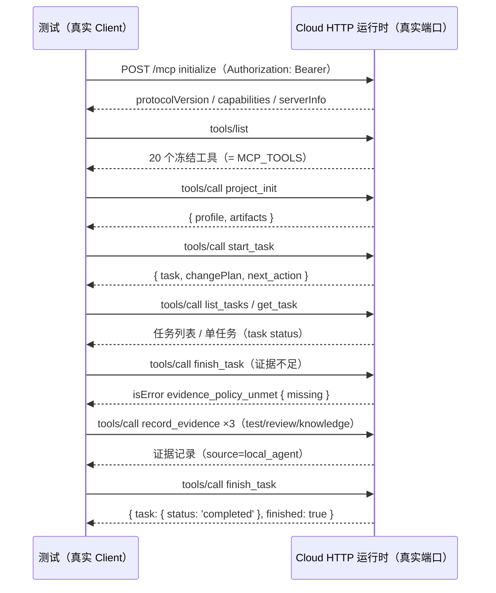

# 交互规格 — TASK-20260919111130-154e748e（D14）

本任务无界面交互；「交互」= **真实 MCP 客户端与服务端的线上交互**（含握手、工具调用与失败路径）。

## 1. 客户端环境解析

| 顺序 | 来源 | 结果 |
|---|---|---|
| 1 | 环境变量 `HARNESS_MCP_SDK_DIR` | 指向 `.../node_modules/@modelcontextprotocol/sdk` |
| 2 | 默认路径 `os.tmpdir()/harness-mcp-client/node_modules/@modelcontextprotocol/sdk` | 隔离安装位置 |
| 3 | 都不存在 | **skip**（打印安装命令），不判失败 |

安装（一次）：
```text
npm i --prefix "%TEMP%\harness-mcp-client" @modelcontextprotocol/sdk@1.30.0
```

## 2. 交互序列（真实网络）



## 3. 失败路径

| 场景 | 期望 |
|---|---|
| 无 `Authorization` 的真实客户端 | 连接/首次请求失败（HTTP **401**），数据库**无新增任务** |
| 错误的 `Authorization` | 同上（401 `invalid_key`） |
| 服务端未配置 `HARNESS_API_KEY` | 503（部署错误），客户端得到明确错误 |
| SDK 未安装 | 测试 skip（提示安装命令），`test:core` 不失败 |

## 4. 清理契约

- 断言结束后：关闭真实 HTTP 服务器（`close()`）→ 关闭 SQLite → 删除临时目录；
- 端口使用 `port: 0`（系统分配），避免与开发机其它服务冲突。
