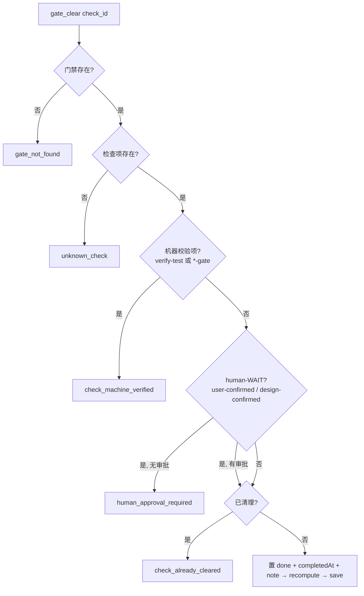

# 交互规格 — TASK-20260919111951-ea475538（Cloud 门禁能力）

本任务无界面交互；「交互」= **门禁端口写路径 + 两个 Cloud 工具的调用契约**。

## 1. 端口扩展契约（GateRepository）

| 方法 | 输入 | 输出 | 空态 |
|---|---|---|---|
| `loadLatest()` | — | `{ ok:true, gateState }` \| `{ ok:false, code:'NO_ACTIVE_GATES' }` | 同左（**不变**） |
| `statusSnapshot()` | — | `{ ok:false, code }` \| `{ ok:true, phase, remainingPreparation, remainingVerification }` | 同左（**不变**） |
| `save(gateState)`（**新增**） | 完整 gate 状态（含 `id`） | 落库/写盘后的同状态；缺 `id` → `TypeError` | — |

**双适配器一致性**：File 写 `<rootDir>/<config.paths.gates>/<gateId>.json`（原子写）；Sqlite 按 `id` upsert 到 `gates` 表。二者都必须通过契约用例 `save → loadLatest`（同 id 重复 save 只保留一条）。

## 2. Cloud 工具契约

| 工具 | 参数 | 成功返回 | 失败信封 |
|---|---|---|---|
| `gate_create` | `{ task_id?, type?, lite? }` | `{ gateId, phase, remainingPreparation, remainingVerification, next_action }` | `task_not_found` · `gate_already_active` |
| `gate_clear` | `{ gate_id?, check_id, note? }` | `{ gateId, cleared, remainingPreparation, remainingVerification }` | `gate_not_found` · `unknown_check` · `check_machine_verified` · `human_approval_required` · `check_already_cleared` · `missing_argument` |

## 3. 清理守卫（与 Local 语义对齐）

## 4. 语义边界（写入文档）

- **门禁 = 流程指引**：Cloud 门禁记录准备项/验证项进度，供 `gate_status` 与 `get_next_action` 使用。
- **完工 = 证据判定**（D13 strict）：`finish_task` **不读取门禁**；证据/审批齐备才完工。二者刻意解耦，避免"清门即完工"的误解。
- **机器校验项**：Cloud 不执行本机验证器（`run_verifier` 仍 `cloud_not_implemented`），故 `verify-test` / `*-gate` 保持 pending，由证据路径满足完工要求。

## 5. 失败语义（补充）

| 场景 | 行为 |
|---|---|
| 无任务时 `gate_create` | `task_not_found` |
| 已有未完成门禁时 `gate_create` | `gate_already_active`（附现有 `gateId`） |
| 守卫失败 | **不落库**（返回错误信封，门禁状态保持原样） |
| `save` 缺 `id` | 抛 `TypeError`（fail-loud，不静默写坏数据） |
