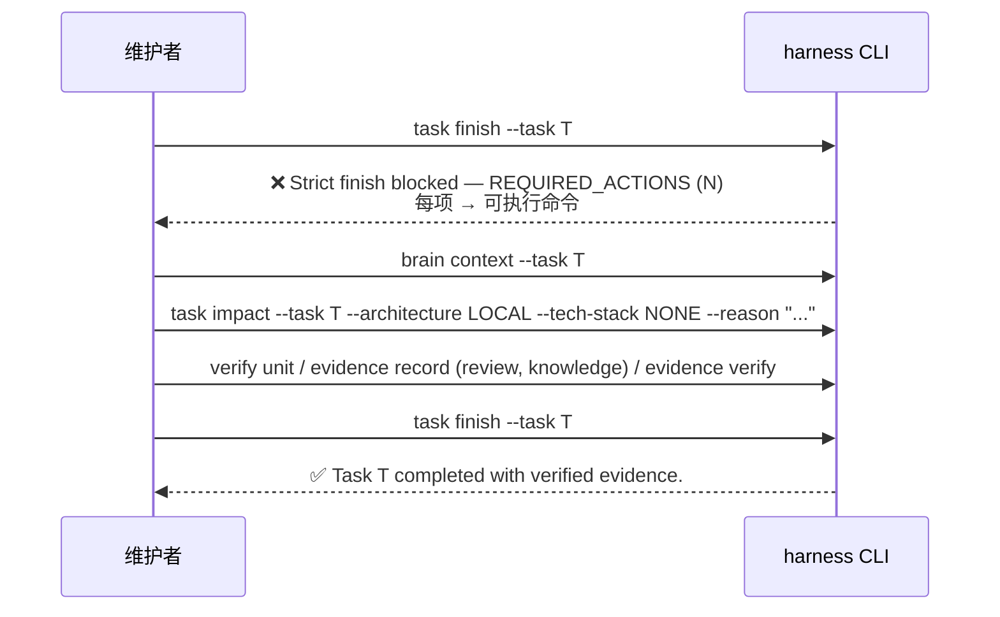

# 交互规格 — TASK-20260919113354-6b2096bb（本仓 strict 严格治理 dogfood）

## 1. 角色与触点

| 角色 | 触点 | 变化 |
|---|---|---|
| 维护者/Agent（本仓） | `harness task finish` | 严格收尾生效：缺事实 → `REQUIRED_ACTIONS` |
| 维护者/Agent（本仓） | `harness task impact` | **新增为强制步骤**（生命周期 §2） |
| 下游项目 | `harness task finish` | **零变化**（未声明 strict → 兼容路径） |

## 2. 生命周期（本仓，strict 生效后）

```text
task start → brain context → risk check → gate → 实施
   → task impact --architecture <v> --tech-stack <v>   ← 新增强制步骤
   → verify / evidence record(review, knowledge) → evidence verify
   → task finish（strict：12 项事实门）
```

## 3. 阻断 → 修复 → 放行（交互闭环）



## 4. 影响评估交互（CHANGE 级）

| 输入 | 行为 |
|---|---|
| `task impact --architecture LOCAL --tech-stack NONE` | 记录 `task.impact`，无需 Decision |
| `task impact --architecture ARCHITECTURE_CHANGE`（无 Decision） | **拒绝**（非 0 退出），提示"先记录决策再继续编码" |
| `task impact --architecture ARCHITECTURE_CHANGE --decision "<内容>"` | 记录 impact + 追加 Decision 条目 |

## 5. 失败语义

| 场景 | 期望 |
|---|---|
| 忘记 `task impact` | 阻断并给出确切命令（不猜） |
| 忘记 `brain context` | 阻断并给出 `harness brain context --task <id>` |
| 试图改配置回非严格 | `test:core` 守卫用例失败（AC-001） |
| 下游项目未声明 strict | 行为与变更前一致（AC-005 断言） |

## 6. 幂等与可重复

- 同一任务重复 `task impact` → 覆盖 `task.impact`（最后一次有效），不报错。
- `task finish` 阻断是**幂等**的：反复执行不会改变任务状态或写入部分完成标记。
