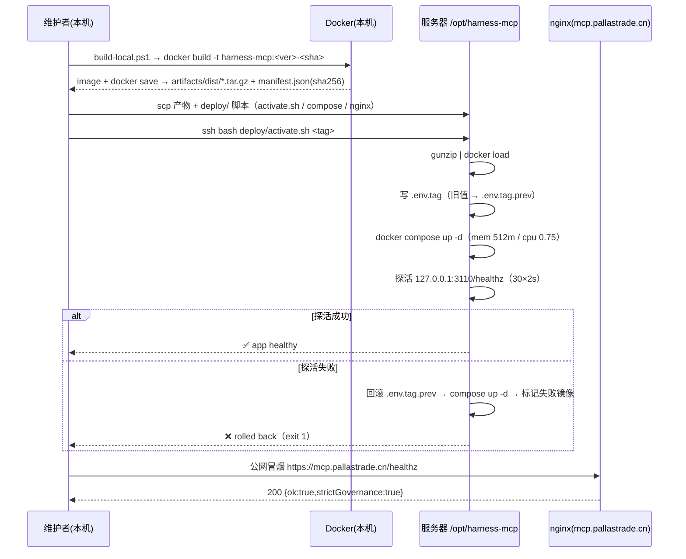

# 交互规格 — TASK-20260919123118-6991b0c0（harness 托管 MCP 本地构建与离线部署）

## 1. 角色与责任边界

| 角色 | 位置 | 职责 |
|---|---|---|
| 维护者（本机） | Windows + Docker Desktop | 构建镜像、生成离线产物与 manifest、上传、触发激活 |
| 服务器 | ECS `/opt/harness-mcp` | `docker load` → `compose up` → 探活 → 失败回滚；**不做构建** |
| nginx | 服务器 | 80→443 跳转、TLS、限流、反代 `127.0.0.1:3110`、其余 404 |
| 云监控 | 阿里云 | 探活 `/healthz` + 磁盘/内存告警（阈值见 RFC §7.1） |

## 2. 交付主链路（本地推送版）



## 3. 服务内部交互（与既有 Cloud 分层一致，不改）

```text
POST /mcp → HTTP Transport → Static Key Auth(HARNESS_API_KEY) → MCP JSON-RPC Adapter
          → Application/Command → Governance Core/端口 → SQLite(/data/harness-cloud.db)
```

不变式：HTTP 层不碰存储（静态断言已存在）；工具不判业务结论（ARCH-R2）；Cloud `strictGovernance` 恒 true。

## 4. 失败语义

| 场景 | 期望行为 |
|---|---|
| 本机无 Docker / 构建失败 | 脚本非 0 退出并指向日志；**不产生**半成品产物文件 |
| 缺 `HARNESS_API_KEY` | 容器启动即失败（日志 `❌ harness-mcp: HARNESS_API_KEY is required in --http mode`），compose 状态 `restarting` 可见 |
| 服务器磁盘不足 | `activate.sh` 预检 `df -h`（<5G 直接失败并提示清理 `docker builder prune -f`） |
| 新版本探活失败 | 自动回滚上一 tag；失败镜像保留（tag 带 `-failed` 或不 prune）供排查 |
| nginx 配置错误 | `nginx -t` 失败即**不 reload**，保留旧配置（沿用已验证模式） |
| 公网不可达但本机健康 | 报告为 nginx/证书/DNS 问题，不回滚应用（区分层次） |

## 5. 幂等与重入

- `build-local.ps1` 同 tag 重复构建 → 覆盖同名产物（先删旧文件再写，避免半截文件）。
- `activate.sh` 同 tag 重复执行 → `docker load` 幂等；`.env.tag` 写同值不产生回滚点抖动（`prev` 仅在 tag 变化时更新）。
- 中断恢复：产物文件 + manifest 是唯一事实源，可从任意一步重跑。
