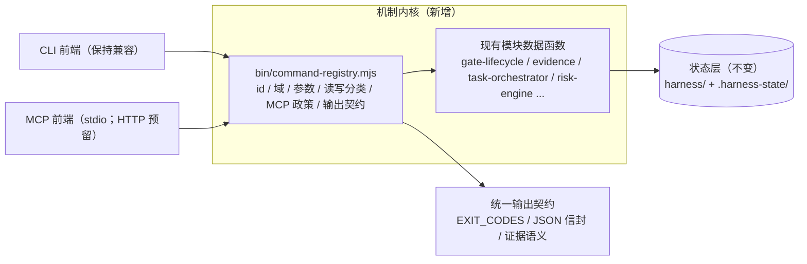

# RFC-0004: MCP 全量机制接入（Mechanism-as-MCP）

> 状态：draft（待评审，评审通过后 approved）
> 日期：2026-09-18
> 关联：RFC-0001 §5（六层防线/信任边界）、RFC-0001 §11 增量（本 RFC 附录 D）、RFC-0002（ChangeSnapshot）、AGENTS.md §2/§3/§6
> 决策记录：2026-09-18 六项自主决策（见 §8）

## 1. 目的与范围

把 pallastrade-harness 的**全部治理机制**（Task / Risk / Gate / Supervisor / Evidence / Recovery / Knowledge / PRD / Design / Skill / Standards / Scan / Adapter / Report）以 MCP 服务形态对外暴露，使任何 MCP 客户端（VS Code Copilot、Cursor、Claude Code、Claude Desktop、Codex）**零安装接入**即可驱动完整治理闭环。

范围：

- 在 `bin/mcp.mjs` 现有 13 个工具基础上，升级为**机制全量接口**（L1 一等公民 + L2 域派发 + L3 资源/提示）。
- 新增**命令注册表**内核层，CLI 与 MCP 共用同一事实源（消除双份逻辑与长期漂移）。
- 建立 MCP 专属安全政策（三类写、人工确认点、审计）与兼容承诺（命名冻结、错误信封、版本策略）。

非目标：

- 不提供任意 shell / 任意命令执行（沿用既有约束）。
- 不替代 Hook / CI / Ruleset 强制层（MCP 不是安全边界，见 §5.4）。
- 不建设远程 SaaS / 集中 RBAC；Phase 3 的 HTTP 形态仅限本地回环。
- 本版本不改变 CLI 的既有用户可见行为（只增不改）。

## 2. 现状与差距

### 2.1 现状（实测）

| 维度 | 实测结果 |
|---|---|
| 命令面 | `harness.mjs` 58 个分发分支；`docs/commands.md` 64 行命令参考；约 65 个命令族、120+ 操作 |
| MCP 现状 | `bin/mcp.mjs`：协议 `2025-03-26`，13 个工具；无 gate 生命周期；无根目录参数；无多客户端配置生成 |
| 结构化输出 | 26 个命令族有 `--json`（模块内各自实现）；`gate` / `prd` / `check` / `coverage` / 4 个 scanner / `doc-impact` / `visual` 等约 20 个命令族**纯文本** |
| 根定位 | `resolveProjectRoot()` 从 cwd 向上查找 `harness.config.*`，无 `--root` / 环境变量 / MCP `roots` 支持 |
| 状态层 | `state-store.mjs`：`withStateLock` 文件锁 + 原子写；多进程安全现成可用 |

### 2.2 差距

1. **覆盖缺口**：gate 全生命周期不在 MCP 面内（治理闭环最大缺口）。
2. **协议缺口**：无 `--root`；IDE 拉起 stdio 时 cwd 不可靠；无配置生成器（5 客户端逐一手工配置）。
3. **契约缺口**：无统一错误信封与输出 schema；工具命名无规范；`--json` 能力参差且不统一。
4. **内核缺口**：命令逻辑绑定在 `harness.mjs` if/else + `console.log`，MCP 无法结构化复用（尤其 `gate` 460–860 行、`prd` 956–1254 行两块内联）。

## 3. 架构：注册表内核 + 三前端

设计要点：

1. **单一事实源**：每个命令在注册表中登记 `{ id, domain, args, mutating, requiresTask, dryRunDefault, mcp: full|readonly|excluded, outputSchema }`；MCP `tools/list`、参数校验、annotations、错误语义全部自动派生。
2. **传输无关**：`createMcpHandler`（已有）与 `runMcpStdio`（已有）保持分离；HTTP 形态只加传输层，不动工具层。
3. **桥接过渡**：Phase 0–1 对未注册命令用 CLI 桥接（固定白名单，非任意 shell）；Phase 2 逐域替换为模块数据函数直连，桥接逐条退场。桥接与内核共用同一份注册表清单，不产生第二份逻辑。
4. **重定位成本**：MCP 侧**不解析 stdout**；无 `--json` 的命令一律走模块函数直连（`gate` / `prd` 家族优先提炼）。

## 4. 工具面

### 4.1 L1 一等公民工具（20 个）

既有 13 个（名称与语义**冻结**）：`get_project_context` `start_task` `resume_task` `get_applicable_standards` `get_change_plan` `risk_check` `record_decision` `record_evidence` `review_diff` `finish_task` `generate_standards` `generate_skill` `generate_docs`

新增 7 个：

| 工具 | 映射命令 | 说明 |
|---|---|---|
| `gate_create` | `gate` | 创建分阶段门禁 |
| `gate_status` | `gate:status --short` | 单行状态（token 优化） |
| `gate_clear` | `gate:clear` | 服务端机器校验；human-WAIT 禁裸清（§5.2） |
| `run_verifier` | `verify <id>` | 仅注册验证器白名单（INV-02） |
| `get_next_action` | `next --json` | 稳定下一步结构 |
| `get_task` | `task status` | 单任务结构化读取 |
| `list_tasks` | `task list` | 默认裁剪 + 过滤 |

### 4.2 L2 域派发工具（16 个）

统一形态 `harness_<域>` + `action` 枚举（enum 校验，只增不删）：

`harness_task`（checkpoint/handoff/abandon）、`harness_brain`（index/query/eval）、`harness_prd`（new/list/verify）、`harness_design`（scan/check/reuse_adherence）、`harness_evidence`（run/list/verify/bundle/report）、`harness_recovery`（create/status/verify）、`harness_knowledge`（assess/status/verify）、`harness_standards`（list/select/coverage/gap/validate/generate）、`harness_skill`（new/check/list/audit/catalog）、`harness_supervise`（plan/diff/review）、`harness_quality`（check/coverage/baseline/visual/generated_check/affected）、`harness_audit`（scan/anti_patterns/secrets/ui_anti_patterns/degraded_loop/doc_impact/sync_check/docs_check/readme_sync/nav_check）、`harness_governance`（profile/wizard/setup/onboard/analyze/doctor/config_check）、`harness_adapter`（list/generate/register/registered/unregister）、`harness_report`（report/metrics/suggest/plugins_list）、`harness_eval`（eval_ai/eval_scenarios/eval_llm，只读）。

> 若 `tools/list` token 超预算，可将 quality+audit 合并、eval 并入 report（收敛至 ~12 个）；以 token 基线实测为准。

### 4.3 L3 资源与提示（零工具成本）

- resources（6）：`harness://next`、`harness://tasks`、`harness://tasks/{id}`、`harness://gate/current`、`harness://standards/coverage`、`harness://report/summary`
- prompts（4）：`lifecycle`、`prd-workflow`、`design-workflow`、`bugfix-workflow`

### 4.4 排除档（EX / DEFER）

| 命令 | 处理 |
|---|---|
| `tui`、`mcp`（元命令） | EX（无 MCP 语义） |
| `gate:required` | EX（设计给 pre-commit/CI） |
| `e2e`、`visual:capture`、`eval-llm` | DEFER（依赖运行环境 / Playwright / 外部 key） |
| `state:migrate` `config:migrate` `gate:migrate` `gate:clean` `cache:clean` `hooks` | EX-DEFAULT（`mcp.policy.ops=true` + `apply:true` 双条件放开） |

## 5. 安全政策

### 5.1 三类写

| 类 | 范围 | MCP 行为 |
|---|---|---|
| C1 治理状态 | task 生命周期、`gate_create/clear`、`record_evidence/decision`、recovery、knowledge、adapter register | 直接执行（沿用 `withStateLock` + 原子写；响应 `source: mcp`） |
| C2 产物 | `onboard` `setup` `wizard finish` `standards generate` `skill new` `docs generate` `ci github` `adapter generate` | **默认 dry-run**，`apply: true` 才落盘；响应返回受影响文件清单与 diff 摘要 |
| C3 运维 | migrate / clean / hooks 等 | 默认排除；双条件放开（§4.4） |

C2 例外：`prd new`（单文件新建、可 git 回滚、属正常流程）直接执行，保留相似查重与 `--force` 语义（决策 D4）。

### 5.2 人工确认点（3 个）

1. **human-WAIT 检查项**（`user-confirmed` / `design-confirmed`）：MCP **禁止裸清**，必须附 `approval` / `ui-approval` 类证据；CLI 人工操作保持现状（AC-004"人可清"），MCP 侧收紧为"人可清、Agent 不可清"（决策 D5）。
2. **critical 任务收口**：沿用现有要求（approval 类证据 + recovery plan），MCP 不改。
3. **C3 运维执行**：政策开关 + `apply:true` 双条件。

手工证据延续 `success:null`（未审批）语义；MCP 不提供 `--approve` 直通路径。

### 5.3 审计

C1/C2 写操作记 `.harness-state/mcp/audit.ndjson`（默认开，`mcp.policy.audit=false` 可关），字段 `{ts, tool, action, target, source:'mcp'}`；仅本地、不上传（对齐 RFC-0001 §7）。

### 5.4 威胁模型增量（拟并入 RFC-0001 §11）

| ID | 威胁 | 缓解 | 状态 |
|---|---|---|---|
| T-MCP-01 | 借 MCP 执行任意命令 | 无 shell 工具；L2 action 白名单；验证器仅注册表（INV-02） | 已有/延续 |
| T-MCP-02 | 路径逃逸（file/asset 参数） | 所有路径参数 resolve 限制在 root 内；沿用 evidence 逃逸测试并扩展 | 部分已有 |
| T-MCP-03 | 伪造状态推进（假 clear / 假证据） | 服务端与 CLI 同校验；`success:null`；human-WAIT 禁裸清 | 新增 |
| T-MCP-04 | Prompt 注入诱导高危写 | C2 dry-run 默认、C3 默认关、`destructiveHint` 标注、审计 | 新增 |
| T-MCP-05 | 多客户端并发竞争 | 文件锁 + 原子写；MCP 无内存状态 | 已有机制 |
| T-MCP-06 | 工具面/输出契约漂移 | 错误信封 + schemaVersion + 冻结清单（§6） | 新增 |
| T-MCP-07 | 信息外泄到外部模型 | 不复制 secrets 进上下文/证据；输出不读密钥文件 | 已有约束 |
| T-MCP-08 | npx 供应链 | 配置生成器默认 pin `@1.10`；发布 OIDC provenance | 部分已有 |
| T-MCP-09 | 资源耗尽（大扫描/长任务） | 输出截断 + 超时 + `tools/list` 精简 | 新增 |
| T-MCP-10 | 客户端错挂错仓库 | 启动校验 root 为 git 仓库；响应/说明回显 root | 新增 |

**诚实边界（必须同步进 `docs/mcp.md`）**：MCP 通道本身不是安全边界——它只能拦截"经它发生的事"，无法阻止 Agent 绕过它直接写文件；enforced 仍来自 Hook/CI/Ruleset（RFC-0001 §5）。MCP 的实质增强是：**状态推进不可伪造** + 治理能力**默认可达**（消除攻击者等级 1 的"忘了跑命令"式意外绕过）。

## 6. 兼容与契约

### 6.1 命名规范 v1

1. 工具名 `snake_case`、全局唯一、≤40 字符、禁止版本后缀。
2. L1 新增用 `<域>_<动作>`；既有 13 个名字历史豁免冻结（含 `start_task` 等 verb-first）。
3. L2 = `harness_<域>`；`action` 为 enum，值 `snake_case` 动词。
4. 参数名 `camelCase`；落盘开关新增工具统一 `apply: true`（旧 `write` 保留不扩散）。
5. 枚举值只增不删、语义不可变；删除走 deprecation（≥2 个 minor 别名转发）。
6. 错误信封 `{ code, message, hint?, retryable, nextAction? }`：以 `EXIT_CODES`（`POLICY_FAILURE=1` / `USAGE_OR_CONFIG=2` / `INTERNAL_ERROR=3`）为基线 + 细分码 `NOT_FOUND` / `STALE` / `LOCKED`；以 **`isError:true` 的 tool result** 返回（非 JSON-RPC error），便于 Agent 自愈。

### 6.2 冻结清单

36 个工具名（13 既有 + 7 新 L1 + 16 L2）登记于附录 C；一旦随 1.10.0 发布即视为公共契约。

### 6.3 版本策略

- 本次为 **1.10.0**（只增不改，无 breaking）；命名/语义 breaking 仅限 major。
- 客户端配置默认 pin `@1.10`（minor 冻结，补丁自动）；文档提供 exact pin 选项。
- 同步产物：本 RFC + `docs/roadmap.md` 版本行 + `CHANGELOG.md`（发布时）。

## 7. 分阶段实施与验收

| 阶段 | 内容 | 验收 |
|---|---|---|
| **Phase 0 内核** | `bin/command-registry.mjs` 骨架；注册生命周期核心 + `--json` 命令桥接；CLI 行为不变 | `node --test` 全绿 + 注册表契约测试；`gate` 家族提炼为模块函数 |
| **Phase 1 零安装闭环** | `--root` / `HARNESS_ROOT` / MCP `roots` 协商；独立 bin 入口 `harness-mcp`；L1 20 工具；5 客户端配置生成器；`docs/mcp.md` | 真 stdio e2e：零安装纯 MCP 跑通「起任务→清门禁→记证据→收口」 |
| **Phase 2 全量覆盖** | L2 16 域 + L3 resources/prompts；逐域替换桥接为模块直连；输出截断与 token 基线 | 每域黄金用例 + `tools/list` token 基线报告 |
| **Phase 3 形态扩展** | 可选 Streamable HTTP（127.0.0.1 + token）、多根工作区、RFC-0001 §11 定稿 | 多客户端并发测试 + 安全评审证据 |
| **Phase 4 Dogfood** | 本仓 + PallasTrade 主仓接入；AGENTS.md 生命周期表述更新（MCP/CLI 双路径） | 接入耗时与 token 对比报告 |

## 8. 决策记录（2026-09-18，自主决策）

| # | 决策 | 结果 | 理由 |
|---|---|---|---|
| D1 | `generate_skill` 写盘行为 | 保持兼容 + `destructiveHint`，2.0 改默认 | 冻结承诺优先 |
| D2 | L2 域数量 | 先 16 个 | 清晰优先，可后续合并 |
| D3 | 运维类开关 | 保留（默认 false） | 默认安全 + 可配置 |
| D4 | `prd new` 例外 | 直接执行 | 单文件、可回滚、风险不对称 |
| D5 | human-WAIT 禁裸清 | MCP 收紧 | 安全模型核心收益 |
| D6 | MCP 审计 | 默认开（仅本地） | 可观测性收益 > 成本 |

## 附录 A：L1/L2 全量映射

见 §4.1 / §4.2 表格（含命令映射与形态）。

## 附录 B：结构化输出缺口与策略

有 `--json`（26 族）→ 注册表直接复用数据函数：`task` `brain` `evidence` `standards` `skill`（部分）`skill audit` `design:scan` `design:check` `reuse-adherence` `baseline:*` `governance:*` `wizard` `metrics` `recovery` `knowledge` `report` `suggest` `supervise` `next/do` `tui --json` `analyze` `scan` `docs:check` `readme:sync` `migrations` `adapter`。

无 `--json`（—20 族）→ **不补 `--json`**，改为模块数据函数直连：`gate` / `gate:status` / `gate:clear` / `gate:required`（内联 460–860 行）、`prd` 家族（内联 956–1254 行）、`check` `coverage` `affected`、4 个 scanner、`generated:check` `doc-impact` `sync-check` `nav:check` `config:check` `plugins:list` `visual:*` `eval-ai` `eval-scenarios` `eval-llm`。

## 附录 C：命名登记表（36）

- 既有 13：`get_project_context` `start_task` `resume_task` `get_applicable_standards` `get_change_plan` `risk_check` `record_decision` `record_evidence` `review_diff` `finish_task` `generate_standards` `generate_skill` `generate_docs`
- 新 L1 7：`gate_create` `gate_status` `gate_clear` `run_verifier` `get_next_action` `get_task` `list_tasks`
- L2 16：`harness_task` `harness_brain` `harness_prd` `harness_design` `harness_evidence` `harness_recovery` `harness_knowledge` `harness_standards` `harness_skill` `harness_supervise` `harness_quality` `harness_audit` `harness_governance` `harness_adapter` `harness_report` `harness_eval`

## 附录 D：RFC-0001 增量清单

§5.4 威胁表（T-MCP-01..10）与"诚实边界"表述，评审通过后并入 RFC-0001 §11。
