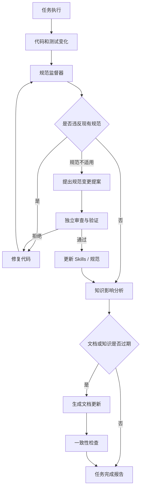
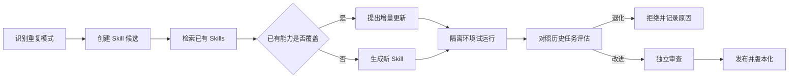
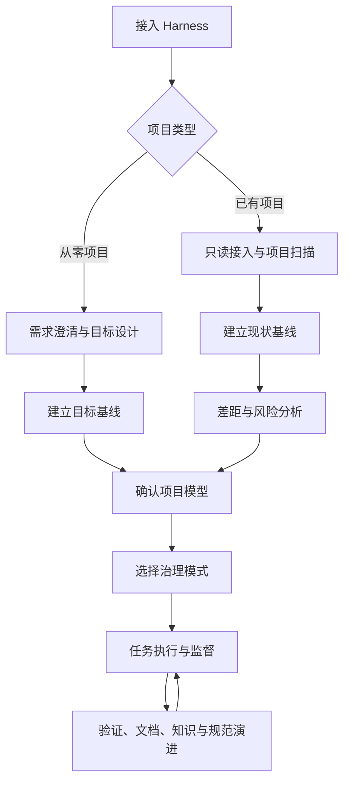
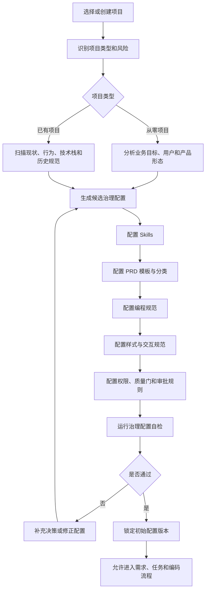
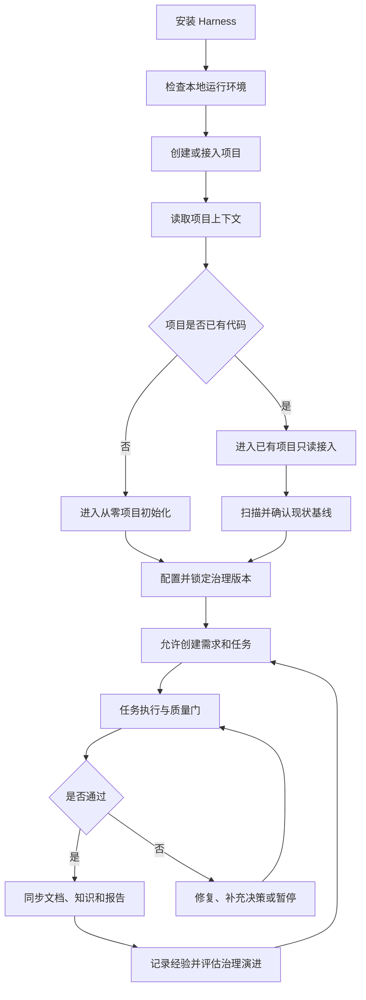
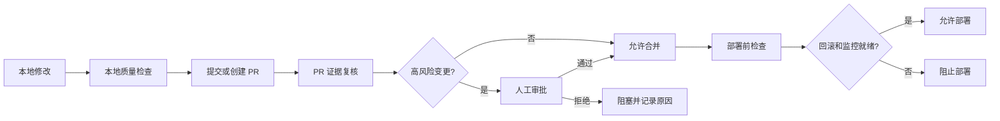
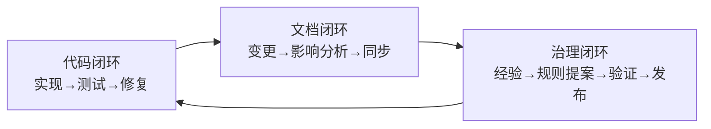

# Harness 持续治理机制设计

这意味着 Harness 不能只负责“规划、编码、测试”，还需要增加一个持续治理层：

> **Harness 不仅约束 AI 写代码，还要维护约束本身，并让代码、规范、Skills、文档和知识库持续同步。**

但有一个重要边界：**不能允许执行 AI 无条件修改监督它自己的规则。** 否则容易出现为了让任务通过而降低质量门、篡改规范、删除失败检查等问题。

更合理的架构是把规则分层，并建立“提议、审查、验证、发布”的治理闭环。

## 总前置条件：先配置治理，再开始项目

无论是从零创建项目，还是接入已有项目，Harness 都不能直接进入 PRD 编写或代码修改。项目必须先根据业务目标、项目现状和风险等级完成一轮治理配置。

至少需要在项目开发前确定并锁定版本：

- 适用的 Skills 及其工具权限；
- PRD 主分类、附加分类和对应模板；
- 编程规范、架构边界和质量门；
- 样式、交互、响应式和可访问性规范；
- 权限、数据、安全、部署和审批规则；
- 从零项目的目标基线，或已有项目的现状基线与目标基线。


治理版本锁定后，所有任务都必须记录所使用的配置版本。当前任务不能为了通过检查而静默修改这些配置；如果发现配置不适用，必须走变更提案、验证、审查和版本发布流程。



## 一、增加“持续工程治理层”

可以把完整 Harness 拆成五个控制面：

| 控制面 | 负责内容 |
|---|---|
| 任务控制面 | 需求、任务拆分、依赖、状态机 |
| 执行控制面 | 文件访问、工具调用、编码与部署 |
| 验证控制面 | 测试、类型、安全、视觉和验收 |
| 规范控制面 | 代码规范、架构规则、Skills 和工作流 |
| 知识控制面 | 文档、决策记录、知识库和经验沉淀 |

其中新增的规范控制面和知识控制面应贯穿整个任务，而不是只在最后运行。

## 二、规范监督需要分成三种规则

仅依靠 lint 不够。建议将工程规范分为三层。

### 1. 机器可执行规则

这类规则应优先交给确定性工具，而不是让 AI 主观判断：

- formatter；
- lint；
- typecheck；
- 单元测试；
- 依赖边界检查；
- API schema 校验；
- 数据库迁移校验；
- 密钥扫描；
- 依赖漏洞扫描；
- 文件命名和目录结构检查。

```yaml
rules:
  - id: CODE-001
    description: 所有 TypeScript 代码必须通过类型检查
    enforcement: command
    command: npm run typecheck
    severity: blocking

  - id: ARCH-003
    description: UI 模块不能直接访问数据库
    enforcement: dependency-rule
    from: src/ui/**
    deny:
      - src/database/**
    severity: blocking
```

### 2. AI 审查规则

适合检查难以完全静态化的内容：

- 模块职责是否清晰；
- 抽象是否过度；
- 错误处理是否完整；
- 命名是否表达业务含义；
- 实现是否偏离 PRD；
- 是否重复实现已有能力；
- 是否遗漏空、错、加载和权限状态；
- 文档是否准确描述当前行为。

AI 审查必须输出结构化证据：

```yaml
finding:
  rule_id: DESIGN-004
  severity: warning
  file: src/features/orders/OrderPage.tsx
  evidence: 页面直接渲染错误对象，未转换为用户可理解的信息
  expected: 使用统一错误状态组件
  recommendation: 映射错误类型并提供重试操作
  confidence: high
```

不能只输出“代码整体质量不错”。

### 3. 人工决策规则

有些规则涉及产品和组织取舍：

- 是否更换技术栈；
- 是否接受破坏性 API 变更；
- 是否降低测试覆盖要求；
- 是否修改安全策略；
- 是否引入付费服务；
- 是否调整架构边界；
- 是否发布新的全局 Skill。

这类变更只能由 Harness 生成提案，不能自动生效。

## 三、规范本身要有优先级和保护级别

建议建立规则层级：

```text
平台安全策略
    ↓
组织级工程规范
    ↓
仓库级架构规范
    ↓
模块级约定
    ↓
当前任务指令
```

下层规则不能覆盖上层规则。

每个规范文件都声明自己的保护级别：

```yaml
id: repository-engineering-policy
scope: repository
protection: reviewed
owners:
  - tech-lead
applies_to:
  - src/**
change_policy:
  proposal_required: true
  independent_review_required: true
  user_approval_required: false
```

可以设置三种保护模式：

| 模式 | 行为 |
|---|---|
| `locked` | AI 不允许修改，只能报告冲突 |
| `reviewed` | AI 可以生成变更提案，审查通过后更新 |
| `adaptive` | AI 可自动更新，但必须验证、记录并允许回滚 |

典型分配：

- 安全、权限、部署策略：`locked`
- 架构和仓库规范：`reviewed`
- 示例、常见命令、局部经验：`adaptive`

## 四、自动生成和更新 Skills

Skill 不应只是长篇提示词，而应是一个可测试、可版本化的能力包。

```text
.harness/skills/
  database-migration/
    SKILL.md
    metadata.yaml
    examples/
    checks/
    tests/
```

`metadata.yaml` 可以描述：

```yaml
id: database-migration
version: 1.3.0
purpose: 安全创建和验证数据库迁移
triggers:
  - schema changed
  - migration requested
inputs:
  - schema
  - affected models
allowed_tools:
  - read_files
  - edit_migrations
  - run_local_database
forbidden_actions:
  - reset_production_database
required_checks:
  - migration_up
  - migration_down
  - existing_data_preserved
protection: reviewed
```

### Skill 的自动创建触发条件

Harness 可以在以下情况提出新 Skill：

- 同类任务出现至少两至三次；
- 多次使用了相同工具调用序列；
- 同一种错误重复出现；
- 某类任务依赖隐含知识才能成功；
- 当前规范无法指导 Agent 稳定完成任务；
- 人工反复补充同类提示。

但不能看到一次成功操作就立刻固化成 Skill。否则知识库会迅速膨胀。

推荐使用一个候选池：

```yaml
skill_candidate:
  id: candidate-018
  pattern: 新增 API 后同步 OpenAPI 文档和契约测试
  observations:
    - TASK-021
    - TASK-034
    - TASK-041
  success_rate: 0.92
  proposed_scope: repository
  action: update_existing_skill
  target: api-development
```

### 更新 Skill 的执行闭环



核心检查包括：

- 是否与已有 Skill 重复；
- 是否把项目特例错误地泛化；
- 是否请求了过宽工具权限；
- 是否降低了已有质量门；
- 是否能在历史任务上复现成功；
- 是否引入相互冲突的指令；
- 是否明确失败和退出条件。

## 五、规则修改必须与任务执行隔离

这是整个机制里最重要的安全设计。

假设任务因为测试覆盖率不足而失败，执行 Agent 不得直接把覆盖率要求从 80% 改成 50%。

应采用两个不同流程：

```text
任务失败
  → 优先修复实现
  → 若确认规范不合理，创建 RFC
  → 独立 Governance Agent 审查
  → 运行历史项目回归
  → 根据保护级别请求批准
  → 下一次任务开始时生效
```

规则变更不应在当前任务中静默生效。至少要满足：

$$
\text{规则变更生效}
=
\text{变更理由}
\land
\text{影响分析}
\land
\text{独立验证}
\land
\text{可回滚版本}
$$

推荐将执行身份拆分为：

- `Implementer`：可以修改业务代码，不能修改阻塞自己的规则；
- `Reviewer`：只读代码和规范，输出审查结论；
- `Governance Maintainer`：可以修改规范和 Skills，不能修改业务代码；
- `Knowledge Curator`：可以更新文档和知识索引；
- `Release Gate`：只依据证据决定是否通过。

逻辑角色可以由同一个模型分阶段承担，但上下文、权限和产物必须隔离。

## 六、任务完成后的文档影响分析

文档更新不能简单依赖“让 AI 看看 README 是否要改”。应先建立代码与文档之间的追踪关系。

```yaml
traceability:
  - source:
      - src/api/orders/**
    documents:
      - docs/api/orders.md
      - openapi/orders.yaml
    triggers:
      - public_api_changed
      - validation_changed
      - response_schema_changed

  - source:
      - src/config/**
    documents:
      - README.md
      - docs/deployment.md
    triggers:
      - environment_variable_changed
      - startup_command_changed
```

每次任务完成后，Harness 对变更进行语义分类：

| 代码变化 | 可能需要更新的知识 |
|---|---|
| 新增或修改公开 API | API 文档、SDK 示例、OpenAPI |
| 修改环境变量 | README、部署手册、配置模板 |
| 修改数据库模型 | 数据字典、迁移文档、备份说明 |
| 修改权限 | PRD、权限矩阵、安全文档 |
| 修改用户流程 | 用户指南、截图、验收用例 |
| 修改架构边界 | 架构文档、ADR、依赖规则 |
| 引入依赖 | 安装文档、许可证清单、供应链记录 |
| 修复复杂故障 | 故障知识库、排障手册、回归测试 |
| 修改命令 | 开发指南、CI 配置、运行手册 |

影响分析的输出应是明确的清单：

```yaml
documentation_impact:
  task: TASK-042
  changes:
    - type: environment_variable_added
      name: EMAIL_PROVIDER_API_KEY
      affected_documents:
        - .env.example
        - docs/deployment.md
      status: required

    - type: internal_refactor
      affected_documents: []
      status: no_update
      reason: 未改变公开行为或运维方式
```

重要的是允许得出“无需更新”，但必须记录理由。

## 七、区分文档、知识库与决策记录

三者不应混在一起。

### 文档

描述系统当前事实：

- 如何安装；
- 如何使用；
- API 是什么；
- 如何部署；
- 当前架构如何工作。

代码改变后，文档应同步覆盖旧内容。

### 决策记录

解释为什么这样设计：

- 为什么选择 PostgreSQL；
- 为什么不支持匿名用户；
- 为什么采用单体架构；
- 为什么引入某个依赖。

建议使用 ADR，不能因为实现变化随意覆盖历史：

```text
docs/decisions/
  0001-use-postgresql.md
  0002-owner-only-visibility.md
```

新决策应补充或标记旧决策被替代，而不是删除历史。

### 知识库

记录可复用经验：

- 常见故障及诊断方法；
- 某个第三方服务的特殊限制；
- 已验证的工程模式；
- 容易踩中的项目特例；
- 有效和无效的修复尝试。

知识条目应包含来源和可信度：

```yaml
knowledge:
  id: KB-037
  statement: 本项目测试环境必须显式设置 TZ=UTC
  evidence:
    - incident: INC-012
    - test: tests/date-boundary.spec.ts
  scope: repository
  confidence: verified
  last_verified: 2026-08-27
  invalidation_triggers:
    - test_runtime_changed
    - date_library_changed
```

## 八、知识需要生命周期，而不是只增不减

自动沉淀知识很容易造成污染。每个知识条目需要状态：

```text
candidate → verified → active → stale → archived
```

触发过期检查的条件包括：

- 相关依赖升级；
- 对应文件或模块被删除；
- 架构决策被替代；
- 长时间没有被验证；
- 与新规范发生冲突；
- 引用的测试不再存在；
- 多次使用后没有提高成功率。

Harness 应周期性执行：

1. 查找没有来源的知识；
2. 查找引用失效文件的条目；
3. 查找相互矛盾的规则；
4. 查找长期未触发的 Skills；
5. 合并重复知识；
6. 降级无法复现的结论；
7. 归档过时内容。

知识库的目标不是越大越好，而是：

$$
\text{知识价值}
=
\text{可复现性}
\times
\text{相关性}
\times
\text{可信度}
-
\text{检索噪声}
$$

## 九、任务完成协议应增加治理步骤

原来的“代码通过测试即完成”需要扩展为：

```yaml
completion_protocol:
  - verify_acceptance_criteria
  - run_code_quality_checks
  - run_security_checks
  - classify_changed_behavior
  - analyze_documentation_impact
  - update_required_documents
  - analyze_knowledge_impact
  - extract_skill_candidates
  - validate_cross_artifact_consistency
  - record_decisions
  - generate_completion_report
```

任务只有满足以下条件才算真正完成：

```yaml
definition_of_done:
  code_checks: passed
  acceptance_checks: passed
  documentation_impact: resolved
  knowledge_impact: resolved
  rule_violations: resolved
  decisions_recorded: true
  rollback_available: true
```

对于低风险文档可以自动更新；对于架构、安全、法律、支付等内容，则应生成待审提案。

## 十、建立跨产物一致性检查

代码、PRD、测试和文档可能各自正确，但彼此矛盾。因此还需要一个 Consistency Agent。

例如：

```yaml
consistency_rules:
  - prd_acceptance_criteria_have_tests
  - public_routes_exist_in_api_spec
  - documented_environment_variables_exist_in_schema
  - permission_matrix_matches_authorization_rules
  - database_diagram_matches_migrations
  - task_status_matches_validation_results
  - readme_commands_run_successfully
  - skills_reference_existing_tools
```

一个功能从 PRD 到代码的追踪链可以表示为：

```text
REQ-012
  → ACCEPT-021
  → TASK-042
  → src/api/orders.ts
  → tests/orders/create.spec.ts
  → docs/api/orders.md
```

链条中任何一环缺失，都应产生治理告警。

## 十一、建议新增的目录结构

```text
.harness/
  project.yaml
  tasks.yaml
  acceptance.yaml

  policies/
    code-quality.yaml
    architecture.yaml
    security.yaml
    documentation.yaml
    knowledge.yaml

  skills/
    api-development/
    database-migration/
    frontend-page/
    incident-diagnosis/

  governance/
    proposals/
    reviews/
    change-log.yaml

  knowledge/
    index.yaml
    patterns/
    incidents/
    troubleshooting/

  traceability/
    artifact-map.yaml
    requirement-map.yaml

docs/
  architecture/
  decisions/
  api/
  operations/
  user-guide/
```

## 十二、一个实际运行示例

假设 AI 完成了“增加订单取消功能”。

Harness 在编码后自动执行：

1. 发现新增了 `POST /orders/{id}/cancel`；
2. 检查权限规则，确认只有订单所有者可取消；
3. 检查 PRD，发现没有定义“已发货订单是否可取消”；
4. 阻止直接完成任务，要求产品决策；
5. 用户选择“已发货订单不可取消”；
6. 更新验收标准和权限状态表；
7. 补充对应实现和测试；
8. 更新 OpenAPI、订单 API 文档和用户指南；
9. 创建 ADR，记录取消规则；
10. 发现“新增 API 后同步契约测试”已重复发生三次；
11. 提议更新 `api-development` Skill；
12. 用历史 API 任务验证更新后的 Skill；
13. Governance Reviewer 通过后发布新版本；
14. 运行代码、文档、测试、规范间的一致性检查；
15. 生成可追溯的任务完成报告。

最终报告不只是“修改了 5 个文件”，而是：

```yaml
task_result:
  task: TASK-042
  acceptance: passed
  code_quality: passed
  security: passed

  documents_updated:
    - openapi/orders.yaml
    - docs/api/orders.md
    - docs/user-guide/orders.md

  decisions_added:
    - ADR-0017

  knowledge:
    added: []
    updated:
      - KB-014

  skills:
    proposal:
      - PROP-009
    published:
      - api-development@1.4.0

  unresolved_risks: []
```

## 十三、同时支持从零项目与已有项目

Harness 不应为两类项目维护两套完全独立的机制。更合理的方式是：

> **统一使用同一套工程治理内核，根据项目入口不同，采用不同的初始化方式、质量基线和治理节奏。**

从零项目是“先定义目标，再生成工程”；已有项目是“先理解现实，再建立基线，最后逐步改善”。



### 13.1 统一内核与双入口

两类项目共享以下能力：

- 项目上下文管理；
- 任务状态机；
- 代码规范监督；
- 工具权限控制；
- 自动测试和质量门；
- 文档影响分析；
- 知识库管理；
- Skill 生成与更新；
- 跨产物一致性检查；
- 版本化、回滚和部署监控。

差异主要发生在项目初始化阶段：

| 能力 | 从零项目 | 已有项目 |
|---|---|---|
| 事实来源 | 用户描述和产品决策 | 代码、配置、运行环境、历史记录和用户确认 |
| 产品文档 | 从零生成 | 反向推导，标记可信度和缺失内容 |
| 技术方案 | 先设计再实现 | 先识别现有架构和隐含约束 |
| 代码规范 | 先定义再执行 | 先识别现状，再增量治理 |
| 测试策略 | 从第一个功能开始建立 | 先保护关键路径和本次变更 |
| 质量门 | 可以从干净状态设定 | 采用基线感知的“不新增问题”策略 |
| 文档策略 | 新建并持续维护 | 盘点、修复、补充并区分当前与目标状态 |

项目入口应明确记录在 `.harness/project.yaml` 中：

```yaml
project:
  name: customer-platform
  mode: existing
  lifecycle: maintenance_and_evolution

governance:
  enforcement_mode: incremental
  baseline_strategy: no_regression
  touched_area_policy: strict
  documentation_policy: impact_driven
  skill_policy: reviewed
```

从零项目可以使用 `mode: greenfield` 和 `baseline_strategy: clean_start`。

### 13.2 已有项目先建立现状基线

已有项目不能一接入就套用理想规范，也不能在没有理解行为的情况下直接重构。接入阶段应先完成：

```text
扫描 → 运行 → 观察 → 推断 → 用户确认 → 建模
```

基线至少包含四个部分：

#### 代码基线

- 语言、框架、依赖和版本；
- 入口文件和目录结构；
- 前端页面、后端路由和数据访问方式；
- 配置文件、构建脚本和部署文件；
- 已有测试、代码风格和模块边界。

#### 行为基线

- 启动方式和核心用户流程；
- API 的实际响应；
- 登录、权限和数据保存行为；
- 加载、空状态、错误和异常流程；
- 用户已经依赖但尚未文档化的行为。

#### 工程基线

- 构建、测试、lint 和类型检查命令；
- CI/CD、环境变量和数据库迁移；
- 发布、监控、备份和回滚方式；
- 外部服务、生产风险和当前质量门。

#### 知识基线

- README、API 文档、设计文件和 ADR；
- issue、PR、提交历史和故障记录；
- 团队约定、用户手册和已有 Skills。

扫描结果必须区分事实和推断：

```yaml
fact:
  value: npm run test
  source: package.json
  confidence: verified

inference:
  value: modular_monolith
  evidence:
    - src/features/**
    - src/server/**
  confidence: medium
```

可信度建议使用以下级别：

```text
verified      可由代码、命令或运行结果直接验证
confirmed     用户或维护者确认
inferred      AI 根据证据推断
unknown       尚未确定
contradictory 不同来源存在冲突
```

接入初期默认只读。只有完成扫描、风险评估并得到用户确认后，才开放局部写权限。

```yaml
adoption_permissions:
  read:
    - src/**
    - tests/**
    - docs/**
    - package.json
    - .github/**
  execute:
    - local_build
    - local_test
    - local_dev_server
  forbidden:
    - .env
    - secrets/**
    - production/**
    - database_reset
    - production_deploy
```

### 13.3 分离现状模型与目标模型

已有项目必须同时维护两个模型：

```text
Current State：现在真实运行的系统
Target State：希望逐步达到的系统
```

例如：

```yaml
project_model:
  current:
    architecture: legacy_modular_monolith
    auth_behavior: inferred
    testing_level: partial

  target:
    architecture: modular_monolith
    auth_behavior: documented
    testing_level: critical_paths_covered
```

当前发现的问题不应自动变成当前任务的重构范围：

```yaml
finding:
  id: ARCH-012
  current_state: controller_directly_queries_database
  target_state: controller_uses_repository
  action: defer
  reason: 当前任务不涉及该模块，重构风险高
  planned_task: TASK-REFACTOR-003
```

这样可以明确区分当前问题、目标要求、是否影响本次任务以及未来治理计划。

### 13.4 已有项目的质量基线与增量门禁

已有项目经常在接入时就存在 lint、测试或文档问题。不能要求所有历史问题立刻清零，而应区分：

- **历史问题**：接入时已经存在，记录但暂不阻断；
- **新增问题**：本次变更引入，必须修复；
- **触及问题**：历史存在但本次修改触及相关区域，通常需要处理。

```yaml
quality_baseline:
  lint:
    existing_errors: 124
    new_errors: 0
    touched_area_errors: 0
    gate: no_new_errors

  tests:
    existing_failures:
      - tests/legacy/date.spec.ts
    new_failures: 0
    gate: no_new_failures

  security:
    baseline_findings:
      - SEC-001
    new_findings: 0
    gate: blocking_for_new_findings
```

已有项目的默认策略是：

```text
不让质量变差
  → 保护本次变更
  → 治理被触及区域
  → 逐步改善全局
```

建议提供四种治理模式：

| 模式 | 行为 | 适用场景 |
|---|---|---|
| `observe` | 只读扫描、报告风险，不修改和阻断 | 刚接入、风险未知 |
| `incremental` | 禁止新增问题，严格检查本次触及区域 | 已有项目默认模式 |
| `focused` | 针对指定模块或技术债专项治理 | 重构、补测试、补文档 |
| `strict` | 全量质量门和人工审批 | 支付、权限、生产基础设施 |

从零项目通常直接使用 `strict` 的代码质量门，但不需要处理历史基线。

### 13.5 已有项目任务的变更影响分析

已有项目任务在编码前必须先检查现状，而不是直接根据一句需求修改代码。

例如“增加团队邀请功能”需要分析：

```text
团队邀请功能
  ├── 认证模块
  ├── 用户模型
  ├── 团队模型
  ├── 权限系统
  ├── 邮件服务
  ├── 前端路由
  ├── 数据库迁移
  ├── API 文档
  └── 用户指南
```

Harness 应先确认：

- 项目是否已有用户、团队和角色概念；
- 是否已有邮件服务和邀请记录；
- 当前认证系统是否支持邀请；
- 是否存在类似流程可以复用；
- 哪些旧行为必须保持兼容；
- 哪些模块和文档会受到影响。

任务应携带现状约束：

```yaml
task:
  id: TASK-089
  title: 增加团队邀请功能
  project_mode: existing
  current_constraints:
    - reuse_existing_authentication
    - preserve_existing_team_roles
    - do_not_change_public_user_id_format
    - keep_existing_email_provider
  baseline_policy:
    new_violations: forbidden
    touched_module_failures: must_resolve
    unrelated_legacy_failures: record_only
```

### 13.6 已有项目的规范监督原则

已有项目的规范检查应同时回答三个问题：

1. 是否符合项目当前已有约定；
2. 是否违反平台或安全级别的强制规则；
3. 是否正在向目标规范靠近。

规范可以分为：

```yaml
policies:
  inherited:
    - 项目现有命名风格
    - 现有 API 错误格式
    - 现有状态管理方式
  mandatory:
    - 禁止提交密钥
    - 禁止绕过权限检查
    - 禁止新增高危依赖
  target:
    - 服务层和控制器分离
    - 关键路径有集成测试
    - API 全部进入 OpenAPI
```

优先级应为：

```text
安全和数据完整性
  > 公开行为兼容性
  > 项目当前约定
  > 目标架构规范
  > 代码美观偏好
```

因此，普通功能任务不应为了统一格式而一次性改造整个旧 API 协议；这类变更应拆成独立的迁移任务。

### 13.7 已有项目的文档和知识接入

已有项目的文档工作不是简单“生成 README”，而是：

```text
盘点现有文档
  ↓
识别过期内容
  ↓
补齐缺失内容
  ↓
持续按变更影响同步
```

文档必须区分当前事实和目标改造方向，不能把尚未完成的重构写成当前状态。

已有项目还要记录“考古结论”，例如：

```yaml
knowledge:
  id: KB-EXISTING-012
  statement: 订单状态不能直接从 pending 改为 completed
  scope: orders
  source:
    type: code_and_history
    files:
      - src/orders/order-state.ts
    commits:
      - a13f8c2
  evidence:
    - transition_guard_exists
    - related_regression_test_exists
  confidence: verified
```

对于行为已确认但原因未知的遗留逻辑，也应记录为“保留直到决策”，不能由 AI 擅自删除：

```yaml
knowledge:
  id: KB-EXISTING-013
  statement: 删除用户后，历史订单仍然保留
  source:
    type: runtime_observation
  reason: unknown
  confidence: verified_behavior_unknown_reason
  action: preserve_until_decision
```

### 13.8 技术债与触及区域治理

扫描发现的技术债必须进入任务系统，而不是停留在报告中：

```yaml
technical_debt:
  - id: DEBT-014
    category: testing
    location: src/payment/**
    description: 支付回调缺少集成测试
    risk: high
    detected_by:
      - baseline_scan
      - production_incident
    status: planned
    blocking:
      - payment_callback_change
```

技术债的处理原则：

- 新增安全漏洞和数据损坏风险必须阻断；
- 被修改区域中的严重缺陷通常必须处理；
- 无关模块的历史 lint 可以记录并延后；
- 架构不理想的问题进入专项治理任务；
- 局部改善不能无限扩大当前任务范围。

可以采用“离开模块时不能比进入时更差”的增量原则，但超出复杂度预算时必须拆分任务。

### 13.9 统一任务完成协议

两类项目使用同一个完成协议，只根据项目模式配置不同质量门：

```yaml
completion_protocol:
  - validate_task_scope
  - run_baseline_aware_quality_checks
  - check_new_violations
  - check_touched_area
  - verify_acceptance_criteria
  - run_regression_tests
  - analyze_behavior_changes
  - analyze_documentation_impact
  - update_documents
  - update_knowledge
  - identify_skill_candidates
  - validate_cross_artifact_consistency
  - generate_completion_report
```

已有项目的门禁示例：

```yaml
project_policy:
  mode: existing
  baseline_strategy: no_regression
  gates:
    existing_unrelated_failures: non_blocking
    new_failures: blocking
    touched_area_failures: blocking
    security_regressions: blocking
    public_api_changes: review_required
    architecture_changes: proposal_required
```

从零项目则可以使用：

```yaml
project_policy:
  mode: greenfield
  baseline_strategy: clean_start
  gates:
    all_type_errors: blocking
    all_lint_errors: blocking
    missing_tests: blocking
    undocumented_public_api: blocking
```

### 13.10 统一后的完整状态流转

```text
选择或创建项目
  ↓
判断项目类型
  ├── 从零项目：需求澄清 → 目标设计 → 目标基线
  └── 已有项目：只读接入 → 扫描运行 → 现状基线 → 差距分析
  ↓
确认项目模型和治理模式
  ↓
提出任务
  ↓
变更影响分析
  ↓
读取规范和 Skills
  ↓
受限执行
  ↓
基线感知质量检查
  ├── 失败：修复或创建治理提案
  └── 通过：用户验收
  ↓
文档和知识同步
  ↓
Skill 与规范改进分析
  ↓
跨产物一致性检查
  ↓
任务完成报告
  ↓
部署、监控和持续治理
```

最终原则是：**统一治理内核，不统一质量起点；先理解已有项目，再进行增量修改；不要求一次性清理全部技术债，但绝不允许新变更让项目变得更差。**

## 十四、审计短板与补强方案

前面的设计已经形成了较完整的治理闭环，但仍需要解决几个落地问题：AI 判断可能出错、审查角色可能并不真正独立、规范和 Skill 可能漂移、已有项目的坏习惯可能被固化、流程成本可能过高，以及系统缺少明确的停止条件。

本章将这些短板转换为可以实现和验证的控制机制。

### 14.1 建立决策权与证据等级

Harness 必须区分“AI 可以提出判断”和“系统可以据此放行”。任何治理结论都需要声明决策主体、证据来源、可信度和是否阻断。

```yaml
decision:
  id: DECISION-042
  subject: documentation_impact
  conclusion: docs/api/orders.md requires update
  authority: ai_with_evidence
  evidence:
    - public_route_changed
    - response_schema_changed
    - contract_test_added
  confidence: high
  gate: blocking_until_resolved
```

建议采用以下决策分工：

| 决策 | 主要依据 | 是否允许 AI 单独决定 |
|---|---|---|
| formatter、typecheck、测试结果 | 确定性工具输出 | 否，必须以工具结果为准 |
| 文档影响、架构风险、重复代码 | 变更内容和结构化分析 | 可以提出，必须附证据 |
| 安全策略、支付行为、生产数据 | 黑盒验证和人工责任 | 不允许 |
| 公开 API 破坏性变更 | 契约测试和人工确认 | 不允许自动放行 |
| Skill 或强制规范发布 | 回归验证和治理审查 | 不允许执行 Agent 单独决定 |

事实可信度继续使用：

```text
verified      可由代码、命令或运行结果直接验证
confirmed     用户或维护者确认
inferred      AI 根据证据推断
unknown       尚未确定
contradictory 不同来源存在冲突
```

如果高风险结论只有 `inferred` 或 `unknown` 证据，Harness 必须暂停或升级审查，不能显示为“安全通过”。

### 14.2 建立真正独立的审查链

角色拆分只有在输入、权限、证据和责任都隔离时才有效。建议遵循以下约束：

- Reviewer 不读取 Implementer 的自我总结，只读取任务、规范、变更和验证结果；
- Reviewer 优先使用验收标准和黑盒行为测试，而不是只看实现代码；
- Release Gate 只读取机器检查、审查结论和审批状态；
- 高风险任务使用独立检查器或不同验证路径；
- 审查结论必须引用具体文件、测试或运行证据；
- 执行 Agent 没有修改阻塞自身规则的权限。

```yaml
review:
  task: TASK-042
  input_sources:
    - acceptance.yaml
    - changed_files
    - machine_check_results
  excluded_sources:
    - implementer_summary
  required_evidence:
    - file_reference
    - command_result
    - runtime_observation
  independence: enforced
```

如果多个角色使用同一模型，也必须隔离上下文和工具权限。角色名称本身不能被视为独立性证据。

### 14.3 增加停止、升级和恢复协议

可靠的 Harness 不只是会继续执行，也必须知道什么时候不能继续。以下情况应自动暂停：

- 需求存在互相冲突的解释；
- 代码行为与文档或验收标准冲突；
- 涉及生产数据但没有可恢复方案；
- 权限和身份边界无法确认；
- 测试环境不能代表真实环境；
- 自动修复达到最大次数；
- 变更影响范围无法确定；
- 关键决策只有低可信度推断；
- 规范、Skill 和代码之间发生冲突；
- 发现安全问题但无法完成验证。

```yaml
escalation:
  trigger: payment_callback_behavior_unknown
  status: blocked
  completed:
    - located_payment_service
    - located_order_state_machine
  required_decisions:
    - whether_cancel_triggers_refund
    - allowed_order_states
  risk: possible_duplicate_refund
  next_owner: human_reviewer
  resume_condition:
    - decisions_confirmed
    - regression_test_added
```

停止报告必须说明：已完成什么、为什么暂停、风险是什么、需要谁做什么决定，以及满足什么条件后可以恢复。

自动修复应设置预算：

```yaml
repair_policy:
  max_attempts: 3
  max_scope_expansions: 1
  after_limit: request_review
  preserve_failed_attempts: true
```

### 14.4 防止现状扫描把坏习惯固化成规范

已有项目中的行为不等于应当继承的规范。扫描结果必须明确说明该模式的治理意图：

```yaml
pattern:
  value: controllers_directly_access_database
  status: observed
  inherit_for_new_code: false
  recommendation: do_not_replicate
  target: repository_layer
  migration: planned
```

已有项目发现应至少分为：

| 状态 | 含义 |
|---|---|
| `preserve` | 为保持兼容性，必须继续保留 |
| `inherit` | 可以作为新代码的项目约定 |
| `avoid` | 当前存在，但新代码不能继续复制 |
| `migrate` | 需要拆成专项任务逐步替换 |
| `unknown` | 原因不明，暂不改变 |

已有项目的目标不是立即统一风格，而是同时保护真实行为、阻止问题扩散，并逐步迁移可治理的部分。

### 14.5 提高基线可信度

“不新增问题”依赖可靠基线。基线本身也必须版本化，并记录生成条件和已知盲区。

```yaml
baseline:
  version: baseline-2026-08-27
  generated_from:
    - clean_checkout
    - reproducible_environment
    - repeated_test_run
  confidence: medium
  known_gaps:
    - production_payment_callback_not_reproducible
    - legacy_e2e_suite_flaky
  policy: do_not_claim_uncovered_behavior_is_safe
```

建立基线时应执行：

1. 在干净工作区运行已有构建和测试；
2. 重复运行不稳定检查，区分稳定失败和偶发失败；
3. 保存命令、版本、环境和结果；
4. 标记无法在本地复现的生产行为；
5. 为每项历史问题生成唯一编号；
6. 只比较同一基线和当前变更之间的新增问题。

如果测试环境不能覆盖某个关键行为，报告应写成“已通过已知检查，但该行为未被覆盖”，而不是“验证通过”。

### 14.6 让文档更新建立在行为验证之上

文档 Agent 不应只根据代码差异猜测意图。推荐使用以下顺序：

```text
需求和验收确认
  → 代码验证
  → 行为验证
  → 文档更新
  → 文档示例执行
```

文档自动化策略应按风险分级：

| 文档类型 | 自动更新策略 |
|---|---|
| 内部 API 注释和局部示例 | 可以自动更新并执行示例检查 |
| README 启动命令和环境变量 | 自动生成候选，必须运行验证 |
| 公开 API 文档 | 必须通过契约验证 |
| 权限、安全和支付文档 | 需要人工确认 |
| 用户操作指南 | 需要预览或端到端流程验证 |

“无需更新文档”也必须有证据和理由：

```yaml
documentation_decision:
  path: README.md
  action: no_update
  reason: internal_refactor_only
  evidence:
    - public_routes_unchanged
    - startup_command_unchanged
    - environment_schema_unchanged
```

### 14.7 防止规范和 Skill 漂移

历史任务成功不代表其中的做法值得推广。Skill 候选必须经过正确性、泛化性、安全性和维护成本评估。

```yaml
skill_evaluation:
  correctness_evidence: required
  security_review: required_for_sensitive_scope
  maintainability_review: required
  regression_result: required
  generalization_scope: explicit
  rollback_version: required
```

Skill 或规范的发布条件：

- 与已有规则没有重复或冲突；
- 明确适用范围，不能把项目特例泛化为通用规则；
- 工具权限保持最小化；
- 不降低已有质量门；
- 能在代表性历史任务上通过回归；
- 具有失败条件和退出条件；
- 有版本号、变更记录和回滚版本。

建议评估以下指标，而不仅是任务成功率：

```yaml
governance_metrics:
  task_success_rate: measured
  regression_failure_rate: measured
  false_positive_rate: measured
  false_negative_rate: sampled
  post_release_defect_rate: measured
  repair_rounds: measured
  review_latency: measured
  maintenance_cost: measured
```

重复出现的模式只能先进入候选池；只有经过验证和审查，才能成为活动 Skill 或强制规范。

### 14.8 按风险和用户模式控制流程成本

完整治理流程不应被无差别应用到所有任务。Harness 应根据项目和任务风险选择流程深度。

建议提供以下用户模式：

| 模式 | 主要特征 | 适用对象 |
|---|---|---|
| `prototype` | 快速生成、基础检查、本地预览 | 一次性 Demo、想法验证 |
| `guided_build` | 完整需求、任务、测试和文档闭环 | 小白和非专业开发者 |
| `existing_adoption` | 项目考古、现状基线、增量门禁 | 已有项目 |
| `team_engineering` | 代码审查、知识同步、CI 集成 | 小型研发团队 |
| `strict` | 完整证据链、人工审批、生产控制 | 高风险系统 |

```yaml
execution_budget:
  max_ai_rounds: 6
  max_repair_attempts: 3
  max_scope_expansions: 1
  max_files_changed: 20
  max_new_dependencies: 2
  require_full_governance_for:
    - authentication
    - payments
    - database_migration
    - production_deploy
```

低风险文案任务可以只执行变更检查、格式检查和预览；支付、权限、数据库迁移和生产部署则必须执行完整流程。

### 14.9 明确责任边界与人工接管

Harness 需要明确：它可以帮助生成、检查和解释，但不能替用户承担业务责任、生产责任和合规责任。

```yaml
responsibility:
  user_or_owner:
    - confirm_business_behavior
    - approve_high_impact_decisions
    - confirm_production_release
  harness:
    - enforce_process
    - collect_evidence
    - block_unsafe_actions
    - preserve_traceability
  human_engineer:
    - review_high_risk_changes
    - approve_policy_changes
    - handle_unresolved_ambiguity
```

用户界面应隐藏不必要的工程术语，但不能隐藏事实。例如，不要求小白编辑 `baseline_strategy`，而是解释为：“这个项目已经存在一些历史问题，接下来只保证新改动不增加问题，并优先保护本次修改的区域。”

### 14.10 文档结构和实现路线的补强

当前设计内容不断增加后，应避免“最终原则”之后继续追加核心机制。正式版本建议整理为：

```text
1. 目标和边界
2. 统一内核与两类项目入口
3. 项目现状和目标基线
4. 任务执行与质量门
5. 代码规范监督
6. 文档、知识和追踪关系
7. Skill 与规范演进
8. 权限、安全、停止和人工审批
9. 状态机、完成定义和报告
10. 用户模式、成本控制和指标
11. MVP 与实施路线
12. 风险和最终原则
```

建议按以下顺序实现 MVP：

1. 统一项目配置和任务状态机；
2. 已有项目只读扫描与现状基线；
3. 机器质量门和新增问题检测；
4. 受限文件和命令权限；
5. 文档影响分析与变更报告；
6. 用户验收和停止升级协议；
7. 知识库和追踪关系；
8. Skill 候选、回归验证和版本发布；
9. 高风险审批和生产部署。

先实现确定性强、收益明显的控制，再逐步增加 AI 审查和自动演进能力，可以降低系统自身的不确定性。

## 十五、项目开始前的治理配置

前面的流程默认项目已经拥有可用的 Skills、PRD 模板、编程规范和样式规范，这是一个重要缺口。实际上，无论是从零项目还是已有项目，Harness 都必须先完成治理配置，才能进入正式的需求和编码阶段。

核心原则是：

> **先根据业务目标或项目现状确定“如何工作”，再让 AI 按照这套规则工作。**

项目正式开始前，Harness 至少要确定以下五类内容：

```text
项目治理配置
  ├── Skills 能力包
  ├── PRD 模板
  ├── PRD 分类体系
  ├── 编程规范
  └── 样式与交互规范
```

这些配置不是普通的初始化文件，而是后续任务的上游约束。任务、代码、测试、文档和知识库都必须引用当前生效的治理配置版本。

### 15.1 前置治理配置的完整流程



前置配置阶段的结束条件不是“文件已经生成”，而是：

```yaml
governance_bootstrap:
  status: ready
  skills: configured
  prd_templates: configured
  prd_categories: configured
  coding_policy: configured
  style_policy: configured
  risk_policy: configured
  quality_gates: configured
  unresolved_blocking_decisions: 0
  version: governance-0.1.0
```

只要存在未解决的阻塞性决策，Harness 就不能把项目标记为“可开发”。

### 15.2 从零项目如何设定治理配置

从零项目没有现有代码可以参考，因此治理配置主要根据以下输入生成：

- 业务目标；
- 目标用户；
- 产品类型；
- 数据敏感程度；
- 预期平台；
- 团队规模和维护能力；
- 项目生命周期；
- 交付速度要求；
- 合规、支付、身份和安全要求。

例如，一个只供内部使用的管理工具和一个面向公众的支付产品，不能使用同一套治理配置。

```yaml
project_profile:
  mode: greenfield
  product_type: internal_business_tool
  audience: small_operations_team
  data_sensitivity: medium
  lifecycle: long_lived
  delivery_priority: balanced
  risk_domains:
    - authentication
    - business_data
```

Harness 根据项目画像生成候选配置，但必须让用户确认重要取舍：

```text
项目治理配置建议：

- 使用 CRUD 应用开发 Skill；
- 使用内部工具 PRD 模板；
- 采用模块化单体架构规范；
- 启用表单、列表、筛选和权限相关样式规范；
- 所有业务数据需要持久化；
- 关键操作需要审计记录。

[确认配置]
[调整配置]
```

### 15.3 已有项目如何设定治理配置

已有项目不能只根据通用最佳实践生成规范，而要综合三类输入：

```text
已有项目治理配置
  = 现状扫描结果
  + 真实业务目标
  + 强制安全与质量要求
```

Harness 首先从项目中识别：

- 已有的 Skills、Agent 指令和项目规则；
- README、ADR、issue、PR 和代码约定；
- 当前框架、目录结构和模块边界；
- 真实页面、API 和数据行为；
- 当前测试、构建、部署和质量基线；
- 已有设计系统和视觉资产。

然后询问项目维护者：

- 哪些现有行为必须保持兼容；
- 哪些旧规范只允许暂时保留；
- 哪些模块正在迁移；
- 未来业务目标是什么；
- 新代码应该继承哪些模式；
- 哪些已有模式禁止复制。

最终每条现有约定都要获得治理分类：

```yaml
existing_convention:
  id: CONV-012
  pattern: controllers_directly_access_database
  observed_in:
    - src/orders/**
  governance_status: avoid
  preserve_behavior: true
  inherit_for_new_code: false
  target_direction: repository_layer
  migration_task: TASK-REFACTOR-003
```

已有项目的前置治理配置不能把历史实现自动升级为规范，必须区分“观察到的事实”和“允许新代码采用的规则”。

### 15.4 Skills 必须在项目开始前确定

Skill 是 AI 完成特定类型工作的能力包。项目开始前至少要确定：

- 哪些通用 Skills 启用；
- 哪些项目 Skills 启用；
- 哪些模块 Skills 启用；
- 每个 Skill 的触发条件；
- 每个 Skill 可使用的工具；
- 每个 Skill 的禁止操作；
- 每个 Skill 的强制检查；
- Skill 的优先级和冲突处理方式。

```yaml
skills:
  enabled:
    - id: requirements-discovery
      version: 1.0.0
      scope: project
      trigger: project_start

    - id: frontend-page
      version: 1.2.0
      scope: repository
      trigger:
        - page_added
        - page_changed

    - id: database-migration
      version: 1.3.0
      scope: repository
      trigger:
        - schema_changed
      protection: reviewed

  required_for_project_start:
    - requirements-discovery
    - project-architecture
    - coding-quality
    - documentation-sync
```

Skill 配置应遵循以下顺序：

1. 根据项目类型选择通用 Skill；
2. 根据业务领域选择领域 Skill；
3. 根据技术栈选择技术 Skill；
4. 根据已有项目现状选择兼容性 Skill；
5. 根据风险领域启用安全、权限、数据和部署 Skill；
6. 检查 Skills 是否重复、冲突或拥有过宽权限；
7. 锁定初始 Skill 清单和版本。

例如电商项目至少可能需要：

```text
requirements-discovery
product-prd
frontend-page
api-development
database-migration
authentication
authorization
payment-integration
order-state-machine
documentation-sync
security-review
deployment
```

而一个不涉及账号和持久化的静态展示项目不应默认启用支付、数据库和复杂权限 Skills。

### 15.5 PRD 模板必须先按项目类型确定

Harness 不能使用一份覆盖所有项目的万能 PRD。PRD 模板应根据产品类别和风险选择。

建议的 PRD 分类包括：

| 分类 | 典型项目 | 重点内容 |
|---|---|---|
| `content_site` | 官网、博客、知识库 | 内容结构、页面、编辑和 SEO |
| `internal_tool` | 管理后台、运营工具 | 角色、流程、表格、批量操作和审计 |
| `crud_application` | 客户、库存、任务管理 | 数据模型、增删改查和验证 |
| `workflow_system` | 审批、工单、订单流程 | 状态机、角色、流转和异常 |
| `consumer_product` | 面向公众的 Web 产品 | 注册、留存、核心体验和性能 |
| `marketplace` | 交易平台 | 买卖双方、订单、结算和争议 |
| `data_application` | 报表、分析、数据平台 | 数据来源、口径、刷新和权限 |
| `integration_service` | 第三方集成、自动化服务 | 外部 API、重试、幂等和失败补偿 |
| `high_risk_system` | 支付、医疗、金融 | 审计、合规、安全、回滚和审批 |
| `existing_legacy_change` | 已有项目功能变更 | 现状行为、兼容性、回归和迁移 |

一个项目可以包含多个分类，但必须指定主分类和附加分类：

```yaml
prd_profile:
  primary_category: workflow_system
  secondary_categories:
    - internal_tool
    - existing_legacy_change
  template_version: workflow-system-prd@1.1.0
  required_sections:
    - business_goal
    - actors_and_roles
    - state_machine
    - acceptance_criteria
    - exception_flows
    - audit_requirements
```

不同 PRD 分类应自动启用不同的必填字段。例如：

- `crud_application` 必须定义数据对象、字段验证和空状态；
- `workflow_system` 必须定义状态、允许的转换、角色和异常流转；
- `integration_service` 必须定义超时、重试、幂等和补偿；
- `high_risk_system` 必须定义审计、审批、回滚和责任人；
- `existing_legacy_change` 必须定义现有行为、兼容性约束和回归范围。

### 15.6 编程规范必须在编码前确定

编程规范不是任务完成后才用来检查的清单，而是编码前提供给 AI 的施工约束。

至少要确定：

- 语言和框架版本；
- 目录和模块边界；
- 文件和符号命名；
- 组件、服务和数据访问方式；
- 错误处理；
- 日志和可观测性；
- 类型和数据校验；
- API 响应格式；
- 测试目录和测试命名；
- 依赖引入规则；
- 安全和敏感数据处理；
- 数据库迁移和回滚方式。

```yaml
coding_policy:
  version: coding-policy@1.0.0
  language: typescript
  architecture: modular_monolith
  rules:
    module_boundaries: enforced
    strict_types: required
    direct_database_access_from_ui: forbidden
    public_api_requires_contract_test: required
    new_dependency_requires_reason: required
    secrets_in_source: forbidden
    destructive_migration_requires_rollback: required
  enforcement:
    deterministic:
      - formatter
      - lint
      - typecheck
      - dependency_check
    ai_review:
      - abstraction_level
      - error_handling
      - acceptance_alignment
```

已有项目需要同时生成两套结果：

```text
当前代码允许保留的历史问题
新代码不得复制的问题
本次触及区域必须修复的问题
目标架构中长期迁移的问题
```

这样既不会把已有项目一次性推入大规模重构，也不会让 AI 把历史坏习惯复制到新代码中。

### 15.7 样式和交互规范必须在页面开发前确定

样式规范不能只在页面完成后进行截图检查。页面开发前要先确定设计系统和交互规则。

至少包括：

- 品牌和产品视觉方向；
- 色彩和语义色；
- 字体和层级；
- 间距、圆角和阴影；
- 栅格和响应式断点；
- 按钮、表单、表格和弹窗；
- 加载、空、错、成功和禁用状态；
- 导航和反馈方式；
- 可访问性要求；
- 图片、图标和视觉资产来源。

```yaml
style_policy:
  version: style-policy@1.0.0
  visual_direction: clear_operational_interface
  responsive: required
  tokens: .harness/design-tokens.json
  components:
    buttons: component_library_only
    icons: lucide_or_existing_library
    forms: labeled_and_validated
    cards: max_radius_8px
  states:
    loading: required
    empty: required
    error: required
    success: required
    disabled: required
  accessibility:
    keyboard_navigation: required
    color_contrast: required
    focus_visible: required
  visual_checks:
    desktop_screenshot: required
    mobile_screenshot: required
    overflow_detection: required
    overlap_detection: required
```

已有项目要先识别并记录现有设计系统：

```yaml
design_baseline:
  source:
    - src/styles/**
    - src/components/ui/**
  status: observed
  inherit_for_new_pages: true
  known_inconsistencies:
    - button_height_differs_by_module
    - mobile_breakpoints_not_unified
  target_direction: consolidate_incrementally
```

除非用户明确要求改版，已有项目的新页面优先复用现有视觉语言，而不是每次由 AI 重新发明一套设计。

### 15.8 前置配置的冲突检查

所有治理配置锁定前，Harness 必须进行配置自检：

```yaml
bootstrap_checks:
  - skills_have_unique_ids_and_versions
  - skills_do_not_conflict
  - prd_category_matches_project_profile
  - prd_required_sections_are_defined
  - coding_rules_have_enforcement_method
  - style_tokens_are_referenced_by_components
  - high_risk_domains_have_required_skills
  - forbidden_tools_are_not_granted
  - quality_gates_have_executable_checks
  - existing_conventions_are_not_automatically_promoted
```

如果配置存在冲突，应阻止项目进入开发。例如：

```text
无法开始编码：治理配置存在冲突。

发现：
- PRD 要求支持多人协作；
- 当前权限配置只有单用户模式；
- 已启用的前端 Skill 没有团队成员状态设计；
- 数据模型没有团队和成员关系。

需要先处理：
1. 启用团队与权限 Skill；
2. 更新 PRD 模板必填字段；
3. 确认团队数据模型和角色规则。
```

### 15.9 锁定配置版本，但允许后续治理演进

项目开始前设定好的配置不能被当前任务静默修改，但也不能永久不变。

每个任务必须记录所使用的治理版本：

```yaml
task_context:
  task: TASK-042
  governance_version: governance-0.1.0
  skills:
    - api-development@1.2.0
    - documentation-sync@1.0.0
  prd_template: workflow-system-prd@1.1.0
  coding_policy: coding-policy@1.0.0
  style_policy: style-policy@1.0.0
```

如果任务过程中发现治理配置不适用，流程应为：

```text
发现配置不足
  ↓
暂停当前高风险决策
  ↓
生成配置变更提案
  ↓
评估受影响的任务和产物
  ↓
在隔离环境验证
  ↓
审查并发布新版本
  ↓
由后续任务使用新版本
```

低风险的示例、提示和知识可以在审查后更新；编程规范、PRD 必填项、权限规则和高风险 Skill 必须版本化并经过明确批准。

### 15.10 前置治理配置的完成定义

项目只有在以下条件满足后，才能进入正式编码：

```yaml
governance_definition_of_ready:
  project_profile_confirmed: true
  project_mode_confirmed: true
  risk_domains_identified: true
  skills_selected_and_versioned: true
  prd_category_selected: true
  prd_template_selected: true
  coding_policy_selected: true
  style_policy_selected: true
  quality_gates_executable: true
  permissions_configured: true
  existing_project_baseline_verified: true
  blocking_conflicts: 0
  initial_governance_version: governance-0.1.0
```

从零项目的重点是“根据业务目标生成适合的治理配置”；已有项目的重点是“根据现状、真实行为和未来目标生成不破坏兼容性的治理配置”。两者之后才进入同一套需求、任务、编码、验证和持续治理流程。

## 十六、用户安装 Harness 后会发生什么

Harness 安装后不是一个只在用户输入提示词时才工作的聊天助手，而是附着在项目生命周期上的治理运行时。它会根据项目事件启动不同的流程，并在每次流程中明确记录：触发来源、当前治理版本、允许使用的工具、产生的产物、质量检查结果和需要用户决策的事项。

### 16.1 安装后的总体生命周期

用户安装 Harness 后，系统按以下顺序运行：



Harness 的核心状态不是“已安装”或“未安装”，而是项目是否达到可以安全工作的状态：

```text
installed
  → project_connected
  → baseline_or_target_ready
  → governance_ready
  → task_ready
  → executing
  → validating
  → completed / blocked / awaiting_approval
```

只要项目还没有进入 `governance_ready`，用户可以查看、扫描和配置，但不能让 AI 修改业务代码。

### 16.2 安装时触发的动作

安装完成后，Harness 首次启动会触发 `harness_installed` 事件。这个事件只负责建立运行条件，不会自动修改业务代码。

| 顺序 | 自动动作 | 结果 |
|---|---|---|
| 1 | 检查操作系统、运行时、Git、包管理器和可用命令 | 生成环境检查报告 |
| 2 | 创建 Harness 的全局配置和安全默认值 | 默认采用最小权限 |
| 3 | 注册项目接入、扫描、创建任务、运行检查等入口 | 用户可以选择项目 |
| 4 | 检查当前目录是否为项目及其类型 | 判断进入从零或已有项目流程 |
| 5 | 加载平台级安全规则 | 安全规则优先级最高 |
| 6 | 显示待完成的治理配置 | 项目保持在 `governance_setup_required` |

首次启动不应默认执行以下动作：

- 删除、重命名或重构项目文件；
- 安装新的业务依赖；
- 修改生产环境配置；
- 提交或推送 Git 变更；
- 把一次扫描结果直接写成项目规范；
- 自动选择高风险功能的业务规则。

如果环境检查失败，Harness 只允许执行不依赖缺失环境的读取和配置动作，并把缺失项标记为阻塞条件。例如没有 Node.js 时，可以完成项目识别和治理配置，但不能声称已经通过构建或测试。

### 16.3 用户创建从零项目时

用户选择“创建新项目”后，触发 `greenfield_project_created`。Harness 不会先生成一个看似完整的应用，而是先收集足以决定治理方式的项目画像：

```text
业务目标 → 目标用户 → 产品类型 → 平台 → 数据和风险 → 交付方式 → 维护能力
```

随后自动触发：

1. 推荐项目主分类和附加分类；
2. 推荐 PRD 模板及必填字段；
3. 推荐适用的 Skills；
4. 生成架构、编程、样式和交互规范草案；
5. 根据风险启用安全、权限、数据、部署和审批规则；
6. 生成初始质量门和测试策略；
7. 执行治理配置自检。

此时用户需要确认的是业务和风险取舍，而不是手工编写复杂配置。例如用户需要确认“是否需要登录”“哪些数据属于敏感数据”“是否需要多人协作”“是否允许公开访问”，而不必先理解 `quality_gate` 或 `skill_scope` 等内部字段。

治理自检通过后，Harness 才会：

- 创建 `.harness/project.yaml` 和治理目录；
- 锁定初始治理版本；
- 创建 PRD 草稿和需求入口；
- 允许进入需求澄清和任务拆分。

如果业务目标仍然模糊，Harness 可以生成澄清问题，但项目状态保持为 `awaiting_product_decision`，不能用猜测替代决策。

### 16.4 用户接入已有项目时

用户打开一个已有代码仓库并选择“接入 Harness”后，触发 `existing_project_connected`。接入默认是只读的，顺序是：

```text
识别 → 扫描 → 运行观察 → 形成事实 → 区分推断 → 用户确认 → 建立基线
```

Harness 会读取和检查：

- 项目入口、框架、语言、依赖和脚本；
- 页面、路由、API、数据模型和权限行为；
- 测试、构建、部署、环境变量和 CI；
- README、ADR、设计系统、Skills 和 Agent 指令；
- Git 历史、近期变更和已知问题。

接入阶段会触发以下结果：

| 结果 | 含义 | 是否允许直接继承 |
|---|---|---|
| `verified_fact` | 由文件、命令或运行观察直接确认 | 可以作为事实使用 |
| `inference` | Harness 根据证据推断出的结论 | 需要用户确认 |
| `observed_convention` | 代码中重复出现的做法 | 不能自动升级为规范 |
| `risk` | 可能造成回归、安全或运维问题 | 需要纳入门禁或待处理清单 |
| `unknown` | 无法确认的行为或约束 | 高风险场景下必须暂停 |

用户需要确认哪些行为必须保持兼容、哪些旧模式禁止复制、哪些模块可以渐进迁移。确认完成后，Harness 才会生成现状基线、目标基线和差距清单，并采用已有项目默认的 `incremental` 或 `no_regression` 质量策略。

首次接入不会强行清零历史问题。它会把问题分为“历史已有”“本次触及必须修复”和“禁止新增”，之后每个任务只对相关范围执行严格检查。

### 16.5 用户提出需求或启动任务时

用户创建 PRD、提出需求、选择任务或让 AI 开始编码，会触发 `requirement_created`、`task_started` 等事件。Harness 在真正调用执行 Agent 前执行任务准入检查：

```yaml
task_admission:
  project_is_governance_ready: required
  governance_version: pinned
  prd_category: resolved
  acceptance_criteria: present
  affected_area: identified
  required_skills: resolved
  tool_permissions: scoped
  risk_level: calculated
  rollback_plan: required_for_high_risk
```

准入通过后，Harness 会：

1. 读取当前生效的治理版本，而不是只读取用户最新的一段话；
2. 根据需求分类加载对应 PRD 模板和必填项；
3. 识别受影响的模块、文档、测试和知识条目；
4. 选择任务需要的 Skills，并计算最小工具权限；
5. 拆分任务、定义验收标准和完成条件；
6. 对高风险任务要求人工确认后才开始执行。

如果用户只说“做一个订单功能”，但没有说明角色、状态、权限或异常行为，Harness 应进入 `awaiting_clarification`，提出最少但关键的问题，而不是直接生成代码。

### 16.6 编码过程中会触发什么

编码阶段以事件驱动方式运行。不同变化触发不同 Skill 和检查：

| 事件 | 触发的能力或检查 |
|---|---|
| 新增页面 | `frontend-page`、样式规范、响应式和视觉检查 |
| 修改公开 API | `api-development`、OpenAPI、契约测试和文档影响分析 |
| 修改数据库模型 | `database-migration`、上下迁移、数据保留和回滚检查 |
| 修改登录或权限 | 认证、授权、安全审查和权限矩阵一致性检查 |
| 引入第三方依赖 | 依赖理由、许可证、漏洞和供应链检查 |
| 修改环境变量 | 配置 schema、`.env.example`、部署文档检查 |
| 修改用户流程 | 状态、错误、空、加载、成功和验收场景检查 |
| 修改部署配置 | 部署、回滚、密钥和审批规则检查 |

Harness 不会把所有 Skills 全部塞给 Agent，而是根据任务范围和触发条件选择活动能力。每次执行记录：

```yaml
execution_context:
  task: TASK-042
  governance_version: governance-0.1.0
  active_skills:
    - api-development@1.2.0
    - authorization@1.0.0
  allowed_tools:
    - read_files
    - edit_source
    - run_tests
  forbidden_actions:
    - push_to_production
    - modify_locked_policy
```

### 16.7 检查失败、规则冲突和不确定时

Harness 将问题分成三类，并采用不同动作：

| 情况 | Harness 动作 | 用户看到的状态 |
|---|---|---|
| 实现错误 | 返回证据，让 Implementer 在权限范围内修复 | `repair_required` |
| 需求缺失或业务冲突 | 停止相关路径并询问用户决策 | `awaiting_decision` |
| 规则不适用 | 创建治理变更提案，不修改当前任务规则 | `governance_change_proposed` |
| 高风险检查失败 | 禁止继续或发布，要求人工审查 | `awaiting_approval` |
| 检查工具不可用 | 不得伪造通过结果，降低为未验证 | `validation_unavailable` |
| 反复修复仍失败 | 停止自动循环并升级给用户或工程师 | `escalated` |

例如测试覆盖率不足时，Harness 会要求补测试或解释例外；它不能为了让任务通过而降低覆盖率规则。只有治理提案经过独立验证、审查和批准，后续任务才可以使用新规则。

### 16.8 任务完成时会发生什么

当代码修改完成后，Harness 触发 `task_validation_started`，依次运行确定性检查、AI 审查、验收检查、文档影响分析、知识影响分析和跨产物一致性检查。

任务只有在以下事项都得到结论后才能完成：

- 代码、类型、lint 和测试结果明确；
- PRD 验收标准都有实现和验证证据；
- 安全、权限、数据和视觉检查已完成或获得批准；
- 必须更新的文档已经更新；
- 知识条目已新增、更新、降级或明确标记为无需更新；
- 未解决的风险和决策已列出；
- 变更可以回滚；
- 所有产物都记录了治理版本和任务关联。

完成后触发 `task_completed`，Harness 生成报告并更新追踪关系。若任务改变了公开行为，还会触发文档同步；若重复模式达到候选阈值，则触发 Skill 候选分析，但不会自动发布新 Skill。

### 16.9 提交、合并和部署场景

Harness 可以接入本地提交、Pull Request、合并和部署事件，但不同事件的权限不同：



本地通过不等于可以合并，合并通过也不等于可以发布。生产部署、支付、权限、数据库迁移和破坏性 API 变更必须遵守更高一级的审批和回滚要求。

### 16.10 定期和后台触发的治理任务

除用户操作外，Harness 还应支持定时或事件驱动的维护任务：

- 依赖升级后重新验证相关 Skills、规则和知识；
- 发现文档引用了不存在的文件时生成修复任务；
- 发现规则冲突时暂停受影响任务；
- 长期未触发的 Skill 进入复核队列；
- 已替代的 ADR 标记为历史状态；
- 多次任务出现相同修复步骤时生成 Skill 候选；
- 质量指标恶化时提高相关领域的审查级别；
- 定期验证回滚脚本、构建命令和关键路径测试。

后台治理任务不能悄悄改变当前项目行为。它们只能生成报告、候选变更或待处理任务；涉及规则发布和生产行为的变化仍需遵循原有审批协议。

### 16.11 配置变更、暂停、恢复和卸载

当用户修改项目目标、技术栈、设计方向或风险等级时，触发 `governance_change_requested`。Harness 会计算受影响的 PRD、任务、Skills、规范、文档和知识条目，并生成新治理版本。已开始的任务默认继续使用原版本，除非用户明确批准迁移。

当用户主动暂停项目、检查失败或环境不可用时，Harness 保存：

- 当前任务状态和执行上下文；
- 已修改文件和验证结果；
- 未解决的决策与风险；
- 使用过的治理和 Skill 版本；
- 可恢复点和回滚信息。

恢复时触发 `project_resumed`，先重新检查治理版本、工作区差异和环境状态，再决定从上一个安全步骤继续，不能盲目重放全部操作。

卸载 Harness 时，项目代码和文档不应被删除。系统应保留项目已有的 `.harness` 配置、治理版本和任务报告，并导出一份状态快照；卸载只停止运行时触发和自动检查。重新安装后，Harness 通过该快照恢复项目状态，并要求重新验证本地环境。

### 16.12 用户在不同阶段实际会看到什么

为了让非专业用户能够理解流程，界面应将内部状态翻译成行动语言：

| 内部状态 | 用户可理解的提示 | 用户动作 |
|---|---|---|
| `governance_setup_required` | 还需要先确定项目的工作规则 | 确认项目目标、风险和规范 |
| `awaiting_clarification` | 这个需求还有关键行为没有定义 | 回答业务问题 |
| `executing` | 正在按当前项目规则实现 | 查看进度或等待结果 |
| `repair_required` | 检查发现问题，正在尝试修复 | 查看失败原因，必要时介入 |
| `awaiting_decision` | 这里需要你决定产品行为 | 选择或补充业务规则 |
| `awaiting_approval` | 这是高影响变更，需要人工批准 | 批准、拒绝或要求修改 |
| `completed` | 代码、检查、文档和记录已同步 | 查看报告和变更 |
| `escalated` | 自动处理已停止，需要人工处理 | 接管任务或调整范围 |

用户不需要理解所有 Agent 的内部协作，但必须能看到真实的阻塞原因、证据、待决策事项、变更范围和下一步动作。Harness 的价值不是让用户感觉“一切都自动完成”，而是让每一次自动化都有边界、有证据、可恢复。

## 十七、再次升级：让不同 Agent 都能接入，并把建项目这件事说清楚

本章是在前十六章之上的第二次升级。它不推翻已有的任务、风险、门禁、证据和恢复机制，而是补齐五个目前仍然分散的部分：

1. 不同 Agent 用同一套方式接入 Harness；
2. Harness 可以按规则调用不同厂商或本地的 AI；
3. 项目开工前就准备好真正能用的专业 Skills 和 PRD 规则；
4. 新项目可以在用户参与下，一步步搭好基础；
5. 所有面向人的提示都先说大白话，技术细节放在“查看详情”里。

### 17.1 先说结论：升级后各自负责什么

可以把这套关系理解成“司机、交通规则、工具箱和专家”：

| 角色 | 大白话解释 | 主要责任 |
|---|---|---|
| Codex、Claude、DeepSeek 类 Agent、IDE Agent | 司机 | 理解任务、提出计划、修改项目，但不能自己决定闯红灯 |
| Harness | 交通规则和行车记录仪 | 决定能不能开始、能用什么工具、必须做哪些检查，并留下记录 |
| Agent 插件或适配器 | 方向盘接口 | 把不同 Agent 的命令和 Harness 的标准命令互相转换 |
| AI 服务插件 | 可替换的专家 | 在需要时提供分析、审查、分类、总结等能力 |
| Skills | 专业工作手册 | 告诉 Agent 在某个领域要问什么、怎么做、什么不能做、怎么验收 |
| PRD 和架构资料 | 项目共同说明书 | 记录要解决什么问题、怎么判断完成、重要决定是什么 |

这里最重要的变化是：**Agent 接入**和**AI 服务接入**必须分开。

- Codex 可以作为执行 Agent，同时通过 Harness 请求另一个 AI 做安全审查；
- 使用 DeepSeek 模型的 Agent 也可以接入 Harness，并通过 Harness 请求其他已授权的 AI；
- Harness 自己不绑定某个模型品牌，只按“需要长文分析、需要看图、需要代码审查”等能力选择已配置的服务；
- 没有安装或没有授权的 AI 服务不能被偷偷调用；
- AI 给出的结论只是建议，真实测试和真实检查的结果仍然要由工具产生。

### 17.2 当前能力与这次要补的缺口

当前 pallastrade-harness 已经有 Agent 适配器、MCP 工具、插件检查器、Skill 预设、PRD 命令和项目初始化能力。这些是升级的基础，不需要重做。但目前它们还没有完全连成一条线。

| 方面 | 当前已有能力 | 还缺什么 | 本次升级目标 |
|---|---|---|---|
| Agent 接入 | 可以为 Codex、Claude、Copilot、Cursor 和通用 Agent 生成指令 | 不同 Agent 的阻塞能力不完全一样，开始任务仍可能依赖 Agent 主动记得执行 | 增加统一接入协议、任务自动接管和兼容性测试，明确“能提醒”还是“能强制拦住” |
| MCP | 可以暴露任务、风险、门禁和证据工具 | 还不是完整的 Agent 插件协议 | MCP、命令行、原生插件都映射到同一套受控能力 |
| 插件 | 可以增加检查器、扫描器和预设 | 还不能标准化接入 AI 服务，也缺少细权限 | 增加 Agent 插件和 AI 服务插件两类合同 |
| Skills | 已有 API、数据、安全、测试等领域目录 | 多数是“有这个名字”，正文结构、提问方式和验收要求不够统一 | 提供分层 Skill 标准包和机器检查规则 |
| PRD | 可以新建、校验、更新，并有基础分类 | 分类、查重、合并和回写规则不够细 | 建立“分类—查重—评审—回写—追踪”完整规则 |
| 新项目初始化 | 可以识别技术栈并生成一部分配置 | 主要解决“项目已经有什么”，不能完整回答“项目应该怎么建” | 增加从业务到发布的引导式基础搭建 |
| 人机提示 | 已经有状态和下一步提示 | 内部词仍然偏多，不同插件说法可能不一致 | 所有面向人的内容经过统一的大白话翻译层 |

### 17.3 通用 Agent 接入协议

目标不是给每个 Agent 写一套独立治理逻辑，而是公开一套稳定的接入协议。任何 Agent 只要实现其中一种连接方式，就可以使用 Harness；连接方式不同，能做到的强制程度也会不同。

#### 17.3.1 四种连接方式

| 连接方式 | 适合对象 | 能力 | 限制 |
|---|---|---|---|
| 原生插件 | 支持安装插件的 Agent 或 IDE | 可以显示任务状态、拦截危险动作、请求授权、展示证据 | 需要为宿主平台打包 |
| MCP | 支持 MCP 的 Agent | 可以标准化读取上下文和调用 Harness 工具 | 宿主是否真正拦截写入，要经过兼容性测试 |
| 命令行 | 能运行本地命令的 Agent | 覆盖完整生命周期，最容易落地 | 用户界面体验取决于 Agent |
| 托管指令文件 | 只能读取项目规则的 Agent | 至少知道开始任务、检查风险和提交证据的顺序 | 主要是提醒，不能宣称为强制治理 |

Harness 必须把适配器标成以下三个等级，不能把“给了提示”说成“已经拦住”：

- `enforced`：未经 Harness 允许，宿主确实不能执行受限动作；
- `guarded`：大多数动作可以拦截，但仍有宿主绕过路径；
- `advisory`：只能提示和检查，不能从技术上阻止 Agent。

用户看到的说法分别是：“已强制保护”“已开启保护，但仍需注意”“只能提醒，不能强制拦截”。

#### 17.3.2 Agent 插件安装后必须先登记能力

插件安装成功不等于自动获得信任。第一次连接时必须完成能力登记，至少回答：

- 它能读取哪些项目内容；
- 它能不能修改文件、运行命令、访问网络；
- 它能不能拦截提交、合并和部署；
- 它是否支持暂停、取消和恢复；
- 它能不能展示用户确认界面；
- 它使用什么版本的 Harness 接入协议。

Harness 根据登记结果给出最小权限。插件更新、权限增加或签名变化后必须重新确认。用户可以随时查看、收回或缩小权限。

建议的插件说明至少包含以下内容：

```yaml
plugin:
  id: example-agent-adapter
  kind: agent_adapter
  protocol_version: 1
  capabilities:
    - read_governance_context
    - propose_plan
    - propose_patch
    - run_registered_check
    - request_ai_help
  needs_permission:
    - project_read
    - scoped_project_write
    - registered_command_run
  cannot_do:
    - change_locked_policy
    - approve_own_high_risk_change
    - write_outside_task_scope
```

这段配置的大白话含义是：这个插件可以看项目规则、提方案、在指定范围内改文件、运行登记过的检查，也可以向 Harness 请求 AI 帮助；但它不能改掉约束自己的规则，不能自己批准高风险变更，也不能越界写文件。

#### 17.3.3 所有 Agent 使用同一套动作

无论前面接的是哪一种 Agent，进入 Harness 后都转换成以下标准动作：

1. 读取项目情况；
2. 新建或继续任务；
3. 提交执行计划；
4. 请求最小权限；
5. 提出文件修改；
6. 运行已登记的检查；
7. 请求 AI 分析；
8. 请求用户决定或批准；
9. 提交证据；
10. 完成、暂停或回滚任务。

任何插件都不能增加“跳过门禁”“伪造测试通过”“删除审计记录”这类动作。平台有新能力时，应先升级公共协议，再由各适配器实现，不能只在某一个 Agent 里偷偷增加。

#### 17.3.4 兼容性测试

每一种 Agent 适配器发布前，都要自动跑一组相同的测试：

- 能否读到正确的任务和治理版本；
- 未开任务时能否阻止或提醒写入；
- 文件超出允许范围时会发生什么；
- 高风险动作能否真的等待用户确认；
- 测试失败时能否保留真实失败结果；
- 中途取消后能否安全恢复；
- 插件卸载后是否保留项目资料；
- 不支持的能力是否明确显示为“不支持”。

测试结果要进入公开的兼容性清单。用户选择 Agent 时可以直接看到保护等级，而不是猜测。

#### 17.3.5 每个任务先自动经过 Harness

Agent 或 IDE 完成接入后，不能再依赖它“记得先运行 Harness”。插件应安装一个任务入口。用户每次提出新目标时，这个入口先判断任务性质，再决定创建、恢复还是不创建正式 Harness 任务。

整个过程默认自动完成：

1. 用户在 Agent 或 IDE 中提出目标；
2. 任务入口判断这是只读咨询、会改变项目的任务，还是暂时无法确定；
3. 如果会改变项目，查找当前仓库和工作区里是否有匹配的活动任务；
4. 有且确实是同一件事时恢复原任务，否则创建新任务；
5. 自动执行项目上下文、风险判断、任务门禁、Skills 选择和最小权限计算；
6. 把本次任务真正需要的规则和资料注入 Agent；
7. 给 Agent 一份短期、限范围的执行许可；
8. 后续每次实际动作前检查这份许可；
9. 任务结束时进入检查、证据、知识更新和完成流程。

用户不需要复制 Task ID、Gate ID，也不需要反复提醒 Agent“先跑 Harness”。默认提示只需要说：

> 已自动接入项目规则。这次任务可以修改 3 个目录，需要运行单元测试和权限检查。现在开始执行。

如果不能开始，则说清原因和用户要做什么，例如：

> 这次操作会修改生产配置，目前缺少发布权限和回退办法。我先停在这里，请你确认负责人和回退步骤。

#### 17.3.6 哪些任务需要正式接管

所有请求都经过判断，但不是每句话都创建一个重任务。

| 判断结果 | 典型情况 | Harness 动作 |
|---|---|---|
| 只读咨询 | 解释代码、查看状态、回答概念问题，不修改任何内容 | 注入只读项目规则，可以记录会话，但不创建完整修改任务 |
| 项目修改 | 新建、修改或删除文件，运行会改变状态的命令，安装依赖，改数据库或配置 | 自动创建或恢复 Task，完整执行准入流程 |
| 外部动作 | 发消息、创建工单、调用外部 AI、上传数据、部署或发布 | 自动创建或恢复 Task，并检查网络、数据和外部写入权限 |
| 无法确定 | 用户说“帮我处理一下”，但看不出是否会修改项目 | 先保持只读，问一个关键问题；确认前不允许修改 |

判断应优先使用明确规则，例如工具类型、文件操作、命令副作用和目标系统。AI 可以帮助理解自然语言，但不能单独决定放宽权限。规则和 AI 结论不一致时，采用更保守的结果。

一个用户目标通常对应一个 Harness 任务。读取文件、修改多次、运行测试等步骤都复用该任务，不能为每个工具动作重复创建任务。出现新的无关目标、权限范围明显扩大或切换到另一个仓库时，才新建任务或要求用户确认扩展范围。

#### 17.3.7 必须拦在真实动作之前

只把规则写进 Agent 的提示词，仍然可能被忘记或忽略。自动接管必须尽量安装在真实动作入口：

| 动作入口 | 动作发生前检查什么 |
|---|---|
| Agent 收到新目标 | 是否需要创建、恢复或切换 Harness 任务 |
| 文件新建、修改、重命名、删除 | 文件是否在允许范围内，准备门禁是否已经通过 |
| IDE 保存文件或执行批量替换 | 当前工作区是否有有效任务，保存内容是否越界 |
| 运行终端命令 | 命令是只读还是会改状态，是否属于允许工具，是否为危险命令 |
| 安装依赖或访问网络 | 是否允许联网，数据能否外发，来源和供应链检查是否满足 |
| 调用 AI | 服务是否授权、发送内容是否合规、预算和次数是否足够 |
| Git 提交、推送或创建 PR | 检查、证据、文档和知识是否与当前修改匹配 |
| 部署或生产操作 | 是否有审批、监控、回退和生产权限 |

支持原生前置 Hook 的 Agent 或 IDE，应在动作发出前直接阻止。通过 MCP 接入时，所有可改变状态的工具都必须先经过 Harness 包装层。通过命令行接入时，应使用 Harness 的受控命令入口。Git Hook 和 CI 继续作为最后防线，防止前面某一层漏掉。

如果某个 IDE 不提供保存前 Hook，Harness 不能声称已经阻止保存。此时文件监测只能马上发现“未受治理的修改”，将其标为待对账并阻止提交；兼容性等级必须显示为“只能部分保护”或“只能提醒”。

#### 17.3.8 注入给 Agent 的不是一大篇提示词

任务接管完成后，Harness 只注入本次执行需要的最小内容：

- 当前任务和工作区身份；
- 当前使用的治理版本；
- 允许和禁止修改的范围；
- 已启用的 Skills；
- 允许使用的工具和外部服务；
- 必须完成的检查和证据；
- 已知风险、待用户决定事项和下一步动作；
- 执行许可的有效时间。

这份执行许可必须绑定仓库、工作区、任务、阶段、文件范围和权限。它有短有效期，任务暂停、权限变化、治理版本变化或工作区不匹配后立即失效。Agent 不能复制旧许可给另一个项目使用，也不能自行延长有效期。

提示词只帮助 Agent 理解规则；真正决定能否执行的是 Harness 本地状态和动作入口检查。这样即使 Agent 忘记了提示内容，写入和命令入口仍然会再次检查。

#### 17.3.9 多 Agent、重启和异常情况

自动接管必须处理以下真实情况：

- **Agent 或 IDE 重启**：根据仓库、工作区和任务指纹恢复原任务；无法确认是同一任务时先询问，不能随便接管其他任务；
- **多个 Agent 同时工作**：同一个任务和工作区默认只允许一个写入者，其他 Agent 只能读取或审查；需要并行写入时分配不同工作区和独立许可；
- **子 Agent 执行步骤**：继承父任务更小的范围和权限，不能获得父任务没有的权限；
- **接入前已经有修改**：保存为基线并要求对账，不能把旧修改说成本任务产生，也不能用新证据替旧修改背书；
- **Harness 暂时不可用**：强制保护模式下禁止新的修改动作；提醒模式下明确显示“当前未受保护”，并在恢复后补做对账；
- **Hook 被关闭或绕过**：立即降低兼容性等级，未治理修改不能通过提交和 CI；
- **Harness 调用自己的内部命令**：使用一次性内部标记避免再次触发任务入口，防止无限套娃；
- **用户紧急绕过**：只能使用有原因、有时间限制、可追踪的紧急通道，且不能绕过远程 CI 和生产审批。

自动恢复不能只看“最近一个活动任务”。必须同时匹配仓库、工作区、目标、允许范围和执行者。匹配不完整时宁可问用户，也不能把两个任务混在一起。

#### 17.3.10 自动接管的状态和性能要求

自动接管的状态建议统一为：已发现请求 → 已判断类型 → 已创建或恢复任务 → 已注入规则 → 执行中 → 等待验证 → 已完成。任何一步失败都保留原因和恢复入口。

为了不拖慢日常操作，应遵守：

- 一个任务只做一次完整准入，后续动作做轻量许可检查；
- 项目规则没有变化时复用已验证的只读上下文；
- 文件范围、风险或权限发生变化时只重算受影响部分；
- 用户取消任务后立即停止新动作，不继续后台调用工具或 AI；
- 接入层应给出耗时，不能用无提示的长时间等待换取“自动化”。

这套机制的核心不是“每次都自动运行一串命令”，而是“每个任务必经统一入口，每个实际动作都有有效许可”。前者容易重复、缓慢并形成循环，后者才能真正避免忘记执行 Harness。

### 17.4 统一 AI 调用入口

Harness 需要增加一个统一的 AI 调用入口。Agent 不直接拿项目密钥去调用任意模型，而是向 Harness 说明“我为什么需要 AI、需要什么能力、会发送哪些内容”。Harness 检查后再选择已授权服务。

#### 17.4.1 AI 服务插件的共同合同

每个 AI 服务插件必须说明：

- 提供哪些能力，例如代码分析、长文理解、图片理解、分类、总结；
- 数据会不会离开本机，会发送到哪个服务；
- 支持的内容大小和文件类型；
- 预计费用、超时和重试方式；
- 是否允许保存输入，保存多久；
- 如何取消请求；
- 哪些项目或数据级别禁止使用它。

用户的服务密钥只保存在本地安全存储中，不能写进项目文件、任务日志或发送给执行 Agent。Harness 只给插件一次受控调用机会，不把原始密钥交出去。

#### 17.4.2 按能力选 AI，不把品牌写死

任务只描述需要的能力，例如：

- “比较两份 PRD 是否在说同一件事”；
- “审查这次权限修改可能漏掉的越权路径”；
- “把技术错误翻译成用户看得懂的话”；
- “阅读一张架构图并列出未知信息”。

路由规则再根据项目数据级别、质量要求、价格上限、响应时间和用户偏好选择具体服务。没有合适服务时，应明确告诉用户“这一步目前无法使用 AI”，不能换一个未授权服务继续。

#### 17.4.3 防止无限互相调用

Agent 调 AI、AI 再建议调用另一个 AI，容易形成失控循环。每个任务必须设置：

- 最多调用次数；
- 最长运行时间；
- 费用上限；
- 单次可发送的数据范围；
- 同一问题的最多重试次数；
- 用户一键停止开关。

AI 不能直接调用 AI。它只能返回建议，由 Harness 决定是否发起下一次受控调用。达到上限后，系统停止并说明已经做了什么、还缺什么。

#### 17.4.4 每次调用都要留下能看懂的记录

记录至少包括：谁提出调用、为什么调用、选了哪个服务和能力、发送内容的摘要、是否包含敏感数据、花了多少时间和费用、返回内容的摘要、最后有没有被采用。

为了保护数据，默认只保存内容摘要和不可逆指纹，不保存完整提示词和完整回答。确实需要保存原文时，必须由项目规则允许，并显示保存期限。

最关键的边界是：**AI 的回答不能冒充测试结果、数据库结果、扫描结果或人工批准。** AI 可以说“看起来可能有问题”，但只有真实工具运行后，Harness 才能写“检查已通过”。

### 17.5 预设领域 Skills 的正文规范

Skills 不能只有一个目录名或几句提示。每个 Skill 都要像一份可以照着执行的专业工作手册，既能给 Agent 用，也能让人复核。

#### 17.5.1 内置 Skill 分成四层

| 层级 | 解决什么问题 | 例子 |
|---|---|---|
| 通用基础层 | 任何项目都会遇到的事情 | 需求澄清、权限、安全、测试、文档、发布、回滚 |
| 项目类型层 | 某类产品的共同问题 | 内容站、后台工具、交易系统、工作流、数据产品、集成服务 |
| 技术栈层 | 某个框架或语言的正确做法 | Next.js、Rails、Node.js、数据库迁移、移动端 |
| 项目专用层 | 这个项目自己的业务规则 | 订单状态、风控规则、租户隔离、特定 API 约束 |

加载顺序是“通用基础 → 项目类型 → 技术栈 → 项目专用”。后面的内容可以补充前面的内容，但不能悄悄降低安全、证据和审批要求。确实需要例外时，必须走治理变更流程。

#### 17.5.2 每个 Skill 必须写清楚的内容

每个 Skill 至少包含以下十四项：

1. **它解决什么问题**：一句话说清用途；
2. **什么时候使用**：明确触发条件；
3. **什么时候不要使用**：避免误触发；
4. **先问用户什么**：只问会改变方案的关键问题；
5. **需要读取什么**：列出输入资料和可信来源；
6. **要交付什么**：文件、报告、代码或决定清单；
7. **怎么一步步做**：可执行步骤，不写空泛口号；
8. **能用什么工具**：最小权限和允许范围；
9. **绝对不能做什么**：越权、跳检、静默覆盖等红线；
10. **必须运行哪些检查**：给出真实命令或登记的检查器；
11. **什么算完成**：可以判断的验收条件；
12. **什么时候停下来问人**：不确定、高风险和冲突处理；
13. **正确和错误示例**：至少各一个；
14. **版本与适用范围**：支持的项目类型、技术版本、替代关系和失效条件。

Skill 正文中的每条“必须”都要能对应到检查、证据或人工确认。无法验证的内容只能写成建议，不能伪装成强制规则。

#### 17.5.3 默认领域 Skill 包

新项目至少预设以下领域包，初始化时按项目情况启用，不是全部塞给 Agent：

| 领域包 | 重点内容 |
|---|---|
| 需求与 PRD | 问题澄清、范围、验收标准、分类、查重和回写 |
| 业务架构 | 参与者、价值、业务边界、核心流程、重要规则 |
| 产品架构 | 用户角色、功能模块、关键旅程、页面和状态 |
| 技术架构 | 模块边界、外部依赖、运行环境、性能和可观测性 |
| 数据与数据库 | 数据实体、关系、归属、敏感级别、保留、备份和迁移 |
| API 与集成 | 合同、认证、幂等、限流、错误、版本和第三方失败处理 |
| 身份与权限 | 登录、角色、资源、动作、数据范围、租户隔离和审计 |
| 安全与风控 | 威胁、密钥、隐私、滥用、欺诈、供应链和事故处理 |
| 前端与体验 | 页面状态、响应式、无障碍、样式规则和视觉验证 |
| 测试与质量 | 单元、集成、端到端、契约、性能和回归策略 |
| 部署与运行 | 环境、配置、发布、监控、告警、备份和回滚 |
| 文档与知识 | 文档影响、决定记录、知识来源、过期和替代规则 |
| Skill 管理 | 新建、查重、评审、发布、升级、停用和回归验证 |

#### 17.5.4 Skill 发布前的检查

发布或升级 Skill 前必须检查：

- 名称和触发条件是否与现有 Skill 重复；
- 输入、输出、权限、禁区和完成标准是否齐全；
- 示例能否真正跑通；
- 所写命令是否存在；
- 是否要求了超出任务所需的权限；
- 是否降低了已有门禁；
- 旧项目升级后是否会出现冲突；
- 人类说明是否已经翻译成大白话；
- 是否有版本、变更记录和回退办法。

只有文档完整但没有验证过的 Skill，应标为“试用”，不能标为“稳定”。

### 17.6 完整 PRD 模板、分类、查重和回写规则

PRD 不是一次生成后就不再变化的长文档。它是需求从提出、澄清、批准、实现到验收的共同记录。

#### 17.6.1 PRD 由四层模板拼出来

一个 PRD 应由以下内容组合，而不是为所有项目套同一个大模板：

1. 公共正文：所有需求都必须写；
2. 产品类别补充：例如工作流、交易、高风险系统有不同问题；
3. 风险补充：涉及资金、隐私、权限、删除、迁移时自动增加；
4. 项目补充：这个项目自己的术语、规则和验收要求。

公共正文至少包括：

- 原始需求和提出原因；
- 要解决的问题、目标和明确不做的事；
- 用户角色和使用场景；
- 业务规则、名词解释和边界；
- 功能范围和优先级；
- 主流程、分支流程和失败流程；
- 页面或接口的空、加载、成功、失败、无权限状态；
- 数据来源、去向、归属、敏感级别和保留时间；
- 角色、资源、动作和数据范围；
- 外部系统及其失败、重试和降级办法；
- 性能、可用性、安全、隐私和无障碍要求；
- 一条条可以验证的验收标准；
- 测试、监控、发布、迁移和回滚要求；
- 依赖、风险、未知问题和已做决定；
- 需要同步的文档和知识；
- PRD 状态、负责人、版本和变更记录。

#### 17.6.2 分类规则

每个 PRD 有一个主类别，可以有多个副标签和风险标签。建议的主类别是：

| 主类别 | 判断方法 | 必须额外回答的问题 |
|---|---|---|
| 内容展示类 | 主要让用户阅读、搜索或浏览内容 | 内容来源、审核、SEO、无障碍和发布流程 |
| 内部工具类 | 主要由员工或运营人员使用 | 角色权限、批量操作、审计和误操作恢复 |
| 增删改查类 | 主要管理一组业务数据 | 数据规则、并发修改、导入导出和删除恢复 |
| 工作流类 | 有明确步骤、状态和审批流转 | 状态图、权限、超时、撤回和补偿 |
| 用户产品类 | 面向外部用户提供完整体验 | 用户旅程、账号、通知、隐私和服务降级 |
| 平台或市场类 | 连接多类参与者 | 供需两侧、信任、结算、争议和平台责任 |
| 数据应用类 | 核心价值来自采集、计算或展示数据 | 数据质量、血缘、延迟、口径和保留 |
| 集成服务类 | 核心是连接外部系统 | 合同、认证、限流、幂等、重试和供应商故障 |
| 高风险系统类 | 涉及资金、医疗、重大权限或强监管 | 双人审批、审计、风控、应急和合规证据 |
| 存量改造类 | 在旧系统上替换、迁移或兼容 | 旧行为、数据迁移、兼容期、灰度和回退 |

副标签描述业务领域和形态，例如“支付、权限、通知、搜索、报表、移动端”。风险标签描述影响，例如“资金、敏感数据、不可逆删除、生产迁移、外部合规”。分类不确定时先向用户确认，不能为了通过模板检查随便选一个。

#### 17.6.3 查重标准

新建 PRD 前必须在当前项目和已归档需求中查重。查重不能只比较标题，也不能只相信 AI 的一个相似度分数。至少比较：

- 是否引用了同一个需求编号、工单或原始材料；
- 标题和关键词是否只是换了说法；
- 用户角色、业务对象和目标是否相同；
- 涉及的模块、数据实体和流程是否重合；
- 验收标准是否在验证同一个结果；
- 新需求是替代、补充、拆分，还是完全独立。

建议的默认处理区间如下，项目可以经过验证后调整：

| 综合相似度 | 默认处理 | 用户看到的说明 |
|---|---|---|
| 85% 及以上 | 暂停新建，优先回写原 PRD | “这很可能是同一个需求，建议更新原需求。” |
| 65%–85% | 列出差异，请用户选择合并、拆分或新建 | “两份需求很像，但有这些不同，请你决定。” |
| 40%–65% | 可以新建，但自动建立“相关需求”关系 | “不是同一件事，但会影响已有需求。” |
| 40% 以下 | 正常新建 | “没有发现明显重复。” |

这里的分数只用于分流，不能自动覆盖文档。即使超过 85%，只要角色、权限、资金流或验收结果有实质差别，也必须让用户确认。系统要保存“为什么判定相同或不同”的理由，不能只保存一个数字。

#### 17.6.4 回写和更新标准

PRD 更新必须遵守以下规则：

1. 保留原 PRD 编号，不能通过新建文档掩盖历史；
2. 按章节更新，只改受影响内容，不能整篇静默重写；
3. 记录谁在什么时间、因为什么修改了什么；
4. 原始需求、用户确认和重要决定不得被覆盖删除；
5. 不再适用的内容标成“已替代”，并链接到新内容；
6. 合并需求时保留被合并编号、来源和追踪关系；
7. 已批准或实施中的 PRD 发生实质变化，必须重新确认；
8. 验收标准变化后，相关任务、测试和旧证据要标为“需要重新验证”；
9. 涉及权限、资金、数据删除和迁移的变化必须重新做风险检查；
10. 回写失败时保留原文和待处理补丁，不能留下半份文档。

PRD 状态建议统一为：草稿 → 等待补充 → 评审中 → 已批准 → 实现中 → 验证中 → 已完成。另有“已拒绝”和“已替代”两个结束状态。只有用户或项目规定的负责人能把 PRD 从“评审中”改成“已批准”。

#### 17.6.5 PRD 质量门禁

PRD 进入实现前，Harness 至少要确认：

- 问题、范围和不做什么已经说清；
- 关键角色、权限和数据范围没有空白；
- 正常、失败和无权限流程都有结论；
- 每条验收标准都能被测试、检查或人工验收；
- 高风险事项有负责人和处理办法；
- 重复需求已经处理；
- 受影响的旧 PRD、任务、测试和文档已经建立链接；
- 用户仍未决定的事项被明确列出，没有被 AI 猜成事实。

### 17.7 从零开始的项目基础搭建向导

新项目不能一上来就问用户“选什么框架”，更不能只根据一句想法直接生成代码。Harness 应先帮助用户把重要决定补齐。用户不需要一次回答所有问题，每一步都可以保存、退出、恢复和修改。

#### 17.7.1 第一步：用普通话建立项目卡片

先只问会改变整体方案的问题：

- 你想做什么，主要给谁用；
- 用户完成哪件事后，项目才算有价值；
- 是否需要登录、收费、审批或多人协作；
- 是否涉及身份证、联系方式、位置、健康、资金等敏感数据；
- 是新项目、旧项目改造，还是替换已有系统；
- 预计先做一个小版本，还是一开始就要承受较大流量；
- 有哪些必须使用或明确不能使用的技术和服务。

Harness 根据回答生成一页项目卡片，用户确认后再进入下一步。未知内容就写“还没决定”，不能自行补成事实。

#### 17.7.2 第二步：业务架构

这里不是先画复杂图，而是回答：谁参与、各自得到什么、事情怎么流转、责任在哪里。

需要产出：

- 参与者和外部组织清单；
- 项目提供的核心价值；
- 主要业务能力和边界；
- 从开始到结束的关键业务流程；
- 收钱、退款、审批、争议和人工介入规则；
- 哪些责任属于本系统，哪些属于外部系统或人工。

#### 17.7.3 第三步：产品架构

把业务能力变成用户真正看到和使用的产品结构，产出：

- 用户角色和角色目标；
- 功能模块和模块关系；
- 关键用户旅程；
- 页面、导航、入口和后台管理范围；
- 空、加载、错误、无权限、成功等状态；
- 通知、搜索、帮助、运营和客服能力；
- 第一版必须做、可以晚点做和明确不做的内容。

#### 17.7.4 第四步：技术架构

先说明约束，再给两到三个可选方案。每个方案都要用大白话解释成本、难点、扩展性和运维要求，由用户确认关键选择。

需要产出：

- 前端、后端、任务处理和存储的边界；
- 单体还是多服务，以及为什么；
- 外部服务和自建能力的取舍；
- 开发、测试、预发布和生产环境；
- 配置、密钥、日志、监控和告警办法；
- 性能、可用性、容量和故障处理目标；
- 重要技术决定记录，包含未选择其他方案的原因。

#### 17.7.5 第五步：数据和数据库结构

需要先画清数据，再决定具体表结构。至少产出：

- 核心数据对象、关系和生命周期；
- 每类数据由谁创建、谁负责、谁能修改；
- 敏感级别、加密、脱敏和访问记录要求；
- 表、字段、主键、唯一性和关键索引草案；
- 软删除或硬删除、保留时间和用户删除请求处理；
- 备份、恢复、迁移、初始化和测试数据策略；
- 数据量、增长速度和历史归档预估。

没有确认业务规则前，不应直接把 AI 猜出的字段写进正式数据库迁移。

#### 17.7.6 第六步：权限架构

权限设计不能只写“管理员和普通用户”。必须回答“谁、在什么范围内、可以对什么做什么”。需要产出：

- 身份来源和登录方式；
- 用户、角色、服务账号和外部系统；
- 资源、动作和数据范围；
- 角色权限矩阵；
- 租户、组织、团队和个人数据隔离；
- 高风险操作的二次确认或双人审批；
- 权限变更、离职、封禁和紧急收权；
- 管理员行为和敏感操作审计。

默认采用最小权限：没有明确允许的动作就是不允许。

#### 17.7.7 第七步：安全和风控体系

根据项目真实风险选择深度，至少检查：

- 登录、会话、找回账号和多因素认证；
- 输入、上传、链接、接口和第三方回调；
- 密钥、个人信息、资金和重要业务数据；
- 越权、批量滥用、刷量、欺诈和机器人行为；
- 依赖包、构建和发布供应链；
- 限流、封禁、告警、人工审核和申诉；
- 安全日志、事故处理、通知和复盘；
- 备份恢复、业务降级和紧急回滚。

涉及资金、医疗、未成年人、重大个人信息或监管要求时，向导必须进入高风险模式，并要求安全负责人或指定审批人参与。

#### 17.7.8 第八步：代码项目架构

在前面决定完成后，再生成代码目录和工程底座，至少包括：

- 单仓库或多仓库的选择；
- 应用、领域、公共库和基础设施的边界；
- 配置、测试、脚本、文档和生成文件放在哪里；
- 模块之间允许怎样依赖，哪些不能直接依赖；
- 错误、日志、事件和接口的统一约定；
- 本地开发、持续集成、构建和发布命令；
- 代码所有者、评审和高风险目录规则。

Harness 先显示将要创建的目录和文件，用户确认后再写入。已有文件绝不静默覆盖。

#### 17.7.9 第九步：Skills 结构和质量底线

根据前八步启用真正需要的 Skills，生成项目 Skill 清单。清单要写明：

- 为什么启用；
- 哪些任务会触发；
- 需要什么权限；
- 必须运行哪些检查；
- 当前是否缺少项目专用 Skill；
- 谁可以修改和批准它。

同时确定测试、文档、监控、发布、回滚和证据底线。未启用的 Skill 不加载，避免让 Agent 一次背下整个知识库。

#### 17.7.10 第十步：确认并生成项目底座

正式生成前，Harness 给用户一份简短确认单：

- 我们在做什么；
- 哪些重要决定已经确定；
- 哪些还没决定；
- 第一版包含什么；
- 最大风险是什么；
- 将创建或修改哪些文件；
- 建好后第一项任务是什么。

用户确认后，Harness 才创建项目底座，并把这次结果保存为第一个治理版本。后续修改架构或规则时生成新版本，不覆盖旧版本。

#### 17.7.11 向导最终应生成的资料

| 资料 | 大白话解释 |
|---|---|
| 项目卡片 | 一页说清项目为谁解决什么问题 |
| 业务能力图 | 项目在业务上要负责哪些事 |
| 产品模块图 | 用户会使用哪些部分，它们怎么联系 |
| 技术方案和决定记录 | 系统怎么搭、为什么这样选 |
| 数据模型和数据库草案 | 要保存什么数据、数据怎样关联 |
| 权限矩阵 | 谁能对什么做什么 |
| 安全风险清单 | 可能出什么事、怎么防、谁负责 |
| 代码目录计划 | 代码和资料分别放在哪里 |
| Skill 清单 | Agent 要遵守哪些专业工作手册 |
| 质量与发布计划 | 怎么测试、上线、监控和回退 |
| 治理版本 | 上述决定的可追踪快照 |

这些资料彼此要能对上。例如产品里新增“退款”模块，业务流程、权限矩阵、数据模型、安全风险、测试和 Skill 清单都应收到影响提示。

### 17.8 统一的大白话输出层

不同 Agent 和插件不能各说各的话。它们可以在机器接口中使用固定状态码，但所有展示给人的内容都必须经过 Harness 的统一翻译。

#### 17.8.1 每条提示固定回答四件事

1. 发生了什么；
2. 为什么会这样；
3. 需要用户做什么；
4. 接下来会发生什么。

例如，不应只显示：

> `governance_setup_required: project profile missing`

应该显示：

> 这个项目还没有确定基本工作规则，所以现在不能直接写代码。请先回答“给谁用、是否需要登录、是否涉及敏感数据”这三个问题。确认后，我会生成项目基础方案给你检查。

#### 17.8.2 常见内部词的翻译

| 内部词 | 默认给用户看的说法 |
|---|---|
| Gate | 开始前或完成前必须过的检查 |
| Evidence | 证明这件事真实做过的记录 |
| Skill | 某个专业领域的工作手册 |
| Governance version | 当前项目采用的工作规则版本 |
| Risk critical | 影响很大，需要更严格检查和人工确认 |
| Scope violation | 修改超出了这次任务允许的范围 |
| Recovery plan | 出问题时怎么恢复 |
| PRD dedup | 检查是不是已经有相同或相近的需求 |
| Writeback | 把新结论更新回原来的项目资料 |

默认界面先显示短句和下一步按钮。任务编号、状态码、内容指纹、模型参数和原始日志放在“技术详情”中，供工程人员和审计查看。机器使用的 JSON 保持稳定，不为了口语化改变字段。

#### 17.8.3 两种显示深度

- 新手模式：少用缩写，一次只问一组问题，提供例子和推荐选项；
- 专业模式：显示文件、命令、规则编号、原始检查结果和完整影响范围。

两种模式只改变表达方式，不改变规则和安全等级。用户切换成新手模式，不代表可以少做检查。

所有提示还要遵守三条底线：

- 不把“可能”说成“确定”；
- 不把“AI 看过”说成“已经验证”；
- 不只说失败，要告诉用户能做什么。

### 17.9 在当前 Harness 中的落地方式

为了避免一次重写全部系统，建议按四个阶段实施。

#### 第一阶段：先统一接入和权限

- 定义 Agent 插件、AI 服务插件和标准动作的版本化合同；
- 让现有命令行、MCP 和 Agent adapters 都映射到该合同；
- 增加任务自动入口，统一判断只读咨询、项目修改、外部动作和不确定请求；
- 在文件、命令、网络、AI、Git 和部署动作前校验短期执行许可；
- 增加多 Agent 写入协调、会话恢复和未治理修改对账；
- 增加能力登记、最小权限、撤销和兼容性报告；
- 增加统一 AI 调用入口、预算、数据范围和调用记录；
- 保留现有命令和适配器，先做兼容层，不要求老项目立即迁移。

这一阶段完成后，不同 Agent 不需要靠记忆启动 Harness，并且系统能诚实说明每个动作入口的保护等级。

#### 第二阶段：补齐 Skills 和 PRD 标准包

- 为现有领域 Skill 增加统一正文结构和机器检查；
- 补充业务、产品、权限、风控、Skill 管理等领域包；
- 把 PRD 改成公共模板加分类、风险和项目补充模板；
- 实现多信号查重、差异展示、关系建立和受控回写；
- 为旧 Skill 和旧 PRD 提供检查报告，不直接批量覆盖。

这一阶段完成后，Agent 不只是“知道要做安全”，而是知道要问什么、交付什么、运行什么检查。

#### 第三阶段：增加从零项目向导

- 按十个步骤实现可暂停、可恢复的问答向导；
- 每一步先给选项和利弊，再让用户确认关键决定；
- 生成业务、产品、技术、数据、权限、安全、代码、Skill 和发布资料；
- 所有写入先预览，已有项目先做差异分析；
- 关键决定没完成前，只允许生成草案，不进入正式编码任务。

这一阶段完成后，非技术用户也能在引导下搭出可开发的项目底座，而不是只得到一堆看似专业的代码。

#### 第四阶段：统一表达并加强自我治理

- 所有命令、TUI、MCP 和插件提示使用同一翻译表；
- 增加新手和专业两种显示深度；
- 用真实失败案例校准查重阈值、风险分类和 Skill 触发；
- 定期检查适配器、AI 服务、Skills 和模板是否过期；
- 所有规则升级继续走任务、证据、审批、版本和回滚流程。

### 17.10 建议的工程落点

在不破坏现有目录结构的前提下，可以逐步增加以下职责。名称可以在实现时调整，但职责不能再次混在一起：

| 代码或资料层 | 新增职责 |
|---|---|
| `bin/` | 任务自动入口、动作许可、接入协议、AI 服务路由、插件权限、Skill 校验、PRD 治理、项目向导、大白话翻译 |
| `presets/` | 不同项目类型的基础方案、默认 Skill 组合和风险补充包 |
| `templates/skills/` | 十四项 Skill 正文模板和领域示例 |
| `templates/prd/` | 公共 PRD、类别补充、风险补充和项目补充模板 |
| `rules/` | 自动接管判断、动作入口保护、插件权限、AI 数据使用、PRD 分类查重、回写、项目准入和输出规范 |
| `docs/` | 接入开发说明、兼容性清单、项目向导、迁移说明和用户手册 |
| `harness/` 项目状态 | 当前项目选中的服务、Skills、PRD 关系、架构资料和治理版本 |

新增功能必须继续遵守当前 Harness 的自我治理：先开任务、再过门禁、只改允许范围、用真实检查形成证据，最后更新文档和知识。

### 17.11 完成验收标准

不能以“代码写完”为升级完成。至少通过以下场景才算可用：

1. Codex、一个支持 MCP 的通用 Agent、一个仅使用命令行或指令文件的 Agent，都能完成同一条受治理任务；
2. 兼容性报告能准确区分强制保护、部分保护和仅提醒；
3. Agent 安装插件后，未经用户同意不能扩大读写、网络或 AI 调用权限；
4. 至少两个不同 AI 服务和一个本地或模拟服务能通过统一入口被替换，任务流程不需要改写；
5. 敏感项目不会把禁止外发的数据发送给外部 AI，密钥不会出现在日志中；
6. AI 不能伪造测试、扫描或人工审批证据；
7. 默认领域 Skill 都通过结构、权限、命令、示例和回退检查；
8. 重复、相近、相关和独立四类 PRD 样例都得到正确处理，且不会自动覆盖原文；
9. PRD 验收标准变化后，相关任务、测试和证据会收到重新验证提示；
10. 一个完全空的新项目可以从项目卡片走到可确认的项目底座，中途可以保存和恢复；
11. 未确认的业务决定不会被写成正式数据库、权限或安全规则；
12. 新手用户只看主提示，也能知道发生了什么、为什么、要做什么和下一步是什么；
13. 插件卸载、服务不可用或向导中断后，项目资料仍可恢复；
14. 老项目升级时先给差异报告，不破坏已有适配器、PRD 和 Skills；
15. 每个 Agent 或 IDE 请求都先经过任务类型判断，修改类请求不用人工提醒就能创建或恢复 Harness 任务；
16. 只读咨询不会误建重任务，不确定请求在确认前不能修改项目；
17. 没有有效执行许可时，受强制保护的文件写入、状态变更命令、网络外发和 Git 提交都会被阻止；
18. 同一用户目标的连续工具动作复用一个任务，不重复初始化，也不会形成 Harness 调用自身的循环；
19. Agent 重启后能恢复正确任务，多个 Agent 不能误用同一份写入许可；
20. 不支持前置拦截的 IDE 会明确降级，并能在提交前发现和阻止未治理修改。

### 17.12 升级后会得到什么，也会付出什么

主要收益是：

- Agent 可以替换，项目规则不用跟着重写；
- 每个任务自动经过 Harness，不再依赖 Agent 或用户记住启动流程；
- AI 服务可以按权限、质量和费用替换，不被单一模型绑住；
- Skills 从提示词目录变成可检查、可版本化的专业手册；
- PRD 不再越建越多，而是能查重、建立关系并安全更新；
- 新项目先把业务、数据、权限和风险想清楚，再开始写代码；
- 非技术用户能看懂系统为什么拦住、需要做什么；
- 每次 AI 调用、规则变化和项目决定都能追踪和恢复。

需要承担的代价是：

- 初次建项目会多一段问答和确认时间；
- 适配器和 AI 服务插件需要持续做兼容性测试；
- Skill、PRD 模板和分类规则需要有人维护，不能一劳永逸；
- 多模型调用会增加费用、延迟和数据管理工作；
- 保护能力受宿主 Agent 限制，有些环境只能提醒，不能真正拦截；
- 自动判断可能出现误判，需要用真实使用数据校准，并保留用户纠正入口；
- 不同 IDE 的文件、命令和网络 Hook 能力不同，需要分别维护和测试；
- 规则过多会让小项目觉得笨重，因此必须按风险和项目规模逐步启用。

合理的目标不是让所有项目一开始就填满所有资料，而是做到：小项目走最短安全路径，高风险项目补齐必要细节；用户知道自己在决定什么，Agent 知道自己能做什么，Harness 能证明实际发生了什么。

## 十八、UI/UX 监督补充方案

前面的章节已经建立了代码、文档、知识、规范等治理闭环，但 UI/UX 的监督明显薄弱。UI 质量的核心判断——是否好看、层级是否清楚、交互是否顺手、是否与设计稿一致——本质上是主观的，无法像类型检查和单元测试那样由机器直接证明。如果只把 UI 处理成"AI 自己检查一下 + 截图留证"，会出现三种典型失败：

- **AI 自评失效**：AI 写完页面后说"界面符合规范"，但没有对照任何设计基准，自评没有锚点；
- **状态遗漏**：页面"看起来正常"，但加载、空、错误、无权限、禁用状态缺失或错乱（这是 AI 生成 UI 的高频问题）；
- **不可维护**：颜色、间距、字号硬编码散落各处，换肤或统一改版时失控。

因此 UI 监督需要建立独立的"约束—生成—验收"三层闭环，把主观判断变成可执行的门禁。

```text
约束层：不能违反什么（机器可执行）
    ↓
生成层：AI 必须按什么路径产出（工作流强制）
    ↓
验收层：怎么证明做得好（设计稿对齐 + 视觉回归 + 人工确认）
```

### 18.1 约束层：style_policy 与 UI 反模式扫描

在 §15.7 基础上扩展，style_policy 不再只是"规范清单"，而是与代码反模式一样进入**机器扫描**：

```yaml
style_policy:
  version: style-policy@1.0.0
  visual_direction: clear_operational_interface
  responsive: required
  tokens: .harness/design-tokens.json     # 唯一取色/间距/字号来源
  components:
    buttons: component_library_only
    icons: lucide_or_existing_library
    forms: labeled_and_validated
    cards: max_radius_8px
  states:                                 # 状态矩阵（UI 必查）
    loading: required
    empty: required
    error: required
    success: required
    disabled: required
    forbidden: required
  accessibility:
    keyboard_navigation: required
    color_contrast: required
    focus_visible: required
    aria_labels: required
  anti_patterns:                          # 新增：机器扫描的 UI 反模式
    inline_style: forbidden               # 禁止 style={{ }}
    hardcoded_hex_color: forbidden        # 禁止硬编码 #xxx
    bare_network_call: forbidden          # 禁止绕过服务层直接 fetch
    magic_spacing: forbidden              # 禁止魔法数字间距（必须用 token）
    missing_alt_text: forbidden           # 图片必须 alt
  visual_checks:
    desktop_screenshot: required
    mobile_screenshot: required
    overflow_detection: required          # 横向溢出
    overlap_detection: required           # 元素重叠
    dark_mode: optional
```

配套新增机器检查器（与 `scan-anti-patterns`、`scan-secrets` 同级，进 pre-commit 与 CI）：

```yaml
# rules/ui-anti-patterns.json
rules:
  - id: UI-001
    description: 禁止 inline style
    enforcement: command
    command: npx harness-scan-ui-anti-patterns scan --files {staged_files}
    severity: blocking

  - id: UI-002
    description: 禁止硬编码十六进制颜色
    enforcement: regex
    pattern: "#[0-9a-fA-F]{3,8}"
    except: design-tokens.json
    severity: blocking

  - id: UI-003
    description: 页面必须覆盖六种基本状态（loading/empty/error/success/disabled/forbidden）
    enforcement: ai-review
    severity: blocking
```

`UI-001` / `UI-002` 是确定性机器检查；`UI-003` 这类"状态是否齐全"无法完全静态化，交给 AI 审查，但**必须输出结构化证据**（见 18.7），不能只写"界面整体正常"。

### 18.2 生成层：frontend-page Skill 的强制工作流

不能只约束"最终样式"，还要约束"生成路径"。`frontend-page` Skill 规定页面开发必须按以下顺序进行，**缺一步不给实施许可**：

```text
① 状态矩阵：先列出该页面的 loading / empty / error / success / forbidden / disabled 六种状态
② 交互说明：每个可交互元素的行为、跳转、反馈（用普通话说清，不强制作图）
③ 线框草图：页面结构、区块层级、导航与主次（文本线框即可）
④ 组件映射：把线框元素映射到已有组件库 / token，缺失组件先提组件需求
⑤ 编码实现：只使用 token 和组件库，禁止引入未登记样式
```

```yaml
# skills/frontend-page/SKILL.md 关键字段
skill:
  id: frontend-page
  version: 1.2.0
  triggers: [page_added, page_changed]
  required_steps: [state_matrix, interaction_spec, wireframe, component_mapping, implement]
  forbidden: [skip_state_matrix, hardcoded_styles, use_unregistered_component]
  required_checks:
    - ui-anti-patterns-scan
    - visual-regression
    - ui-approval
  protection: reviewed
```

> 🔍 这一步解决了"AI 直接开写、写完才想起状态没做"的问题：**状态和交互在写任何代码前就必须被明确**，且以机器可读文件落盘（`.harness/ui/<page>-states.yaml`），后续 AI 审查与人工验收都对照它。状态矩阵本身就是一条必须人工确认的业务规则（呼应 §14.1）。

### 18.3 验收层一：设计稿 / 设计系统对齐

UI 验收的第一标准是"与设计稿一致"。设计稿或设计 token 文件必须纳入**输入资产**：

- **从零项目**：`setup` 或 10 步向导中登记设计稿来源（Figma 链接 / token JSON / 视觉基准截图），写入 `.harness/design-assets.yaml`；
- **已有项目**：用 §15.7 的 `design_baseline` 扫描现有视觉语言并登记为基准；
- 每个 UI 任务必须引用基准，"与设计稿一致"写成 AC；
- AI 完成页面后，**对照基准逐项自检并输出差异清单**（颜色、间距、层级、状态），不能只说"已完成"。

```yaml
# .harness/design-assets.yaml
design_assets:
  source: figma/taskflow-v1
  tokens: .harness/design-tokens.json
  reference_shots:
    - ui/reference/task-list-desktop.png
    - ui/reference/task-list-mobile.png
  sync_policy: design_change_requires_governance_proposal   # 设计稿变更也走治理
```

> 设计稿本身也是会变的资产。设计稿大改同样触发治理提案（protection: reviewed），不能由执行 Agent 单方面以"设计稿变了"为由扩大任务范围。

### 18.4 验收层二：视觉回归基线（golden screenshot）

截图检查没有基线等于没有检查。必须建立**视觉回归**机制：

```yaml
visual_regression:
  baseline_dir: artifacts/visual-baseline/      # golden screenshot 基线
  capture:                                      # 由确定性工具生成，禁止 AI 手绘/描述
    - desktop_1280
    - mobile_375
    - dark_mode_optional
  diff:
    engine: pixelmatch
    max_diff_ratio: 0.001                       # 超阈值 = blocking
  gate: visual-regression                       # 作为 Gate check 存在
  baseline_update_policy:
    - baseline 更新必须走变更提案（防 AI 用"更新基线"掩盖回归）
    - 更新时记录原因与前后对比
  fallback:                                     # 无基线环境的降级
    - 明确标记 validation_unavailable
    - 不得声明"视觉验证通过"
```

```bash
# 首次建立基线（人工确认截图内容正确后才可锁定为基线）
npx harness visual:baseline --capture
# 每次 UI 变更后
npx harness visual:diff --base origin/main
```

> ⚠️ **红线**：基线更新和"视觉验证通过"都不能由执行 Agent 自行声明。基线锁定需要人确认；无浏览器/基线环境只能降级为 `validation_unavailable`，不能假装通过（呼应 §16.7 与 §14.5）。

### 18.5 验收层三：UI 人工确认 = 硬门禁

UI 是否"达标"最终必须由人（设计师 / 产品 / 用户代表）看。新增 `ui-approval` 证据类型，作为 UI 类任务的**硬性完成条件**：

```yaml
evidence_type: ui-approval
required_for: [ui_task, page_changed, component_changed]
record:
  - reviewer: human_or_designer
  - reviewed_at: timestamp
  - screenshots: [desktop, mobile, states]
  - verdict: approved | changes_requested
  - notes: 具体修改意见
gate: verify-test 之前必须存在新鲜的 ui-approval
```

完成协议相应扩展（见 18.7）：UI 类任务的 `verify-test` 不再只由"测试通过"关闭，还必须附带"人看过截图并批准"的 typed evidence。截图本身必须来自真实运行（浏览器自动化截图），不能由 AI 生成或文字描述代替。

### 18.6 UI 规则的三层分类

呼应 §二（规范监督分三层），UI 规则同样分层：

| 层 | 例子 | 执行方式 | 是否允许 AI 单独决定 |
|---|---|---|---|
| 机器可执行 | UI-001 禁 inline style、UI-002 禁硬编码色、视觉回归 diff、溢出/重叠检测 | 确定性工具 + 扫描器 | 否，以工具结果为准 |
| AI 审查 | 状态是否齐全、层级是否合理、交互是否符合用户心智、是否偏离设计稿 | AI 输出结构化 finding | 可以提出，必须附证据（截图/文件引用） |
| 人工决策 | 是否改版视觉方向、是否接受设计稿偏差、是否新增设计 token | 生成提案 + 人确认 | 不允许自动放行 |

AI 审查的 UI finding 示例（不能只写"整体不错"）：

```yaml
finding:
  rule_id: UI-REVIEW-004
  severity: warning
  file: src/views/task-list.tsx
  evidence: 空状态未处理——无任务时页面只显示空白列表区域，无引导文案
  expected: 使用 EmptyState 组件并给出"新建第一个任务"的引导
  recommendation: 映射 empty 状态到 EmptyState，并提供创建入口
  confidence: high
```

### 18.7 与既有机制的接入

UI 监督不是一套平行系统，而是接入现有 gate / evidence / 事件 / 完成协议：

**事件触发**（扩展 §16.6 事件表）：

| 事件 | 触发的能力或检查 |
|---|---|
| 新增页面 | `frontend-page`、状态矩阵、style_policy、响应式与视觉检查、UI 反模式扫描 |
| 修改样式 token / 组件库 | `design-system`、视觉回归全量基线、组件受影响面分析 |
| 修改用户流程 | 状态矩阵复核、交互说明更新、用户指南与截图同步 |
| 设计稿变更 | 治理提案（reviewed），受影响任务与 AC 重算 |

**Gate check 新增**：

```yaml
gate_checks:
  - id: ui-anti-patterns     # preparation（仅 UI 变更时）
  - id: visual-regression    # verification（仅 UI 变更时）
  - id: ui-approval          # verification（仅 UI 变更时，人工证据）
```

**完成协议扩展**（在 §九 completion_protocol 基础上）：

```yaml
completion_protocol:
  - verify_acceptance_criteria
  - run_code_quality_checks
  - run_security_checks
  - run_ui_checks                # 新增：反模式 + 状态矩阵 + 视觉回归
  - confirm_ui_approval          # 新增：人工确认截图
  - classify_changed_behavior
  - analyze_documentation_impact
  - update_required_documents
  - analyze_knowledge_impact
  - extract_skill_candidates
  - validate_cross_artifact_consistency
  - record_decisions
  - generate_completion_report
```

**definition_of_done 扩展**：

```yaml
definition_of_done:
  code_checks: passed
  acceptance_checks: passed
  ui_checks: passed             # 新增
  ui_approval: obtained         # 新增（UI 类任务）
  documentation_impact: resolved
  knowledge_impact: resolved
  rule_violations: resolved
  decisions_recorded: true
  rollback_available: true
```

### 18.8 从零项目与已有项目的 UI 基线

- **从零项目**（clean_start）：在 10 步向导第 3 步（产品架构）就产出状态矩阵与交互说明；第 9 步启用 `frontend-page` Skill；视觉回归基线从第一个页面开始建立。
- **已有项目**（no_regression）：先扫描现有视觉语言生成 `design_baseline`（§15.7），标记 `inherit_for_new_pages` 与 `known_inconsistencies`；历史样式问题只记录不阻断；新页面必须复用现有视觉语言，除非用户明确要求改版。

```yaml
design_baseline:
  source: [src/styles/**, src/components/ui/**]
  status: observed
  inherit_for_new_pages: true
  known_inconsistencies: [button_height_differs_by_module]
  target_direction: consolidate_incrementally
  anti_patterns_policy:          # 已有项目也禁止新代码复制
    inherit_for_new_code: false
    recommendation: do_not_replicate
```

### 18.9 UI 相关停止与升级场景

以下情况 UI 任务应自动暂停（呼应 §14.3）：

- 页面涉及的交互或状态未在状态矩阵中定义；
- 无设计基准（设计稿 / token / 基线截图都缺失）且无法建立；
- 视觉回归基线无法建立（无浏览器环境），必须降级为 `validation_unavailable`；
- 组件库与 token 缺失，AI 需要引入未登记组件才能继续；
- AI 自检结果与人工验收结论冲突（以人工为准，记录差异）；
- 状态矩阵定义的六种状态中有无法实现的（需要产品决策）。

```yaml
escalation:
  trigger: page_states_not_fully_defined
  status: blocked
  required_decisions:
    - forbidden_state_behavior
    - empty_state_content
  next_owner: product_owner
  resume_condition:
    - state_matrix_completed
    - design_baseline_confirmed
```

### 18.10 大白话输出（UI 相关）

| 内部词 | 用户看到的说法 |
|---|---|
| visual-regression | 页面的截图对比检查，防止这次改动把别的页面弄坏 |
| ui-approval | 需要你（或设计师）亲眼看一下页面效果并确认 |
| state matrix | 页面在加载中、没数据、出错、没权限时分别显示什么 |
| design token | 项目的统一颜色、字体、间距规范 |
| design baseline | 项目现在已有的页面风格，新页面要跟它保持一致 |

### 18.11 验收标准（本方案的完成定义）

1. UI 反模式扫描器能发现并阻止 inline style、硬编码色、裸网络调用；
2. 页面任务强制产出状态矩阵（loading/empty/error/success/disabled/forbidden），缺状态即暂停；
3. 视觉回归有 golden baseline，像素差异超阈值即 blocking，基线更新走提案；
4. UI 类任务的 `verify-test` 必须附带人工 `ui-approval` 证据，截图来自真实运行；
5. 设计稿 / token 变更触发治理提案，受影响任务与 AC 自动重算；
6. 已有项目新页面复用现有视觉语言，历史样式问题不阻断、新代码不复制；
7. 无浏览器环境时明确降级为 `validation_unavailable`，不得声称"视觉验证通过"；
8. 与文档 / 知识 / 一致性检查联动：页面变化同步用户指南、截图与验收用例。

### 18.12 UI 监督资源落点清单

| 资源 | 落点 |
|---|---|
| 设计 token | `.harness/design-tokens.json` |
| 设计基准与参考截图 | `.harness/design-assets.yaml` + `ui/reference/` |
| UI 反模式规则 | `rules/ui-anti-patterns.json` + `bin/scan-ui-anti-patterns.mjs` |
| 页面状态矩阵 | `.harness/ui/<page>-states.yaml` |
| 视觉回归 | `bin/visual-regression.mjs`（capture / diff / baseline）+ `artifacts/visual-baseline/` |
| UI 人工确认证据 | `evidence --type ui-approval` |
| UI Skill | `skills/frontend-page/`、`skills/design-system/` |
| UI 知识条目 | `harness/knowledge/patterns/ui-*.yaml`（含失效条件） |

## 十九、发布前开发与测试监督强化

### 19.1 先说结论：本次只强化"发布前"

发布/上线后的环节（灰度发布、feature flag、AB 实验、SLO 与事故闭环）和需求变更治理，都依赖外部环境与团队流程，确定性弱；按 §14.10 的 MVP 顺序——"先实现确定性强、收益明显的控制，再逐步增加"——本次只补齐**发布前**开发与测试的三项确定性缺口，其余留待后续升级（第二十、二十一章）。

发布前要补齐的三项，全部是**机器可执行、可验证**的控制：

| 缺口 | 一句话问题 | 本次机制 |
|---|---|---|
| ① AC↔测试语义 | "有测试"≠"测对了" | `prd verify --semantic`：断言有效性检查 |
| ② 覆盖率门禁 | 门槛只是文档承诺 | 覆盖率注册为确定性验证器，进 verify-test |
| ③ 任务↔AC 追溯 | 追踪链断在任务环节 | `task start --ac`：任务与 AC 双向强制绑定 |

### 19.2 缺口一：AC 与测试的"语义"绑定

**现状问题**：`prd verify` 只检查测试文件是否标注了 `AC-x`，**无法发现"测试存在但断言无效"**——空断言、只测 happy path、全 mock 掉被测逻辑，都能通过当前的 AC↔测试追溯。

**机制**：把"有测试"升级为"测对了"。每项 AC 必须映射到测试中对验收条件的**真实断言**：

```yaml
ac_verification:
  ac: AC-003
  test: test/unit/task-state.test.ts
  assertion: "expect(canTransition('todo','done')).toBe(false)"
  coverage: semantic            # tagged → semantic（必须包含对 AC 判定条件的断言）
  empty_assert_detected: false  # 空断言 / 无断言 → 拒绝
  only_happy_path: false        # 只测正常流、不测边界/异常 → 拒绝
  over_mocked: false            # 把被测逻辑全部 mock 掉 → 拒绝
```

```bash
npx harness prd verify --semantic --id PRD-xxx   # 语义模式：拒绝"假覆盖"
```

判定规则：

- 每项 AC 的测试必须包含能证明/证伪该 AC 判定条件的断言；
- 测试文件存在但无断言、或断言不涉及 AC 的条件 → 判定 `empty_assert`，不满足；
- 只覆盖正常流、未覆盖该 AC 的边界或异常 → 判定 `only_happy_path`，不满足（AC 本身只定义正常流时除外，需在 AC 中注明）；
- 被测单元的关键路径被 mock 掉 → 判定 `over_mocked`，不满足。

> ⚠️ **红线**：空断言、全 mock、只测 happy path 的测试不能算 AC 已覆盖。该检查是确定性的、进 Gate，不允许执行 Agent 现场放宽。

### 19.3 缺口二：覆盖率门禁真正接通

**现状问题**：`harness.config.mjs` 的 `coverage.thresholds` 默认是空的，覆盖率门槛只存在于文档承诺里，没有注册成验证器，也没有进 Gate——"覆盖率 ≥ 80%"从未被强制执行。

**机制**：把覆盖率注册为确定性验证器，接入 verify-test：

```yaml
# harness.config.mjs
coverage:
  thresholds:
    critical_paths: 80     # 登录、权限、状态机等关键路径（按项目声明）
    new_code: 80           # 本次新增代码行
  verifier: coverage       # 注册为受信验证器（HTH-005）
  reporting: [lcov, text]
  enforcement: blocking
```

```bash
npx harness verify coverage --task TASK-xxx      # 生成覆盖率证据，不达标 exit 1
```

规则：

- `verify-test` 关闭前，`coverage-gate` 必须通过（确定性工具输出）；
- 低于阈值 → blocking；请求豁免必须走**治理提案**，不能由执行 Agent 现场放宽（呼应 §五）；
- 覆盖率不是万能——它和 19.2 的 AC 语义校验配合：**覆盖率拦住"代码没测"，语义校验拦住"测试没测对"**。

### 19.4 缺口三：任务与 AC 的双向追溯

**现状问题**："需求→任务→代码→测试→文档"追踪链（§十）断在任务这一环——任务不声明实现哪些 AC，导致无法回答"这个 AC 由哪个任务实现""这个任务实现了哪些 AC"。

**机制**：任务与 AC 强制双向绑定：

```bash
npx harness task start --title "新增：任务创建与分配" \
  --allow "src/**" "test/**" \
  --ac PRD-20260828-workflow-任务创建与分配 AC-001,AC-002,AC-003,AC-004,AC-005,AC-006
```

```yaml
task:
  id: TASK-xxx
  linked_prd: PRD-20260828-workflow-任务创建与分配
  acceptance_criteria: [AC-001, AC-002, AC-003, AC-004, AC-005, AC-006]
  completion_check:
    - all_linked_ac_have_passing_tests   # 声明的 AC 全部有通过测试
    - no_unclaimed_ac_in_prd             # PRD 中没有未认领的 AC（反向）
```

- 任务完成时校验：声明的 AC 全部有测试且通过；
- PRD 中存在未被任何任务认领的 AC → 治理告警（`unclaimed-ac`），防止"AC 写了但没人实现"；
- 跨产物一致性（§十）新增规则：`task_status_matches_validation_results`、`all_ac_bound_to_tasks`；
- 任务声明了 PRD 中不存在的 AC → 配置错误，阻止开始（防止篡改追溯链）。

### 19.5 三项合起来：发布前的完成定义

```yaml
pre_release_definition_of_done:
  code_checks: passed            # typecheck / lint / 反模式 / 密钥 / generated:check
  tests: passed                  # 受信验证器（verify unit）
  coverage_gate: passed          # 关键路径 ≥ 阈值（19.3）
  ac_semantic: passed            # 每项 AC 有真实断言（19.2）
  task_ac_traceability: passed   # 任务↔AC 双向绑定、无未认领 AC（19.4）
  review_evidence: present       # 审查结论引用具体文件/测试
  ui_checks: passed              # 第十八章：状态矩阵 / 视觉回归 / ui-approval
  knowledge_sync: resolved       # doc-impact / knowledge assess
  rule_violations: resolved
  rollback_available: true       # 代码层面可回退（Git + 迁移可回滚）
```

> 达到上述条件 = "发布前开发与测试"跑清楚。发布（第二十章）与需求变更（第二十一章）治理留待后续升级，当前不要求。

### 19.6 发布前停止与升级场景

- 覆盖率低于阈值且请求"手动豁免" → 必须走治理提案，不能现场放宽；
- AC 无语义断言 → 暂停，要求补断言或标注"人工确认"（人工确认需留证据）；
- 任务声明了 PRD 中不存在的 AC → 阻止开始（追溯链不可篡改）；
- 新代码覆盖率 0 → 直接阻断；
- `prd verify --semantic` 检测到全 mock 测试 → 阻断并列出被 mock 的关键路径。

### 19.7 与既有机制的接入

- **Gate check 新增**：`ac-semantic-validity`（verification）、`coverage-gate`（verification）、`task-ac-traceability`（preparation）；
- **完成协议扩展**（在 §九 completion_protocol 基础上）：

```yaml
completion_protocol:
  - verify_acceptance_criteria
  - run_code_quality_checks
  - run_security_checks
  - run_ui_checks
  - confirm_ui_approval
  - run_semantic_ac_verification    # 新增：AC 断言有效性（19.2）
  - run_coverage_gate               # 新增：覆盖率验证器（19.3）
  - verify_task_ac_traceability     # 新增：任务↔AC 双向追溯（19.4）
  - analyze_documentation_impact
  - update_required_documents
  - analyze_knowledge_impact
  - extract_skill_candidates
  - validate_cross_artifact_consistency
  - record_decisions
  - generate_completion_report
```

- **证据类型**：复用 `test`（覆盖率与语义校验来自确定性工具输出）；审查证据需引用文件/测试（§14.2）。

### 19.8 验收标准（本方案的完成定义）

1. `prd verify --semantic` 能拒绝空断言、全 mock、只测 happy path 的"假覆盖"；
2. 覆盖率阈值注册为受信验证器，低于阈值 blocking，豁免必须走治理提案；
3. `task start --ac` 绑定后，任务完成时校验声明的 AC 全部有通过测试；
4. PRD 中未被任何任务认领的 AC 产生治理告警；
5. 任务声明 PRD 中不存在的 AC 被阻止；
6. 与第十八章 UI 监督、§九 完成协议、§十 一致性检查无缝衔接。

### 19.9 明确不纳入本次范围（留给后续升级）

- 发布与上线后监督（灰度 / feature flag / AB 实验 / SLO 与事故闭环 / 制品溯源）→ 第二十章；
- 需求变更治理（P0/P1/P2 变更分级 / 变更频控 / 影响链重算）→ 第二十一章。

## 最终原则

这套机制可以概括为三个闭环：



其中必须坚持：

1. **代码规范尽量机器执行，AI 负责解释和补充审查。**
2. **任务执行者不能自行放宽约束自己的规则。**
3. **Skills 和规范可以自我演进，但必须经过版本化、回归验证和权限控制。**
4. **文档更新由语义影响分析触发，而不是无差别重写。**
5. **知识必须有证据、作用域、可信度和失效条件。**
6. **任务完成的定义必须包含代码、文档、知识和治理状态。**
7. **所有自动演进都必须可追踪、可审查、可回滚。**
8. **Agent、AI 服务和项目治理必须彼此分开，任何一方都不能绕过其他两方。**
9. **插件安装只代表可以连接，不代表自动获得信任和全部权限。**
10. **项目里的关键业务决定必须来自用户或可信资料，不能由 AI 猜出来。**
11. **机器接口保持准确稳定，面向人的内容必须说大白话并给出下一步。**
12. **任何任务都不能依赖 Agent 记得启动治理；任务入口自动接管，实际动作入口再次校验。**
13. **UI 质量必须有可执行的约束、视觉回归基线和人工确认，不能只靠 AI 自评。**
14. **测试必须验证验收条件的语义；"有测试"不等于"测对了"。**

这样，Harness 才不只是一个“让 AI 写项目的流程”，而会成为一个能够持续维护自身工程能力、又不会失控地修改自身约束的工程治理系统。
