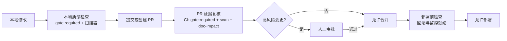

# 从 0 开始一个项目：完整治理路径演示

> **配套文档**：[harness持续治理机制设计(1).md](./harness持续治理机制设计(1).md)
> **演示方式**：真实场景逐步骤模拟 —— 从"我有一个想法"到"第一个功能通过全部治理门禁、完成文档与知识同步、并触发一次规范演进"。
> **演示对象**：`TaskFlow` —— 一个团队内部的任务管理工具（全新空目录，greenfield）。

---

## 如何阅读本文档

| 标记 | 含义 |
|---|---|
| `代码块` | 真实终端命令与输出、或真实文件内容（缩略展示时标注 `…`） |
| 🟡 **决策点** | 必须由**人**确认的事项，AI 不能代替 |
| 🔍 **说明** | Harness 内部机制与设计文档对应章节 |
| ⚠️ **红线** | 违反即被 Harness 拦下的行为 |

本演示的每一步都对应设计文档的章节，附录 B 有完整对照表。建议对照阅读。

---

## 场景设定

- **人物**：小林，产品兼开发，非专业程序员（新手模式）。
- **想法**：给 6 人小团队做一个内部任务管理工具，替代微信群聊里记任务。
- **环境**：Windows + Node.js 22（满足引擎 `>=22` 要求），全新空目录 `D:\taskflow`。
- **目标**：第一版只做"任务创建 / 分配 / 状态流转 / 简单登录"，能跑起来、能上线给团队用。

---

## 阶段 0：起点（一句话需求）

小林在 IDE 里对 Harness 说：

> "我想做一个团队内部的任务管理工具，团队成员能创建任务、分配给别人、把任务从待办改成进行中再改成完成。"

**Harness 任务入口判断**（设计文档 §17.3.6）：

| 判断 | 结果 |
|---|---|
| 只读咨询？ | 否 —— 这句话明显要新建项目、写代码 |
| 项目修改？ | 是，且当前目录是**空目录** → 进入 `greenfield_project_created` |
| 能否直接开写？ | **不能**。项目必须先完成治理配置（设计文档 §15 总前置条件） |

> 🔍 设计文档核心：**先根据业务目标确定"如何工作"，再让 AI 按规则工作。** 未达到 `governance_ready` 之前，AI 不能修改任何业务代码。

Harness 弹给小林的第一条提示（大白话，设计文档 §17.8）：

> "这个项目还没有确定基本工作规则，所以现在不能直接写代码。我会先带你确定：给谁用、要不要登录、涉及什么数据、第一版做什么。大约需要几分钟，中途可以随时保存退出。"

---

## 阶段 1：安装 Harness 与接入

### 1.1 安装

```bash
cd D:\taskflow
npm init -y
npm i -D pallastrade-harness
```

### 1.2 接入项目（推荐 `setup`，先 dry-run 预览）

```bash
npx harness setup --dry-run --preset single --tier standard --name taskflow
```

```text
[dry-run] harness setup --preset single --tier standard
  CREATE harness.config.mjs
  CREATE AGENTS.md
  CREATE lefthook.yml
  CREATE .gitignore
  CREATE harness/policies/anti-patterns.json
  CREATE harness/standards/base-standards.json
  GitHub (您需完成): 启用分支保护 / required checks (Settings → Rulesets)
  撤销: git checkout -- <files>，或删除 setup 生成的配置文件
  下一条: npx harness doctor
```

🔍 `setup` 是唯一推荐入口（`init`/`onboard` 为兼容别名）。预设可选 `single / nextjs / rails / monorepo`，档位可选 `lite / standard / strict`。内部工具类、要上线的项目选 **standard**（比 lite 多了 PRD 工作流 + doc-impact 知识同步门）。

正式接入：

```bash
npx harness setup --preset single --tier standard --name taskflow
git init
```

生成的关键文件 `harness.config.mjs`（节选）：

```js
// harness.config.mjs — taskflow 项目治理配置
export default {
  schemaVersion: '1.0',
  name: 'taskflow',

  layers: [
    { id: 'app',  path: 'src',  label: 'App source' },
    { id: 'test', path: 'test', label: 'Tests' },
  ],

  gates: { expiryHours: { feature: 48, bugfix: 24, docs: 24, ... } },

  // 知识同步门：改了 src 下的公开 API → 必须评估 README / docs/api
  docImpact: { base: 'origin/main', rules: [ /* preset 自带 */ ] },

  paths: {
    gates: 'harness/gates',
    requirements: 'harness/requirements',
    evidence: 'artifacts/harness-evidence',
    prd: 'docs/prd',
    state: '.harness-state',
  },
  ...
};
```

### 1.3 体检

```bash
npx harness doctor
```

```text
✅ git-repo: Git repo detected
✅ node-version: Node v22.x
✅ harness-dirs: All harness directories present
❌ git-hook-installed: Git pre-commit hook NOT installed
   ↳ fix: npm i -D lefthook && npx lefthook install
❌ ci-workflow: No CI workflow (test.yml/ci.yml)
   ↳ fix: Create .github/workflows/test.yml
...
```

```bash
npm i -D lefthook && npx lefthook install
npx harness config:check
```

> 🔍 设计文档 §16.2：安装只建立运行条件，**不会**自动改业务代码、装业务依赖、改生产配置或提交 Git。缺失项标记为阻塞条件。

### 1.4 Agent 接入与能力登记（设计文档 §17.1 / §17.3）

先明确"谁在驾驶、规则由谁执行"——这是设计文档第十七章的角色分工：

| 角色 | 大白话 | 在 TaskFlow 里 |
|---|---|---|
| Agent（Codex/Claude/IDE Agent） | 司机 | 小林 IDE 里的 Agent，负责理解需求、改代码 |
| Harness | 交通规则 + 行车记录仪 | 决定能不能开始、能用什么工具、必须过哪些检查 |
| Agent 适配器 / MCP | 方向盘接口 | 小林通过 MCP + 命令行接入 |
| AI 服务插件 | 可替换的专家 | 需要时（审查/翻译/分类）由 Harness 按能力选择 |
| Skills | 专业工作手册 | `frontend-page`、`api-development` 等 |

接入时必须**能力登记**——安装不等于自动获得信任（§17.3.2）：

```yaml
plugin:
  id: ide-agent-mcp
  kind: agent_adapter
  protocol_version: 1
  capabilities:
    - read_governance_context
    - propose_plan
    - propose_patch
    - run_registered_check
  needs_permission: [project_read, scoped_project_write, registered_command_run]
  cannot_do:
    - change_locked_policy
    - approve_own_high_risk_change
    - write_outside_task_scope
protection_level: guarded   # enforced / guarded / advisory 三选一，诚实标注
```

> 🔍 保护等级（§17.3.1）：小林 IDE 通过 MCP + CLI 接入，能拦截大多数写入，但保存前 Hook 能力有限 → 诚实标为 `guarded`（"已开启保护，但仍需注意"），**不能**声称"已强制保护"。

---

## 阶段 2：治理前置配置（10 步向导）

对应设计文档 **§17.7（从零项目基础搭建向导）** 与 **§15（项目开始前的治理配置）**。Harness 不一次性问 50 个问题，而是分 10 步、每步可保存/退出/恢复，全部使用大白话。

**模式选择**（§14.8 / §17.8）：小林是非专业用户 → 选 **`guided_build` 档位 + 新手显示模式**（少缩写、一次只问一组问题、提供推荐项）；工程细节（任务编号、状态码、内容指纹）放进"技术详情"。**切换显示模式不降低安全等级**——新手模式只是表达更友好，该做的检查一项不少。

### 2.1 第一步：项目卡片（业务目标澄清）

只问会改变整体方案的问题：

```
Q1. 你想做什么，主要给谁用？
    → 团队内部任务管理工具，给 6 人小团队用
Q2. 用户完成哪件事后，项目才算有价值？
    → 成员能创建任务、分派给同事、看到状态从"待办"走到"完成"
Q3. 是否需要登录、收费、审批或多人协作？
    → 需要登录（内部账号）；不需要收费；需要多人协作
Q4. 是否涉及身份证、联系方式、位置、健康、资金等敏感数据？
    → 涉及成员姓名、邮箱（敏感级别：中）；不涉及资金
Q5. 是新项目、旧项目改造，还是替换已有系统？
    → 全新项目
Q6. 预计先做小版本，还是一开始就要承受较大流量？
    → 先做小版本，内部 6 人使用
Q7. 有哪些必须使用或明确不能使用的技术和服务？
    → 无强制；倾向 Node.js + TypeScript
```

**项目卡片**（Harness 生成，未知内容写"还没决定"，不自行补成事实）：

```yaml
# harness/project.yaml
project:
  name: taskflow
  mode: greenfield
  lifecycle: long_lived
  profile:
    product_type: internal_business_tool
    audience: small_operations_team
    data_sensitivity: medium
    delivery_priority: balanced
    risk_domains:
      - authentication
      - business_data
  status: governance_setup_required   # 尚未进入可开发状态
```

🟡 **决策点**：小林确认"登录方式 = 内部邮箱 + 密码（暂不做 SSO）"。未确认项保持 `awaiting_product_decision`。

### 2.2 第二步：业务架构

产出：参与者清单、核心价值、业务能力与边界、关键业务流程、责任归属。

```yaml
business:
  actors:
    - member        # 团队成员：创建/认领/完成任务
    - admin         # 管理员：管理成员、项目
  value: 让任务有归属、有状态、有截止时间，替代口头记任务
  capabilities:
    - task_management     # 任务创建/分配/状态流转
    - member_management   # 成员与角色
    - project_management  # 项目分组
  flows:
    - create_task → assign → in_progress → done
  ownership:
    - task 状态机属于本系统
    - 成员账号认证属于本系统（自建，不接外部 IdP）
  out_of_scope: 计费、审批流、工时统计（第一版不做）
```

### 2.3 第三步：产品架构

把业务能力变成用户看到的结构：

```yaml
product:
  roles:
    - member
    - admin
  modules:
    - 任务列表（按项目/状态筛选）
    - 任务详情（描述、指派人、状态、截止时间）
    - 新建任务表单
    - 成员管理（仅 admin）
  journeys:
    - member_login → view_tasks → create_task → assign → change_status
  states_required: [loading, empty, error, success, forbidden]
  ui:                                       # 设计文档 §18：UI 监督从产品架构就开始
    state_matrix: [loading, empty, error, success, forbidden, disabled]
    design_tokens: .harness/design-tokens.json   # 唯一样式来源（UI-002）
    baseline: ui/reference/                 # 首个页面即建立视觉回归基线（§18.4）
  first_release: [登录、任务 CRUD、状态流转、成员管理]
  later: [通知、搜索、报表]
  not_doing: [看板拖拽（第一版用按钮改状态）]
```

### 2.4 第四步：技术架构（先约束，再给 2~3 个方案）

```
方案 A：Node.js + TypeScript + Express + SQLite（单进程，最简单）
   大白话：一个进程搞定前后端和数据库，适合 6 人内部工具；数据量小不用装数据库服务。
   前端：服务端渲染页面 + 统一设计 token（.harness/design-tokens.json）+ 轻量组件约定。
   成本/难点：后期要拆前后端时会有迁移成本。运维：几乎为零。

方案 B：Next.js 全栈（前后端一体）
   大白话：一套代码同时做页面和接口，生态成熟；但概念多，新手上手稍陡。
   成本/难点：构建链路长一点。运维：中。

方案 C：前后端分离（Vite + Express + PostgreSQL）
   大白话：最"正规"，但需要维护两个项目、装数据库，6 人内部工具暂时过重。
   成本/难点：初期开发慢。运维：高。
```

🟡 **决策点**：小林选择 **方案 A**（Express + TypeScript + SQLite，单层 `src/`）。

技术决定必须记录（不能只有口头结论）：

```markdown
# docs/decisions/0001-use-express-typescript-sqlite.md
# 状态：accepted
# 背景：6 人内部工具，数据量小，单人维护
# 决定：Node.js + TypeScript + Express + SQLite
# 替代方案：Next.js 全栈（过重）；前后端分离 + PostgreSQL（运维成本高）
# 失效条件：团队 > 30 人 或 并发 > 100 时重新评估
```

### 2.5 第五步：数据与数据库结构

先画数据关系，再决定表结构；**未确认业务规则前，不允许把 AI 猜的字段写进正式迁移**。

```yaml
data:
  entities:
    user:      { fields: [id, email, name, role], owner: admin, sensitivity: medium }
    project:   { fields: [id, name, description], owner: admin }
    task:      { fields: [id, title, description, assignee_id, status, project_id, due_date], owner: creator }
  relations:
    project 1—n task
    user 1—n task (as creator / assignee)
  lifecycle:
    task:      [todo, in_progress, review, done]   # 见下方状态机
    user:      软删除（保留历史任务归属）
  sensitivity:
    user.email: medium → 加密存储 + 接口脱敏
  retention: 任务保留，不自动清理
```

🟡 **决策点**：**任务状态机**必须由产品确认，不能 AI 猜：

```
todo → in_progress
todo → review          （可以直接进入评审？→ 小林：可以）
in_progress → review
in_progress → todo     （被打回重做？→ 小林：可以）
review → in_progress
review → done
done → todo            （完成后重新打开？→ 小林：可以）
```

> 🔍 设计文档 §14.1：**关键业务决定必须来自用户或可信资料，不能由 AI 猜出来。** 状态机是业务规则，Harness 把它列为必须人工确认项。

### 2.6 第六步：权限架构

默认最小权限：**没有明确允许的动作就是不允许**。

```yaml
auth:
  identity_source: internal_email_password
  actors: [member, admin]
  resource_actions:
    task:   [create, read, update_status, assign, update, delete]
    member: [manage]            # 仅 admin
    project: [create, read]     # 创建仅 admin
  matrix:
    member: task.create, task.read(自己可见范围), task.update_status(被指派者/创建者)
    admin:  member.manage, project.create, task.delete
  high_risk_actions:
    - user_delete         # 需二次确认
    - project_delete      # 需二次确认
  audit: member.manage, task.delete 必须留审计记录
```

🟡 **决策点**：任务可见范围 —— 全部成员可见（团队小，不搞私有任务）？→ 小林：全部可见。

### 2.7 第七步：安全与风控体系

根据真实风险选择深度（内部工具，非支付/医疗，**不进高风险模式**，但涉及登录与成员数据，需基础项）：

```yaml
security:
  authentication:
    - 密码哈希（argon2），禁止明文
    - 会话：httpOnly cookie + 过期时间
  input:
    - 所有输入校验（zod）
    - SQL 参数化，禁止字符串拼接
  secrets:
    - .env 不进 Git；密钥扫描（harness scan-secrets）纳入 pre-commit
  supply_chain:
    - 新依赖必须写明理由（npm audit 进 CI）
  abuse:
    - 登录限流（每邮箱 5 次/10 分钟）
  audit:
    - 登录成功/失败、任务删除、成员变更写审计日志
  risk_list:
    - R1 越权改他人任务状态 → 权限矩阵 + 服务端校验
    - R2 密码泄露 → argon2 + 限流 + 审计
    - R3 数据误删 → 软删除 + 备份
```

### 2.8 第八步：代码项目架构

Harness **先显示将要创建的目录和文件**，用户确认后才写入；**已有文件绝不静默覆盖**。

```
taskflow/
├── src/
│   ├── server.ts            # 入口
│   ├── app.ts               # Express 装配
│   ├── routes/              # 路由层（薄）
│   ├── services/            # 业务逻辑（状态机、权限在这里）
│   ├── repositories/        # 数据访问
│   ├── domain/              # 实体、状态机定义、错误类型
│   ├── auth/                # 登录、会话、中间件
│   ├── validators/          # zod schema
│   ├── views/               # 服务端渲染页面模板
│   ├── ui/                  # 页面组件（按钮/表单/空态/错误态…）
│   ├── ui-tokens.ts         # 由 design-tokens.json 生成，唯一取色/间距来源
│   └── config.ts            # 环境变量读取 + 校验
├── test/
│   ├── unit/
│   ├── integration/
│   └── ui/                  # 状态矩阵断言测试
├── ui/reference/            # 视觉回归基线截图（golden screenshot，§18.4）
├── docs/
│   ├── decisions/
│   ├── api/
│   └── operations/
├── harness/                 # 治理状态
├── .harness/
│   ├── design-tokens.json   # 设计 token（唯一样式来源，UI-002）
│   └── ui/                  # 页面状态矩阵 <page>-states.yaml（§18.2）
├── .env.example
├── harness.config.mjs
└── AGENTS.md
```

规则（写入 `harness/policies/`）：

- 路由层不写业务逻辑（服务层判断状态机与权限）
- UI 不直接访问数据库（本方案为单层，规则体现为"route → service → repository"单向依赖）
- 公开 API 必须有契约测试
- 新依赖必须写理由（`README` 依赖清单 + PR 说明）
- 禁止密钥进源码
- 样式只使用 design token，禁止硬编码色值与间距（UI-001/UI-002，§18.1）
- 页面必须覆盖六种状态：加载/空/错误/成功/无权限/禁用（UI-003，§18.1）

### 2.9 第九步：Skills 结构与质量底线

根据前八步**只启用真正需要的 Skills**，未启用的不加载：

```yaml
# harness/skills/enabled.yaml
skills:
  enabled:
    - requirements-discovery@1.0.0   # 项目启动：需求澄清
    - api-development@1.2.0          # 新增/修改 API 时
    - database-migration@1.3.0       # schema 变化时（protection: reviewed）
    - authentication@1.0.0           # 登录/会话
    - authorization@1.0.0            # 权限矩阵
    - frontend-page@1.2.0            # 页面开发：状态矩阵→交互→线框→组件（§18.2）
    - testing-quality@1.0.0          # 每个功能
    - documentation-sync@1.0.0       # 任务完成时
  not_enabled:                       # 明确不启用
    - payment-integration            # 不涉及
    - order-state-machine            # 不涉及
    - deployment-kubernetes          # 单进程部署，不需要
  required_for_project_start:
    - requirements-discovery
    - api-development
    - testing-quality
    - documentation-sync
```

质量底线：

```yaml
quality_baseline:
  gate: 全量（greenfield 用 clean_start，见设计文档 §13.9）
  type_errors: blocking
  lint_errors: blocking
  missing_tests_for_new_logic: blocking
  undocumented_public_api: blocking
  security_regressions: blocking
  test_coverage: 关键路径 ≥ 80%（登录、状态机、权限）
  ui_anti_patterns: blocking          # inline style / 硬编码色 / 裸网络调用（§18.1）
  ui_states_complete: blocking        # 六种状态齐全（§18.1）
  visual_regression: blocking         # golden screenshot 像素 diff（§18.4）
  ui_approval: blocking               # 页面需人工确认（§18.5）
```

### 2.10 第十步：确认并生成项目底座

Harness 给出确认单（大白话）：

```
我们在做什么：给 6 人小团队做一个内部任务管理工具
已经确定：
  · 需要登录（邮箱+密码）
  · 任务状态：待办→进行中→评审→完成（可打回/重开）
  · 技术：Node.js + TypeScript + Express + SQLite
  · 权限：成员/管理员两级
  · 页面：统一设计 token + 六种状态矩阵 + 视觉回归基线（设计文档 §18）
还没决定：
  · 无（当前没有未决阻塞项）
第一版包含：登录、任务 CRUD、状态流转、成员管理
最大风险：R1 越权改他人任务；R2 密码泄露
将创建/修改：harness.config.mjs、AGENTS.md、src/ 目录骨架、docs/ 骨架、.env.example…
建好后第一项任务：PRD-「任务创建与分配」→ 编码实现

[确认生成]  [调整]
```

🟡 **决策点**：小林点 **确认生成**。Harness 写入项目底座，并把本次所有决定保存为**第一个治理版本**。

### 2.11 治理自检与版本锁定

```bash
npx harness scan            # 资产治理自检（skills/standards/agent/PRD/scenarios/索引）
npx harness skill check --freshness
npx harness standards validate
npx harness config:check
```

自检通过后锁定初始治理版本（设计文档 §15.9）：

```yaml
# harness/governance/versions/governance-0.1.0.yaml
governance_bootstrap:
  status: ready
  project_profile_confirmed: true
  project_mode_confirmed: true        # greenfield
  risk_domains_identified: true       # authentication, business_data
  skills_selected_and_versioned: true
  prd_category_selected: true         # workflow_system + internal_tool
  prd_template_selected: true         # workflow-system-prd@1.1.0
  coding_policy_selected: true        # coding-policy@1.0.0
  style_policy_selected: true         # style-policy@1.0.0
  ui_governance_configured: true      # 设计 token + 状态矩阵 + 视觉回归基线（§18）
  quality_gates_executable: true
  permissions_configured: true
  blocking_conflicts: 0
  initial_governance_version: governance-0.1.0
```

> 🔍 结束条件不是"文件已生成"，而是 **`blocking_conflicts: 0`**。只有达到 `governance_ready`，才允许进入需求、任务与编码流程。

此时 `harness next` 会告诉你下一步：

```json
{ "taskId": null, "gateId": null, "phase": "no-task",
  "blockingReason": "governance_ready; create first PRD",
  "nextAction": "npx harness prd new --title \"新增：任务创建与分配\"",
  "commands": ["npx harness prd new --title \"新增：任务创建与分配\""],
  "humanDecisionRequired": false }
```

---

## 阶段 3：第一个 PRD

### 3.1 创建 PRD（自动分类 + 查重）

```bash
npx harness prd new --title "新增：任务创建与分配"
```

```text
✅ PRD 骨架已创建: docs/prd/workflow/PRD-20260828-workflow-任务创建与分配.md
   分类: workflow（关键词命中 3）
   下一步: AI 按 _TEMPLATE.md 完整扩充 → 用户确认 → harness gate
```

🔍 `prd new` 做了两件事：**自动分类**（关键词评分，命中 `workflow`）和**查重**（与已有 PRD 算相似度，>0.3 会阻止新建并提示回写）。当前是第一个 PRD，无重复，正常创建。

> 主分类 `workflow_system`，附加分类 `internal_tool`。设计文档 §15.5：workflow_system 必须定义**状态、允许的转换、角色和异常流转**——这正好对应我们 2.5 步确认的状态机。

### 3.2 PRD 完整内容（AI 扩充 → 小林确认）

```markdown
# PRD-20260828-workflow-任务创建与分配

| 元数据 | 值 |
|---|---|
| 状态 | reviewing |
| 创建日期 | 2026-08-28 |
| 来源 | 新增：任务创建与分配 |
| 分类 | workflow（主） + internal_tool（附加） |

## 1. 背景与目标
- 背景：团队靠口头/群聊记任务，无归属、无状态、无截止时间
- 目标：成员能创建任务、指派同事、推进状态到完成
- 成功指标：团队 80% 任务在系统内流转；平均任务完成周期可查

## 2. 用户故事
- 作为 成员，我希望 创建任务并指派给同事，以便 任务有明确负责人
- 作为 被指派者，我希望 把任务从待办改为进行中/完成，以便 反映真实进度
- 场景：正常流（创建→指派→改状态）、边界（空标题、截止时间在过去）、
       异常（未登录、指派不存在用户、无权改状态）

## 3. 功能需求
- FR-001：登录用户可创建任务（标题必填，描述可选，指派给任一成员，截止时间可选）
- FR-002：任务状态按已确认状态机流转（todo→in_progress→review→done，可打回/重开）
- FR-003：创建者或被指派者可更新状态；其他成员只读
- FR-004：任务列表按项目/状态筛选
- FR-005：任务列表与表单页面覆盖六种状态（加载/空/错误/成功/无权限/禁用），
         样式统一使用设计 token（设计文档 §18）

## 4. 非功能需求
- 登录失败限流；密码 argon2；接口统一错误格式 { error: { code, message } }
- 响应式（桌面 1280 / 移动 375 均可用）；键盘可导航；对比度达标；无硬编码色值

## 5. 验收标准（AC，与测试一一映射）
- AC-001 ← FR-001：POST /api/tasks 用合法数据返回 201 且任务入库
- AC-002 ← FR-001：标题为空返回 400，错误信息可读
- AC-003 ← FR-002：todo→done 直接跳转返回 409（必须经过中间状态）
- AC-004 ← FR-003：非创建者/被指派者改状态返回 403
- AC-005 ← FR-001：未登录创建任务返回 401
- AC-006 ← FR-004：GET /api/tasks?status=todo 只返回待办任务
- AC-007 ← FR-005：任务列表与设计 token 基准截图对比，像素差异 ≤ 0.1%（视觉回归，§18.4）
- AC-008 ← FR-005：空/错误/加载/无权限/禁用状态均有对应 UI 与文案（状态矩阵，§18.2）
- AC-009 ← FR-005：375px 与 1280px 视口无横向溢出，键盘可完成创建任务（可访问性）

## 6. 技术影响
- 涉及：src/routes/tasks.ts、src/services/task-service.ts、src/domain/task-state.ts、
        src/repositories/task-repo.ts、数据库迁移（tasks 表）
- 涉及 UI：src/views/（任务列表/表单模板）、src/ui/（组件）、.harness/design-tokens.json
- 视觉：新增 ui/reference/ 基线截图；首个页面建立视觉回归基线（§18.4）
- 影响面：`harness affected --base origin/main` 输出

## 7. 测试计划
- 新增：test/unit/task-state.test.ts（状态机）、test/unit/task-service.test.ts、
       test/integration/tasks.api.test.ts
- 新增 UI：test/ui/states.test.ts（状态矩阵断言）、ui/reference/ 视觉回归基线
- AC 映射：AC-001~006 → API 测试文件（标注 "PRD-20260828-workflow-任务创建与分配 AC-x"）；
          AC-007~009 → 视觉回归 + UI 测试 + 人工 ui-approval 证据

## 8. 文档同步清单（知识同步门）
- docs/api/tasks.md（新增）、README.md（功能列表）、.env.example（若有新变量）
```

🟡 **决策点**：小林审阅 PRD，确认 AC 无遗漏后把状态改为 `approved`。**只有用户或负责人能把 PRD 从 reviewing 改成 approved**（设计文档 §17.6.4）。

### 3.3 PRD 质量门禁

```bash
npx harness prd verify --id PRD-20260828-workflow-任务创建与分配
```

> 此时会报 AC 无测试覆盖（还没写代码）——**这是预期**。PRD 门禁要求"每条 AC 都能被测试、检查或人工验收"，并会在实现阶段用 `prd verify` 再次验证 AC↔测试追溯。
>
> UI 类 AC（AC-007~009）在实现阶段由视觉回归 + 人工 `ui-approval` 验收，而不是单元测试标注——这属于设计文档 §18 的 UI 验收闭环。

---

## 阶段 4：第一个任务完整生命周期

对应设计文档 §16.5–16.8 与仓库 `AGENTS.md` 的强制流程。**核心原则：任务执行者不能自行放宽约束自己的规则**（设计文档 §五）。

### 4.1 创建任务

```bash
npx harness task start --title "新增：任务创建与分配" \
  --allow "src/**" "test/**" "docs/api/**" "docs/prd/**" \
  --ac PRD-20260828-workflow-任务创建与分配 AC-001,AC-002,AC-003,AC-004,AC-005,AC-006
```

```json
{
  "id": "TASK-20260828103000-8f1a2b3c",
  "title": "新增：任务创建与分配",
  "status": "planned",
  "type": "feature",
  "acceptance_criteria": ["AC-001","AC-002","AC-003","AC-004","AC-005","AC-006"],
  "changePlan": { "allow": ["src/**","test/**","docs/api/**","docs/prd/**"],
                  "deny": ["**/package-lock.json"] },
  "requiredEvidence": ["test", "review", "knowledge"]
}
```

> 🔍 设计文档 §19.4：任务与 AC 双向强制绑定（`--ac`），任务完成时校验声明的 AC 全部有通过测试、PRD 中无未认领 AC。

### 4.2 构建项目上下文

```bash
npx harness brain context --task TASK-20260828103000-8f1a2b3c
```

```text
✅ Context pack CTX-xxxx: 14 selected asset(s).
   · harness/project.yaml（项目画像）
   · docs/decisions/0001-use-express-typescript-sqlite.md
   · harness/policies/permissions.yaml（权限矩阵）
   · harness/skills/api-development@1.2.0、authorization@1.0.0 …
   · docs/prd/workflow/PRD-20260828-workflow-任务创建与分配.md
```

> 🔍 设计文档 §16.6：Harness 只注入本次执行需要的最小上下文，**不会把所有 Skills 全部塞给 Agent**。

### 4.3 风险评估

```bash
npx harness risk check --task TASK-20260828103000-8f1a2b3c
```

```text
✅ Risk critical: 涉及 authentication + authorization 域；任务状态机变更触及业务数据
```

> 🔍 涉及权限与业务数据的任务自动升级为 **critical**，要求人工审批环节与恢复预案（`recovery create`）。

### 4.4 打开 Gate（绑定任务）

```bash
npx harness gate --task "新增：任务创建与分配" --task-id TASK-20260828103000-8f1a2b3c
```

```text
🛑 PRE-CODING GATE — GATE-2026-08-28T10-30-12
   [ ] search-bin / search-presets / search-templates / search-rules / search-docs
       （跨层搜索）
   [ ] verify-test (verification)   ← 只能由 typed evidence 关闭
   [ ] plugin-no-todos
   [ ] db-migration-rollback        ← 触及数据库，要求可回滚迁移
   [ ] permission-matrix            ← 触及权限，要求与权限矩阵一致
   [ ] ui-anti-patterns (preparation)   ← 触及页面，禁止 inline style / 硬编码色（§18.1）
   [ ] visual-regression (verification) ← 页面截图像素 diff（§18.4）
   [ ] ui-approval (verification)       ← 需要人工确认页面效果（§18.5）
   [ ] task-ac-traceability (preparation)   ← 任务与 AC 双向绑定（§19.4）
   [ ] ac-semantic-validity (verification)  ← AC 必须有真实断言（§19.2）
   [ ] coverage-gate (verification)         ← 关键路径覆盖率 ≥ 80%（§19.3）
   🛑 PREPARATION NOT CLEARED — AI MUST NOT write or edit implementation files.
```

**实施前**，AI 完成跨层搜索（不只在 src/ 找一遍就下结论），然后清除 preparation 检查：

```bash
npx harness gate:clear --gate GATE-2026-08-28T10-30-12 --clear search-bin
npx harness gate:clear --gate GATE-2026-08-28T10-30-12 --clear search-presets
# … search-templates / search-rules / search-docs / plugin-no-todos
npx harness gate:clear --gate GATE-2026-08-28T10-30-12 --clear db-migration-rollback
npx harness gate:clear --gate GATE-2026-08-28T10-30-12 --clear permission-matrix
npx harness gate:clear --gate GATE-2026-08-28T10-30-12 --clear ui-anti-patterns
npx harness gate:clear --gate GATE-2026-08-28T10-30-12 --clear task-ac-traceability
npx harness gate:status
```

```text
✅ Preparation complete. Implementation may continue.
   Remaining before finish: verify-test（只能由证据关闭）
```

### 4.5 生成允许/禁止修改范围与适用规范

```bash
npx harness supervise plan --task "新增：任务创建与分配" --allow "src/**" "test/**"
```

```text
✅ 执行范围: src/** test/** docs/api/** docs/prd/**（deny: **/package-lock.json）
✅ 适用规范: coding-policy@1.0.0、style-policy@1.0.0、permissions.yaml
✅ 必需证据: test / review / knowledge / ui-approval（UI 类任务，§18.5）
✅ 活动 Skills: api-development@1.2.0、authorization@1.0.0、database-migration@1.3.0、frontend-page@1.2.0
✅ UI 监督: 状态矩阵 + 设计 token + 视觉回归基线（设计文档 §18）
```

### 4.6 实施代码（真实场景节选）

**状态机**（`src/domain/task-state.ts`，业务规则以 2.5 步用户确认为准）：

```ts
export const TASK_STATES = ['todo', 'in_progress', 'review', 'done'] as const;
export type TaskState = (typeof TASK_STATES)[number];

// 用户确认的允许转换（来自 PRD + 项目卡片，AI 不得自行增减）
export const ALLOWED_TRANSITIONS: Record<TaskState, TaskState[]> = {
  todo:        ['in_progress', 'review'],
  in_progress: ['review', 'todo'],
  review:      ['in_progress', 'done'],
  done:        ['todo'],
};

export function canTransition(from: TaskState, to: TaskState): boolean {
  return ALLOWED_TRANSITIONS[from]?.includes(to) ?? false;
}
```

**服务层**（`src/services/task-service.ts`，权限判断在这里，不放在路由）：

```ts
export function updateTaskStatus(
  task: Task,
  actor: User,
  to: TaskState,
): Task {
  // 权限：创建者或被指派者才能改状态（permissions.yaml）
  if (actor.id !== task.creatorId && actor.id !== task.assigneeId) {
    throw new ForbiddenError('只有创建者或被指派者可以更新任务状态');
  }
  if (!canTransition(task.status, to)) {
    throw new ConflictError(`不允许从 ${task.status} 直接变为 ${to}`);
  }
  return { ...task, status: to, updatedAt: new Date() };
}
```

**测试**（`test/unit/task-state.test.ts`，标注 PRD AC 以便追溯）：

```ts
import { test } from 'node:test';
import assert from 'node:assert/strict';
import { canTransition } from '../../src/domain/task-state.js';

// PRD-20260828-workflow-任务创建与分配 AC-003
test('AC-003: todo 不能直接跳转 done', () => {
  assert.equal(canTransition('todo', 'done'), false);
});

test('todo → in_progress 允许', () => {
  assert.equal(canTransition('todo', 'in_progress'), true);
});
```

**数据库迁移**（可回滚）：

```sql
-- migrations/0001_create_tasks.sql
CREATE TABLE tasks (
  id TEXT PRIMARY KEY,
  title TEXT NOT NULL,
  description TEXT,
  creator_id TEXT NOT NULL,
  assignee_id TEXT,
  status TEXT NOT NULL DEFAULT 'todo' CHECK (status IN ('todo','in_progress','review','done')),
  project_id TEXT,
  due_date TEXT,
  created_at TEXT NOT NULL DEFAULT (datetime('now')),
  updated_at TEXT NOT NULL DEFAULT (datetime('now'))
);

-- ROLLBACK:
-- DROP TABLE tasks;
```

**状态矩阵**（`.harness/ui/task-list-states.yaml`，编码前必须先落盘，§18.2）：

```yaml
page: task-list
states:
  loading:    骨架屏 + 禁用筛选
  empty:      EmptyState「还没有任务，新建第一个」
  error:      错误横幅 + 重试按钮
  success:    状态变更成功提示
  forbidden:  无权限提示（非创建者/被指派者尝试改状态）
  disabled:   未登录时创建按钮禁用
```

**页面组件**（`src/ui/status-badge.tsx`，样式只来自 design token，禁止 inline style / 硬编码色）：

```tsx
// ✅ 只使用 token 生成的类名（UI-001/UI-002）
import { tokenClass } from '../ui-tokens.js';

const STATUS_META: Record<TaskState, { label: string; cls: string }> = {
  todo:        { label: '待办',   cls: tokenClass('badge-neutral') },
  in_progress: { label: '进行中', cls: tokenClass('badge-info') },
  review:      { label: '评审',   cls: tokenClass('badge-warning') },
  done:        { label: '完成',   cls: tokenClass('badge-success') },
};

export function StatusBadge({ status }: { status: TaskState }) {
  return <span className={`badge ${STATUS_META[status].cls}`}>{STATUS_META[status].label}</span>;
}
```

**停止与升级：需求空白被拦截**（设计文档 §14.3）——实施任务详情页时，AI 发现"任务逾期后是否自动关闭"在 PRD 里没有定义，不能靠猜测继续：

```text
🔴 ESCALATED — 无法继续
  已完成: 状态机、服务层、列表页、详情页骨架
  冲突: 需求存在空白 —— 逾期任务的行为未定义
  风险: 若 AI 猜一个行为上线，可能与业务预期不符
  需要决策: 逾期任务是否自动关闭？
  恢复条件: 决策确认 + 状态矩阵补充该行为 + AC 判定更新
```

🟡 **决策点**：小林决策"逾期**不自动关闭**，仅列表高亮提醒"。Harness 更新状态矩阵（列表页增加 `overdue` 展示状态）、更新 AC-008 判定、写入 PRD 变更记录，然后恢复任务——**AI 不会用自己的猜测替用户做业务决定**（§14.1）。

### 4.7 实施中与实施后检查

```bash
npx harness supervise diff                 # 范围、依赖、架构、循环、新代码质量
npx harness standards coverage            # 机器执行/Review/仅文档 覆盖率
npx harness scan-anti-patterns scan --files $(git diff --name-only)
npx harness scan-secrets scan --files $(git diff --name-only)
npx harness-scan-ui-anti-patterns scan --files $(git diff --name-only)   # UI-001/002（§18.1）
npx harness visual:diff --base origin/main                               # 视觉回归（§18.4）
npx harness verify coverage --task TASK-20260828103000-8f1a2b3c          # 关键路径覆盖率（§19.3）
npx harness generated:check                # 生成文件未漂移
```

> ⚠️ **红线**：若实现违反了 `permissions.yaml`（例如把权限判断写进路由、或允许越权改状态），`supervise diff` 会输出阻塞 finding，AI 必须先修复代码，**不能**为此修改规范放行。

**跨产物一致性检查**（设计文档 §十）——验证"需求→任务→代码→测试→文档"追踪链是否完整：

```text
REQ-任务创建 → AC-003 → TASK-… → src/domain/task-state.ts
    → test/unit/task-state.test.ts（标注 AC-003）→ docs/api/tasks.md
```

```bash
npx harness sync-check --base origin/main   # 知识同步评估门
npx harness check --profile quick           # 一致性检查档案
```

链上任何一环缺失（AC 无任务认领、公开路由不在 API 文档、环境变量未进 `.env.example`）→ 产生治理告警，`verify-test` 保持开放。

### 4.8 客观验证（受信验证器注册表）

```bash
npx harness verify unit --task TASK-20260828103000-8f1a2b3c
```

```text
✅ test verifier passed: 23 passed, 0 failed
   · task-state.test.ts（状态机，AC-003）
   · task-service.test.ts（权限，AC-004）
   · tasks.api.test.ts（接口，AC-001/002/005/006）
```

```bash
npx harness visual:diff --base origin/main
```

```text
✅ visual regression: 12/12 baselines within threshold (max diff 0.0008 ≤ 0.001)
```

```bash
npx harness verify coverage --task TASK-20260828103000-8f1a2b3c
```

```text
✅ coverage verifier passed: critical paths 84% ≥ 80%（状态机/权限/登录 全部达标）
```

```bash
npx harness prd verify --semantic --id PRD-20260828-workflow-任务创建与分配
```

```text
PRD PRD-20260828-workflow-任务创建与分配: 9 个 AC（语义校验）
  ✅ AC-001 → 1 个测试文件（含真实断言）
  ✅ AC-002 → 1 个测试文件（含真实断言）
  ✅ AC-003 → 1 个测试文件（含真实断言）
  ✅ AC-004 → 1 个测试文件（含真实断言）
  ✅ AC-005 → 1 个测试文件（含真实断言）
  ✅ AC-006 → 1 个测试文件（含真实断言）
  ✅ AC-007 → 视觉回归（ui/reference/）
  ✅ AC-008 → test/ui/states.test.ts
  ✅ AC-009 → test/ui/states.test.ts + ui-approval
✅ 全部 AC 已有测试覆盖，无空断言/全 mock（§19.2）
```

> 🔍 设计文档 §17.4.4：**AI 的回答不能冒充测试结果。** `verify-test` 只能由真实测试运行（受信验证器）产生的 typed evidence 关闭；任何 `evidence run --type test -- <任意命令>` 都会被标记为 `diagnostic`，不满足 Gate。

### 4.9 记录证据（review / knowledge）

```bash
npx harness evidence record --task TASK-20260828103000-8f1a2b3c \
  --type review --summary "状态机与权限实现符合 PRD；越权路径已由 AC-004 覆盖" --approve
npx harness evidence record --task TASK-20260828103000-8f1a2b3c \
  --type knowledge --summary "新增 docs/api/tasks.md；README 功能列表已同步" --approve
npx harness evidence record --task TASK-20260828103000-8f1a2b3c \
  --type ui-approval --summary "小林已查看桌面/移动截图与六种状态，确认与设计稿一致" --approve
```

> 🔍 设计文档 §14.2：**Reviewer 不读取 Implementer 的自我总结**，只读取任务、规范、变更和验证结果；审查结论必须引用具体文件/测试/运行证据。上面的 review evidence 只是"记录"，真正放行的是机器检查 + 黑盒测试。

### 4.10 关闭 verification（只能通过证据）

```bash
npx harness evidence verify --task TASK-20260828103000-8f1a2b3c --gate GATE-2026-08-28T10-30-12
npx harness gate:status
```

```text
✅ GATE-2026-08-28T10-30-12 CLEARED
   Remaining before finish: (none)
```

### 4.11 完成任务

```bash
npx harness task finish --task TASK-20260828103000-8f1a2b3c
npx harness gate:status
```

```text
✅ Task TASK-20260828103000-8f1a2b3c completed
```

---

## 阶段 5：治理演进（规范、Skill、知识、决策）

### 5.1 场景 A：规范不适用 → 治理提案（不是当场改规则）

**触发**：第二个任务"新增任务评论"时，AI 发现 `coding-policy@1.0.0` 要求"所有公开 API 必须有契约测试"，但项目目前没有契约测试基础设施，只有集成测试。

**正确做法**（设计文档 §五：规则修改必须与任务执行隔离）：

```text
任务失败（契约测试要求无法满足）
  → 优先修复实现（先补一个最小的契约测试示例，让规则可执行）
  → 若确认规范不合理：创建治理提案 PROP-001
  → 独立 Governance Agent 审查
  → 运行历史项目回归（用已完成的 TASK-xxx 验证新规范不降低质量）
  → 根据保护级别请求批准
  → 下一次任务开始时生效（当前任务继续用 governance-0.1.0）
```

```yaml
# harness/governance/proposals/PROP-001.yaml
proposal:
  id: PROP-001
  subject: 将"公开 API 必须契约测试"细化为"公开 API 必须有契约或集成测试（新增 API 时）"
  reason: 项目无契约测试基础设施，0.1.0 规则在当前阶段不可执行
  impact_analysis:
    affected_tasks: [TASK-…评论功能]
    affected_docs: [docs/decisions/…, coding-policy]
    regression: 用 3 个历史 API 任务重跑，成功率不降
  protection: reviewed
  status: proposed
```

🟡 **决策点**：用户批准 PROP-001 → 发布 `coding-policy@1.1.0` → 记录 `governance-0.2.0`。**当前任务仍用 0.1.0 完成，不静默切换**。

> ⚠️ 红线：AI **绝不能**把测试覆盖率从 80% 改成 50% 来让自己通过。这是整个机制最重要的安全设计。

### 5.2 场景 B：重复模式 → Skill 候选 → 回归 → 发布

**触发**：三个 API 任务都重复了同一动作"新增 API 后同步 OpenAPI 文档 + 契约测试"。Harness 识别出重复模式，**不自动发布**，先进入候选池：

```yaml
# harness/knowledge/skill_candidates.yaml
skill_candidate:
  id: candidate-001
  pattern: 新增 API 后同步 OpenAPI 文档和契约测试
  observations: [TASK-…创建任务, TASK-…任务评论, TASK-…任务附件]
  success_rate: 0.95
  proposed_scope: repository
  action: update_existing_skill
  target: api-development
```

评估（设计文档 §14.7 与 §17.5.4）：

- 与已有 Skill 是否重复 → 否，`api-development@1.2.0` 未覆盖文档同步细节
- 是否把项目特例错误泛化 → 否，这是通用 API 工作流
- 是否请求过宽工具权限 → 否，仅 `read_files / edit_openapi / run_tests`
- 是否降低已有质量门 → 否
- 能否在历史任务上复现 → 用 3 个历史任务重跑，全部通过
- 是否明确失败/退出条件 → 是（OpenAPI 校验失败即停止）

```bash
npx harness skill audit --generate   # 生成/更新缺失 Skill 并注册索引
npx harness skill check --freshness  # 结构 + 索引 + 权威路径新鲜度校验
```

🟡 **决策点**：Governance Reviewer 通过 → 发布 `api-development@1.3.0`（带版本号、变更记录、回滚版本）。不通过则拒绝并记录原因，不会发布。

### 5.3 场景 C：知识生命周期（candidate → verified → active）

**触发**：任务调试中发现"SQLite 在测试环境必须显式设置 `TZ=UTC`，否则日期断言全挂"。这是可复用经验，沉淀为知识条目：

```yaml
# harness/knowledge/patterns/KB-001.yaml
knowledge:
  id: KB-001
  statement: 本项目测试环境必须显式设置 TZ=UTC，否则 datetime('now') 与断言偏移
  evidence:
    - test: test/unit/task-state.test.ts（日期边界用例）
  scope: repository
  confidence: verified
  last_verified: 2026-08-28
  invalidation_triggers:
    - date_library_changed
    - test_runtime_changed
```

> 🔍 设计文档 §八：知识生命周期 `candidate → verified → active → stale → archived`。Harness 周期性检查：无来源的知识、引用失效文件的条目、互相矛盾的规则、长期未触发的 Skill，并合并重复、降级无法复现的结论。

### 5.4 场景 D：决策记录（ADR）

**触发**：实现中确认"任务删除用软删除（保留历史归属）"。这是产品决策，写入 ADR，**不覆盖历史**：

```markdown
# docs/decisions/0002-soft-delete-tasks.md
# 状态：accepted
# 背景：任务删除后仍需保留历史归属与审计
# 决定：tasks 表增加 deleted_at 字段，接口默认过滤已删除；硬删除仅 admin 可做且记审计
# 替代：物理删除（丢失历史，被否）
```

### 5.5 场景 E：文档影响分析

```bash
npx harness doc-impact --base origin/main
npx harness docs:check
```

```yaml
documentation_impact:
  task: TASK-20260828103000-8f1a2b3c
  changes:
    - type: public_api_added
      name: POST /api/tasks, PATCH /api/tasks/:id/status, GET /api/tasks
      affected_documents: [docs/api/tasks.md, README.md]
      status: required          # 已更新
    - type: environment_variable_added
      name: SESSION_SECRET, DATABASE_PATH
      affected_documents: [.env.example, docs/operations.md]
      status: required          # 已更新
    - type: internal_refactor
      affected_documents: []
      status: no_update
      reason: 未改变公开行为或运维方式
```

> 🔍 "无需更新"也是合法结论，但**必须记录理由与证据**（设计文档 §14.6）。

### 5.6 场景 F：UI 视觉回归基线更新（也必须走提案）

**触发**：徽章改版后，视觉回归 diff 超阈值。AI 不能直接"更新基线"掩盖回归，基线变更与设计稿改版一样走治理提案：

```yaml
# harness/governance/proposals/PROP-002.yaml
proposal:
  id: PROP-002
  subject: 更新视觉回归基线（状态徽章配色改版）
  reason: 设计稿 v2 调整状态徽章语义色，属有意变更
  evidence:
    - 设计稿引用: figma/taskflow-v2
    - 前后对比截图: artifacts/visual-baseline/badge-compare.png
  review: 独立审查确认变更与设计稿一致
  status: proposed
```

🟡 **决策点**：用户确认后基线才更新。**执行 Agent 不能自行更新基线掩盖回归**（设计文档 §18.4 红线）。

### 5.7 场景 G：后台治理任务（设计文档 §16.10）

除用户操作外，Harness 定期/事件驱动执行维护任务，**不悄悄改变项目行为**，只生成报告与待处理任务：

| 触发 | 动作 |
|---|---|
| 依赖升级（如 sqlite 大版本） | 重新验证相关 Skills、规则、知识（KB-001 的 TZ 经验可能失效） |
| 文档引用不存在的文件 | 生成修复任务 |
| 规则互相冲突 | 暂停受影响任务 |
| 长期未触发的 Skill | 进入复核队列 |
| 已替代的 ADR | 标记为历史状态 |

```bash
npx harness skill check --freshness     # 权威路径新鲜度 + gate 幽灵引用检测
npx harness knowledge assess            # 对受影响知识资产做显式闭环评估
```

---

## 阶段 6：完成报告与持续治理

### 6.1 任务完成报告

最终报告不是"改了 5 个文件"，而是完整治理结论（设计文档 §十二）：

```yaml
task_result:
  task: TASK-20260828103000-8f1a2b3c
  governance_version: governance-0.1.0
  acceptance: passed            # 9/9 AC（含 UI AC-007~009），prd verify --semantic 通过
  ac_semantic: passed           # 每项 AC 有真实断言，0 空断言/全 mock（§19.2）
  coverage_gate: passed         # 关键路径 84% ≥ 80%（§19.3）
  task_ac_traceability: passed  # 任务↔AC 双向绑定，无未认领 AC（§19.4）
  code_quality: passed          # typecheck / lint / anti-patterns / generated:check
  security: passed              # secrets 扫描、权限矩阵一致、依赖审计
  ui_checks:
    anti_patterns: passed       # UI-001/002 扫描 0 违规
    state_matrix: passed        # 六种状态齐全
    visual_regression: passed   # 12/12 基线在阈值内
    ui_approval: obtained       # 人工确认截图（ui-approval 证据）
  documents_updated:
    - docs/api/tasks.md
    - README.md
    - .env.example
    - docs/operations.md
  decisions_added:
    - ADR-0002（软删除）
  knowledge:
    added: [KB-001]
    updated: []
  skills:
    proposal: [PROP-001]
    published: [api-development@1.3.0]   # 后续治理批次
  unresolved_risks: []
  rollback_available: true      # 迁移可回滚 + Git 可回退
```

### 6.2 治理版本演进表

| 版本 | 时间 | 变更 | 方式 |
|---|---|---|---|
| `governance-0.1.0` | 项目启动 | 初始配置锁定（Skills/PRD/编码/样式/权限/质量门/UI 监督） | 向导 + 用户确认 |
| `governance-0.2.0` | 第 2 个任务后 | coding-policy@1.0.0 → 1.1.0（PROP-001） | 提案 → 独立审查 → 回归 → 批准 |
| `governance-0.3.0` | 徽章改版后 | style-policy@1.0.0 → 1.1.0 + 视觉回归基线 v2（PROP-002） | 提案 → 独立审查 → 批准 |

> 设计文档 §15.9：配置版本**可演进但不可被当前任务静默修改**。已开始的任务继续用原版本，除非用户明确批准迁移。

### 6.3 接下来：提交、CI、部署



```bash
# lefthook.yml（setup 已生成）
# pre-commit: harness gate:required + scan-anti-patterns + scan-secrets
# pre-push:   harness doc-impact --base origin/main
```

### 6.4 用户视角：小林在不同阶段会看到什么（设计文档 §16.12 / §14.9）

| 内部状态 | 小林看到的提示 | 小林的动作 |
|---|---|---|
| `governance_setup_required` | 还需要先确定项目的工作规则 | 确认目标、风险、规范 |
| `awaiting_clarification` | 这个需求还有关键行为没定义 | 回答业务问题（如逾期任务行为） |
| `executing` | 正在按项目规则实现 | 查看进度 |
| `repair_required` | 检查发现问题，正在修复 | 查看失败原因，必要时介入 |
| `awaiting_decision` | 这里需要你决定产品行为 | 选择或补充业务规则 |
| `awaiting_approval` | 这是高影响变更，需要人工批准 | 批准 / 拒绝 / 要求修改 |
| `completed` | 代码、检查、文档和记录已同步 | 查看报告和变更 |
| `escalated` | 自动处理已停止，需要人工处理 | 接管任务或调整范围 |

**责任边界**（§14.9）：

- **小林（用户/负责人）**：确认业务行为、批准高影响决策、确认上线；
- **Harness**：执行流程、收集证据、拦截危险动作、保留可追溯性；
- **人类工程师**：审查高风险变更、批准规则变化、处理未解决的歧义。

Harness 帮助生成、检查和解释，但**不替用户承担业务责任、生产责任和合规责任**。

---

## 附录

### A. 命令速查表

| 阶段 | 命令 |
|---|---|
| 安装接入 | `npm i -D pallastrade-harness` → `npx harness setup --preset single --tier standard --name <app>` |
| 体检 | `npx harness doctor` / `npx harness config:check` |
| 治理自检 | `npx harness scan` / `npx harness skill check --freshness` / `npx harness standards validate` |
| PRD | `npx harness prd new --title "…"` / `prd list` / `prd verify --id PRD-xxx` |
| 任务 | `npx harness task start --title "…" --allow "src/**"` → `brain context` → `risk check` → `gate` |
| 实施监督 | `npx harness supervise plan` / `supervise diff` / `standards coverage` |
| 验证 | `npx harness verify unit --task <id>` / `evidence record` / `evidence verify` |
| AC/覆盖率/追溯 | `harness prd verify --semantic` / `harness verify coverage` / `task start --ac PRD-xxx AC-1,AC-2`（§19） |
| 完成 | `npx harness task finish --task <id>` / `gate:status` |
| 知识/演进 | `npx harness doc-impact --base origin/main` / `docs:check` / `skill audit` / `knowledge assess` |
| 一致性/后台 | `npx harness sync-check --base origin/main` / `check --profile quick` / `skill check --freshness`（§十 / §16.10） |
| UI 监督 | `harness-scan-ui-anti-patterns` / `visual:baseline` / `visual:diff` / `evidence record --type ui-approval` |
| 零认知 | `npx harness next` / `npx harness do "新增：…"` / `npx harness tui` |

### B. 与设计文档章节对照表

| 本演示阶段 | 设计文档章节 |
|---|---|
| 阶段 0 需求判断 | §17.3.6 哪些任务需要正式接管 |
| 阶段 1 安装接入 | §16.1–16.2 安装后生命周期 / §16.4 用户接入已有项目（对称） |
| 阶段 1.4 Agent 接入 | §17.1 角色分工 / §17.3.1–17.3.2 接入方式与能力登记 |
| 阶段 2 治理前置配置 | §15 项目开始前的治理配置 / §17.7 从零项目基础搭建向导 |
| 阶段 2 模式选择 | §14.8 按风险和用户模式控制流程成本 / §17.8 大白话输出层 |
| 阶段 2.3/2.8/2.9 UI 配置 | §18.1 约束层 / §18.2 生成层 / §18.8 从零项目 UI 基线 |
| 阶段 2.11 版本锁定 | §15.9–15.10 锁定配置版本 / governance definition of ready |
| 阶段 3 PRD | §17.6 PRD 模板、分类、查重、回写规则 |
| 阶段 3 PRD UI-AC | §18.3 设计稿对齐 / §18.4 视觉回归基线 |
| 阶段 4 任务生命周期 | §16.5–16.8 事件驱动执行 / §13.9 统一完成协议 |
| 阶段 4.6 停止升级 | §14.3 停止、升级和恢复协议 / §14.1 决策权与证据等级 |
| 阶段 4.7 一致性检查 | §十 跨产物一致性检查 |
| 阶段 4.4 Gate | §2 规范监督三层 / §14.8 流程成本控制 |
| 阶段 4.4 Gate UI 检查 | §18.5 ui-approval 硬门禁 |
| 阶段 4.4 Gate AC/覆盖率/追溯检查 | §19.2 / §19.3 / §19.4 |
| 阶段 4.8 语义验证与覆盖率 | §19.2 AC 语义绑定 / §19.3 覆盖率门禁 |
| 阶段 5.1 规范提案 | §五 规则修改与任务执行隔离 / §三 优先级与保护级别 |
| 阶段 5.2 Skill 候选 | §四 自动生成和更新 Skills / §14.7 防漂移 |
| 阶段 5.3 知识 | §七 / §八 知识生命周期 |
| 阶段 5.5 文档影响 | §六 文档影响分析 / §14.6 行为验证之上的文档更新 |
| 阶段 5.6 UI 基线更新提案 | §18.4 视觉回归基线更新红线 |
| 阶段 5.7 后台治理 | §16.10 定期和后台触发的治理任务 |
| 阶段 6 完成报告 | §九 完成协议 / §十二 实际运行示例 |
| 阶段 6.4 用户视角 | §16.12 用户在不同阶段实际会看到什么 / §14.9 责任边界 |

### C. 常见问题

1. **Q：必须每一步都做吗？** A：不是。Harness 按风险与用户模式选择流程深度（§14.8）。`prototype` 模式小项目走最短安全路径；本演示是 `guided_build`/`team_engineering` 级的完整流程。
2. **Q：AI 想改规则怎么办？** A：只能创建治理提案，走"提议→独立审查→回归验证→版本发布→后续任务生效"，当前任务不能改（§五）。
3. **Q：中途退出能恢复吗？** A：能。向导每步可保存；任务用 `task checkpoint/resume` 恢复，恢复时先核对治理版本、工作区差异与环境状态（§16.11）。
4. **Q：AI 判断错了怎么办？** A：任何放行都以确定性工具结果为证据；高风险结论只有 `inferred`/`unknown` 证据时 Harness 必须暂停或升级审查（§14.1）。

---

## 一句话总结

> 从 0 开始一个项目 = **先治理配置并锁定版本 → 按 PRD 拆任务 → 每个任务过"上下文→风险→门禁→监督→验证→证据→知识"闭环 → 完成后按影响同步文档与知识 → 经验沉淀为 Skill/规范（走提案、审查、回归、版本化）**。UI 页面额外经过 **状态矩阵 → 视觉回归 → 人工确认** 三层验收（设计文档 §18）。
>
> 小项目走最短安全路径，高风险项目补齐必要细节；用户知道自己在决定什么，Agent 知道自己能做什么，Harness 能证明实际发生了什么。
